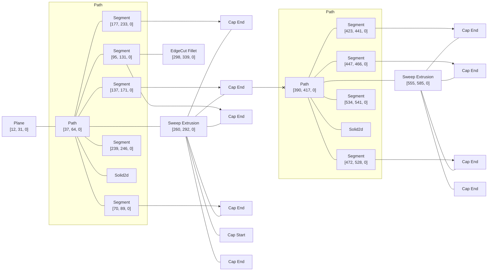

```mermaid
flowchart LR
  subgraph path2 [Path]
    2["Path<br>[37, 64, 0]"]
    3["Segment<br>[70, 89, 0]"]
    4["Segment<br>[95, 131, 0]"]
    5["Segment<br>[137, 171, 0]"]
    6["Segment<br>[177, 233, 0]"]
    7["Segment<br>[239, 246, 0]"]
    8[Solid2d]
  end
  subgraph path17 [Path]
    17["Path<br>[390, 417, 0]"]
    18["Segment<br>[423, 441, 0]"]
    19["Segment<br>[447, 466, 0]"]
    20["Segment<br>[472, 528, 0]"]
    21["Segment<br>[534, 541, 0]"]
    22[Solid2d]
  end
  1["Plane<br>[12, 31, 0]"]
  9["Sweep Extrusion<br>[260, 292, 0]"]
  10["Cap End"]
  11["Cap End"]
  12["Cap End"]
  13["Cap End"]
  14["Cap Start"]
  15["Cap End"]
  16["EdgeCut Fillet<br>[298, 339, 0]"]
  23["Sweep Extrusion<br>[555, 585, 0]"]
  24["Cap End"]
  25["Cap End"]
  26["Cap End"]
  27["Cap End"]
  1 --- 2
  2 --- 3
  2 --- 4
  2 --- 5
  2 --- 6
  2 --- 7
  2 ---- 9
  2 --- 8
  3 x--> 13
  4 x--> 12
  4 --- 16
  5 x--> 11
  6 x--> 10
  9 --- 10
  9 --- 11
  9 --- 12
  9 --- 13
  9 --- 14
  9 --- 15
  11 <--x 17
  17 --- 18
  17 --- 19
  17 --- 20
  17 --- 21
  17 ---- 23
  17 --- 22
  18 x--> 26
  19 x--> 25
  20 x--> 24
  23 --- 24
  23 --- 25
  23 --- 26
  23 --- 27
```
