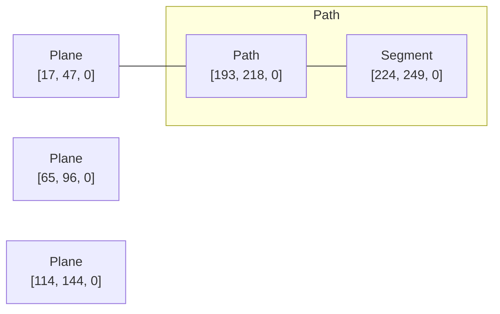

```mermaid
flowchart LR
  subgraph path4 [Path]
    4["Path<br>[193, 218, 0]"]
    5["Segment<br>[224, 249, 0]"]
  end
  1["Plane<br>[17, 47, 0]"]
  2["Plane<br>[65, 96, 0]"]
  3["Plane<br>[114, 144, 0]"]
  1 --- 4
  4 --- 5
```
