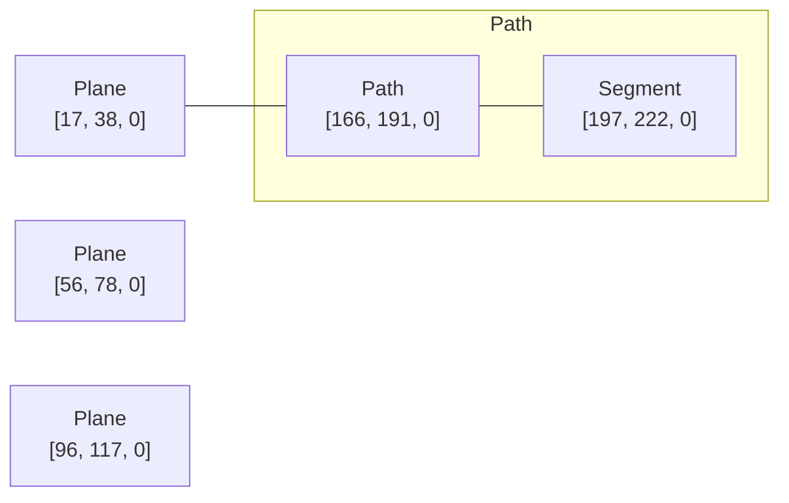

```mermaid
flowchart LR
  subgraph path4 [Path]
    4["Path<br>[166, 191, 0]"]
    5["Segment<br>[197, 222, 0]"]
  end
  1["Plane<br>[17, 38, 0]"]
  2["Plane<br>[56, 78, 0]"]
  3["Plane<br>[96, 117, 0]"]
  1 --- 4
  4 --- 5
```
