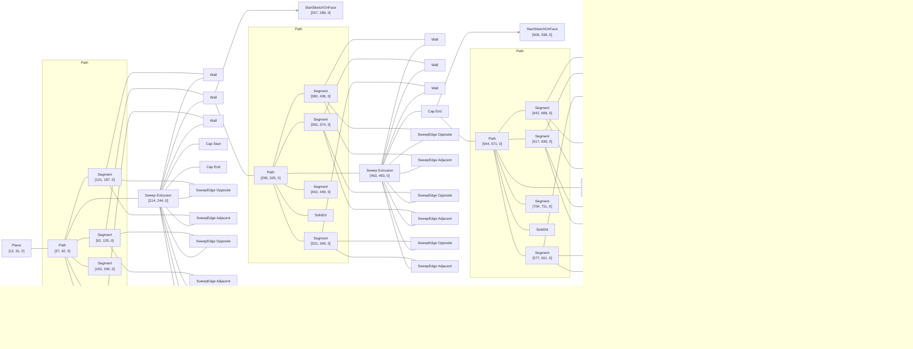

```mermaid
flowchart LR
  subgraph path2 [Path]
    2["Path<br>[37, 62, 0]"]
    3["Segment<br>[68, 86, 0]"]
    4["Segment<br>[92, 125, 0]"]
    5["Segment<br>[131, 187, 0]"]
    6["Segment<br>[193, 200, 0]"]
    7[Solid2d]
  end
  subgraph path20 [Path]
    20["Path<br>[295, 325, 0]"]
    21["Segment<br>[331, 349, 0]"]
    22["Segment<br>[355, 374, 0]"]
    23["Segment<br>[380, 436, 0]"]
    24["Segment<br>[442, 449, 0]"]
    25[Solid2d]
  end
  subgraph path37 [Path]
    37["Path<br>[544, 571, 0]"]
    38["Segment<br>[577, 611, 0]"]
    39["Segment<br>[617, 636, 0]"]
    40["Segment<br>[642, 698, 0]"]
    41["Segment<br>[704, 711, 0]"]
    42[Solid2d]
  end
  subgraph path54 [Path]
    54["Path<br>[806, 833, 0]"]
    55["Segment<br>[839, 859, 0]"]
    56["Segment<br>[865, 886, 0]"]
    57["Segment<br>[892, 948, 0]"]
    58["Segment<br>[954, 961, 0]"]
    59[Solid2d]
  end
  1["Plane<br>[12, 31, 0]"]
  8["Sweep Extrusion<br>[214, 244, 0]"]
  9[Wall]
  10[Wall]
  11[Wall]
  12["Cap Start"]
  13["Cap End"]
  14["SweepEdge Opposite"]
  15["SweepEdge Adjacent"]
  16["SweepEdge Opposite"]
  17["SweepEdge Adjacent"]
  18["SweepEdge Opposite"]
  19["SweepEdge Adjacent"]
  26["Sweep Extrusion<br>[463, 493, 0]"]
  27[Wall]
  28[Wall]
  29[Wall]
  30["Cap End"]
  31["SweepEdge Opposite"]
  32["SweepEdge Adjacent"]
  33["SweepEdge Opposite"]
  34["SweepEdge Adjacent"]
  35["SweepEdge Opposite"]
  36["SweepEdge Adjacent"]
  43["Sweep Extrusion<br>[725, 755, 0]"]
  44[Wall]
  45[Wall]
  46[Wall]
  47["Cap End"]
  48["SweepEdge Opposite"]
  49["SweepEdge Adjacent"]
  50["SweepEdge Opposite"]
  51["SweepEdge Adjacent"]
  52["SweepEdge Opposite"]
  53["SweepEdge Adjacent"]
  60["Sweep Extrusion<br>[975, 1005, 0]"]
  61[Wall]
  62[Wall]
  63[Wall]
  64["Cap End"]
  65["SweepEdge Opposite"]
  66["SweepEdge Adjacent"]
  67["SweepEdge Opposite"]
  68["SweepEdge Adjacent"]
  69["SweepEdge Opposite"]
  70["SweepEdge Adjacent"]
  71["StartSketchOnFace<br>[257, 289, 0]"]
  72["StartSketchOnFace<br>[506, 538, 0]"]
  73["StartSketchOnFace<br>[768, 800, 0]"]
  1 --- 2
  2 --- 3
  2 --- 4
  2 --- 5
  2 --- 6
  2 ---- 8
  2 --- 7
  3 --- 11
  3 --- 18
  3 --- 19
  4 --- 10
  4 --- 16
  4 --- 17
  5 --- 9
  5 --- 14
  5 --- 15
  8 --- 9
  8 --- 10
  8 --- 11
  8 --- 12
  8 --- 13
  8 --- 14
  8 --- 15
  8 --- 16
  8 --- 17
  8 --- 18
  8 --- 19
  10 --- 20
  20 --- 21
  20 --- 22
  20 --- 23
  20 --- 24
  20 ---- 26
  20 --- 25
  21 --- 29
  21 --- 35
  21 --- 36
  22 --- 28
  22 --- 33
  22 --- 34
  23 --- 27
  23 --- 31
  23 --- 32
  26 --- 27
  26 --- 28
  26 --- 29
  26 --- 30
  26 --- 31
  26 --- 32
  26 --- 33
  26 --- 34
  26 --- 35
  26 --- 36
  30 --- 37
  37 --- 38
  37 --- 39
  37 --- 40
  37 --- 41
  37 ---- 43
  37 --- 42
  38 --- 46
  38 --- 52
  38 --- 53
  39 --- 45
  39 --- 50
  39 --- 51
  40 --- 44
  40 --- 48
  40 --- 49
  43 --- 44
  43 --- 45
  43 --- 46
  43 --- 47
  43 --- 48
  43 --- 49
  43 --- 50
  43 --- 51
  43 --- 52
  43 --- 53
  46 --- 54
  54 --- 55
  54 --- 56
  54 --- 57
  54 --- 58
  54 ---- 60
  54 --- 59
  55 --- 63
  55 --- 69
  55 --- 70
  56 --- 62
  56 --- 67
  56 --- 68
  57 --- 61
  57 --- 65
  57 --- 66
  60 --- 61
  60 --- 62
  60 --- 63
  60 --- 64
  60 --- 65
  60 --- 66
  60 --- 67
  60 --- 68
  60 --- 69
  60 --- 70
  10 <--x 71
  30 <--x 72
  46 <--x 73
```
