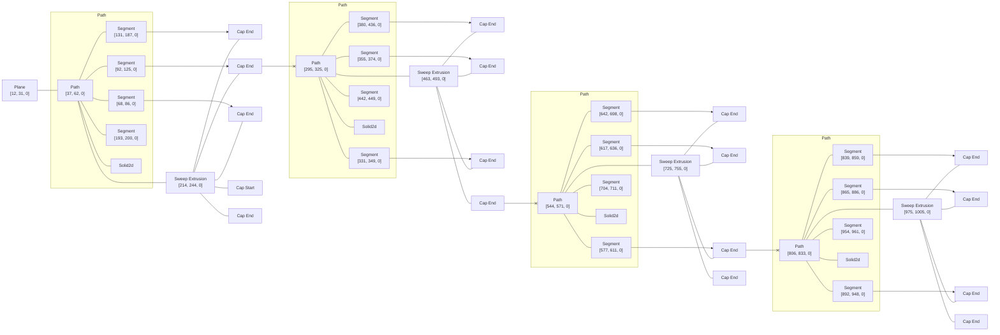

```mermaid
flowchart LR
  subgraph path2 [Path]
    2["Path<br>[37, 62, 0]"]
    3["Segment<br>[68, 86, 0]"]
    4["Segment<br>[92, 125, 0]"]
    5["Segment<br>[131, 187, 0]"]
    6["Segment<br>[193, 200, 0]"]
    7[Solid2d]
  end
  subgraph path14 [Path]
    14["Path<br>[295, 325, 0]"]
    15["Segment<br>[331, 349, 0]"]
    16["Segment<br>[355, 374, 0]"]
    17["Segment<br>[380, 436, 0]"]
    18["Segment<br>[442, 449, 0]"]
    19[Solid2d]
  end
  subgraph path25 [Path]
    25["Path<br>[544, 571, 0]"]
    26["Segment<br>[577, 611, 0]"]
    27["Segment<br>[617, 636, 0]"]
    28["Segment<br>[642, 698, 0]"]
    29["Segment<br>[704, 711, 0]"]
    30[Solid2d]
  end
  subgraph path36 [Path]
    36["Path<br>[806, 833, 0]"]
    37["Segment<br>[839, 859, 0]"]
    38["Segment<br>[865, 886, 0]"]
    39["Segment<br>[892, 948, 0]"]
    40["Segment<br>[954, 961, 0]"]
    41[Solid2d]
  end
  1["Plane<br>[12, 31, 0]"]
  8["Sweep Extrusion<br>[214, 244, 0]"]
  9["Cap End"]
  10["Cap End"]
  11["Cap End"]
  12["Cap Start"]
  13["Cap End"]
  20["Sweep Extrusion<br>[463, 493, 0]"]
  21["Cap End"]
  22["Cap End"]
  23["Cap End"]
  24["Cap End"]
  31["Sweep Extrusion<br>[725, 755, 0]"]
  32["Cap End"]
  33["Cap End"]
  34["Cap End"]
  35["Cap End"]
  42["Sweep Extrusion<br>[975, 1005, 0]"]
  43["Cap End"]
  44["Cap End"]
  45["Cap End"]
  46["Cap End"]
  1 --- 2
  2 --- 3
  2 --- 4
  2 --- 5
  2 --- 6
  2 ---- 8
  2 --- 7
  3 x--> 11
  4 x--> 10
  5 x--> 9
  8 --- 9
  8 --- 10
  8 --- 11
  8 --- 12
  8 --- 13
  10 <--x 14
  14 --- 15
  14 --- 16
  14 --- 17
  14 --- 18
  14 ---- 20
  14 --- 19
  15 x--> 23
  16 x--> 22
  17 x--> 21
  20 --- 21
  20 --- 22
  20 --- 23
  20 --- 24
  24 <--x 25
  25 --- 26
  25 --- 27
  25 --- 28
  25 --- 29
  25 ---- 31
  25 --- 30
  26 x--> 34
  27 x--> 33
  28 x--> 32
  31 --- 32
  31 --- 33
  31 --- 34
  31 --- 35
  34 <--x 36
  36 --- 37
  36 --- 38
  36 --- 39
  36 --- 40
  36 ---- 42
  36 --- 41
  37 x--> 45
  38 x--> 44
  39 x--> 43
  42 --- 43
  42 --- 44
  42 --- 45
  42 --- 46
```
