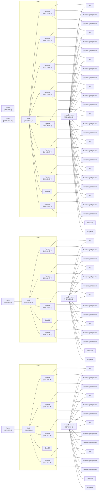

```mermaid
flowchart LR
  subgraph path3 [Path]
    3["Path<br>[1358, 1517, 3]"]
    4["Segment<br>[1523, 1618, 3]"]
    5["Segment<br>[1624, 1785, 3]"]
    6["Segment<br>[1791, 1886, 3]"]
    7["Segment<br>[1892, 2056, 3]"]
    8["Segment<br>[2062, 2158, 3]"]
    9["Segment<br>[2164, 2327, 3]"]
    10["Segment<br>[2333, 2428, 3]"]
    11["Segment<br>[2434, 2441, 3]"]
    12[Solid2d]
  end
  subgraph path41 [Path]
    41["Path<br>[1119, 1160, 5]"]
    42["Segment<br>[1168, 1263, 5]"]
    43["Segment<br>[1271, 1367, 5]"]
    44["Segment<br>[1375, 1461, 5]"]
    45["Segment<br>[1469, 1476, 5]"]
    46[Solid2d]
  end
  subgraph path63 [Path]
    63["Path<br>[503, 596, 4]"]
    64["Segment<br>[602, 639, 4]"]
    65["Segment<br>[645, 683, 4]"]
    66["Segment<br>[689, 727, 4]"]
    67["Segment<br>[733, 751, 4]"]
    68[Solid2d]
  end
  1["Plane<br>[358, 387, 3]"]
  2["Plane<br>[1322, 1351, 3]"]
  13["Sweep Extrusion<br>[2790, 2826, 3]"]
  14[Wall]
  15[Wall]
  16[Wall]
  17[Wall]
  18[Wall]
  19[Wall]
  20[Wall]
  21[Wall]
  22["Cap Start"]
  23["Cap End"]
  24["SweepEdge Opposite"]
  25["SweepEdge Adjacent"]
  26["SweepEdge Opposite"]
  27["SweepEdge Adjacent"]
  28["SweepEdge Opposite"]
  29["SweepEdge Adjacent"]
  30["SweepEdge Opposite"]
  31["SweepEdge Adjacent"]
  32["SweepEdge Opposite"]
  33["SweepEdge Adjacent"]
  34["SweepEdge Opposite"]
  35["SweepEdge Adjacent"]
  36["SweepEdge Opposite"]
  37["SweepEdge Adjacent"]
  38["SweepEdge Opposite"]
  39["SweepEdge Adjacent"]
  40["Plane<br>[405, 442, 0]"]
  47["Sweep Extrusion<br>[1495, 1542, 5]"]
  48[Wall]
  49[Wall]
  50[Wall]
  51[Wall]
  52["Cap Start"]
  53["Cap End"]
  54["SweepEdge Opposite"]
  55["SweepEdge Adjacent"]
  56["SweepEdge Opposite"]
  57["SweepEdge Adjacent"]
  58["SweepEdge Opposite"]
  59["SweepEdge Adjacent"]
  60["SweepEdge Opposite"]
  61["SweepEdge Adjacent"]
  62["Plane<br>[467, 497, 4]"]
  69["Sweep Extrusion<br>[797, 849, 4]"]
  70[Wall]
  71[Wall]
  72[Wall]
  73[Wall]
  74["Cap Start"]
  75["Cap End"]
  76["SweepEdge Opposite"]
  77["SweepEdge Adjacent"]
  78["SweepEdge Opposite"]
  79["SweepEdge Adjacent"]
  80["SweepEdge Opposite"]
  81["SweepEdge Adjacent"]
  82["SweepEdge Opposite"]
  83["SweepEdge Adjacent"]
  2 --- 3
  3 --- 4
  3 --- 5
  3 --- 6
  3 --- 7
  3 --- 8
  3 --- 9
  3 --- 10
  3 --- 11
  3 ---- 13
  3 --- 12
  4 --- 21
  4 --- 38
  4 --- 39
  5 --- 20
  5 --- 36
  5 --- 37
  6 --- 19
  6 --- 34
  6 --- 35
  7 --- 18
  7 --- 32
  7 --- 33
  8 --- 17
  8 --- 30
  8 --- 31
  9 --- 16
  9 --- 28
  9 --- 29
  10 --- 15
  10 --- 26
  10 --- 27
  11 --- 14
  11 --- 24
  11 --- 25
  13 --- 14
  13 --- 15
  13 --- 16
  13 --- 17
  13 --- 18
  13 --- 19
  13 --- 20
  13 --- 21
  13 --- 22
  13 --- 23
  13 --- 24
  13 --- 25
  13 --- 26
  13 --- 27
  13 --- 28
  13 --- 29
  13 --- 30
  13 --- 31
  13 --- 32
  13 --- 33
  13 --- 34
  13 --- 35
  13 --- 36
  13 --- 37
  13 --- 38
  13 --- 39
  40 --- 41
  41 --- 42
  41 --- 43
  41 --- 44
  41 --- 45
  41 ---- 47
  41 --- 46
  42 --- 48
  42 --- 54
  42 --- 55
  43 --- 49
  43 --- 56
  43 --- 57
  44 --- 50
  44 --- 58
  44 --- 59
  45 --- 51
  45 --- 60
  45 --- 61
  47 --- 48
  47 --- 49
  47 --- 50
  47 --- 51
  47 --- 52
  47 --- 53
  47 --- 54
  47 --- 55
  47 --- 56
  47 --- 57
  47 --- 58
  47 --- 59
  47 --- 60
  47 --- 61
  62 --- 63
  63 --- 64
  63 --- 65
  63 --- 66
  63 --- 67
  63 ---- 69
  63 --- 68
  64 --- 73
  64 --- 82
  64 --- 83
  65 --- 72
  65 --- 80
  65 --- 81
  66 --- 71
  66 --- 78
  66 --- 79
  67 --- 70
  67 --- 76
  67 --- 77
  69 --- 70
  69 --- 71
  69 --- 72
  69 --- 73
  69 --- 74
  69 --- 75
  69 --- 76
  69 --- 77
  69 --- 78
  69 --- 79
  69 --- 80
  69 --- 81
  69 --- 82
  69 --- 83
```
