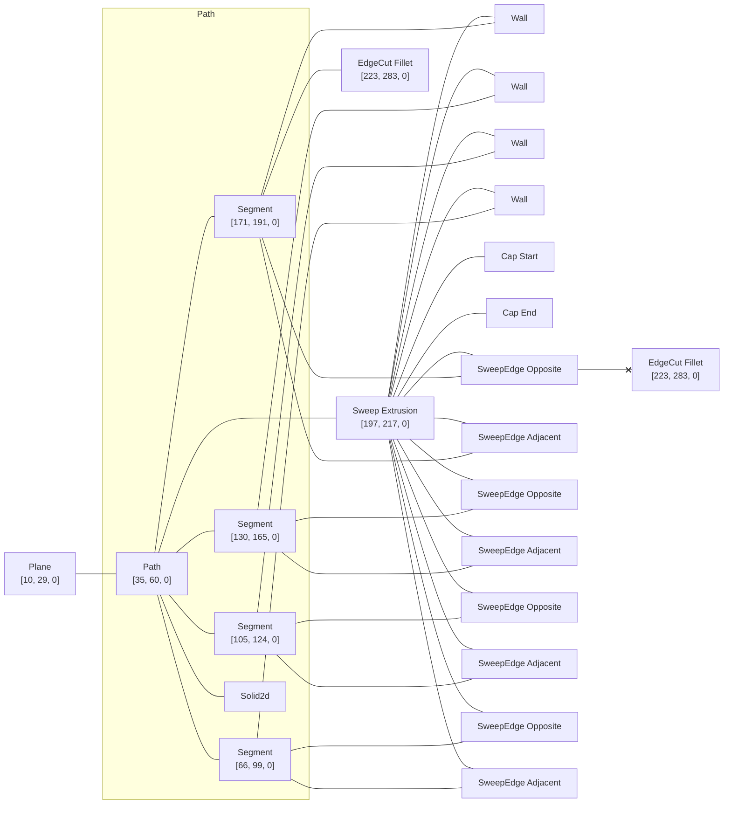

```mermaid
flowchart LR
  subgraph path2 [Path]
    2["Path<br>[35, 60, 0]"]
    3["Segment<br>[66, 99, 0]"]
    4["Segment<br>[105, 124, 0]"]
    5["Segment<br>[130, 165, 0]"]
    6["Segment<br>[171, 191, 0]"]
    7[Solid2d]
  end
  1["Plane<br>[10, 29, 0]"]
  8["Sweep Extrusion<br>[197, 217, 0]"]
  9[Wall]
  10[Wall]
  11[Wall]
  12[Wall]
  13["Cap Start"]
  14["Cap End"]
  15["SweepEdge Opposite"]
  16["SweepEdge Adjacent"]
  17["SweepEdge Opposite"]
  18["SweepEdge Adjacent"]
  19["SweepEdge Opposite"]
  20["SweepEdge Adjacent"]
  21["SweepEdge Opposite"]
  22["SweepEdge Adjacent"]
  23["EdgeCut Fillet<br>[223, 283, 0]"]
  24["EdgeCut Fillet<br>[223, 283, 0]"]
  1 --- 2
  2 --- 3
  2 --- 4
  2 --- 5
  2 --- 6
  2 ---- 8
  2 --- 7
  3 --- 12
  3 --- 21
  3 --- 22
  4 --- 11
  4 --- 19
  4 --- 20
  5 --- 10
  5 --- 17
  5 --- 18
  6 --- 9
  6 --- 15
  6 --- 16
  6 --- 23
  8 --- 9
  8 --- 10
  8 --- 11
  8 --- 12
  8 --- 13
  8 --- 14
  8 --- 15
  8 --- 16
  8 --- 17
  8 --- 18
  8 --- 19
  8 --- 20
  8 --- 21
  8 --- 22
  15 <--x 24
```
