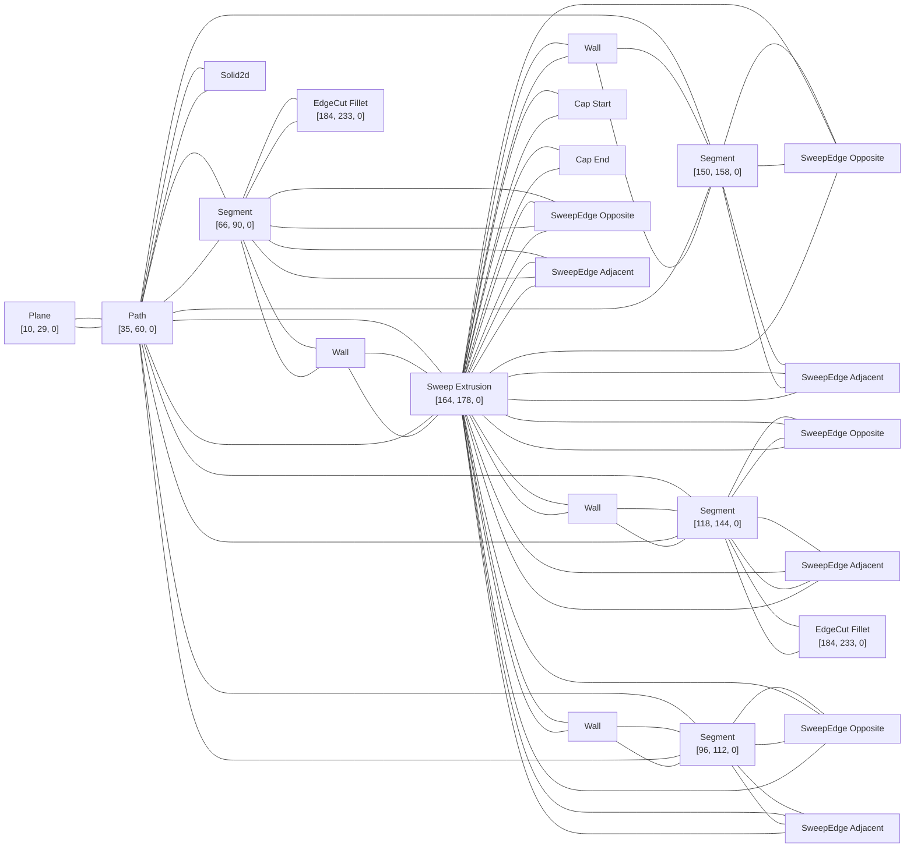

```mermaid
flowchart LR
  1["Plane<br>[10, 29, 0]"]
  2["Path<br>[35, 60, 0]"]
  3["Segment<br>[66, 90, 0]"]
  4["Segment<br>[96, 112, 0]"]
  5["Segment<br>[118, 144, 0]"]
  6["Segment<br>[150, 158, 0]"]
  7[Solid2d]
  8["Sweep Extrusion<br>[164, 178, 0]"]
  9[Wall]
  10[Wall]
  11[Wall]
  12[Wall]
  13["Cap Start"]
  14["Cap End"]
  15["SweepEdge Opposite"]
  16["SweepEdge Adjacent"]
  17["SweepEdge Opposite"]
  18["SweepEdge Adjacent"]
  19["SweepEdge Opposite"]
  20["SweepEdge Adjacent"]
  21["SweepEdge Opposite"]
  22["SweepEdge Adjacent"]
  23["EdgeCut Fillet<br>[184, 233, 0]"]
  24["EdgeCut Fillet<br>[184, 233, 0]"]
  1 --- 2
  2 --- 1
  2 --- 3
  2 --- 4
  2 --- 5
  2 --- 6
  2 --- 8
  2 --- 7
  3 --- 2
  3 --- 12
  3 --- 21
  3 --- 22
  3 --- 23
  4 --- 2
  4 --- 11
  4 --- 19
  4 --- 20
  5 --- 2
  5 --- 10
  5 --- 17
  5 --- 18
  5 --- 24
  6 --- 2
  6 --- 9
  6 --- 15
  6 --- 16
  7 --- 2
  8 --- 2
  8 --- 9
  8 --- 10
  8 --- 11
  8 --- 12
  8 --- 13
  8 --- 14
  8 --- 15
  8 --- 16
  8 --- 17
  8 --- 18
  8 --- 19
  8 --- 20
  8 --- 21
  8 --- 22
  9 --- 6
  9 --- 8
  10 --- 5
  10 --- 8
  11 --- 4
  11 --- 8
  12 --- 3
  12 --- 8
  13 --- 8
  14 --- 8
  15 --- 6
  15 --- 8
  16 --- 6
  16 --- 8
  17 --- 5
  17 --- 8
  18 --- 5
  18 --- 8
  19 --- 4
  19 --- 8
  20 --- 4
  20 --- 8
  21 --- 3
  21 --- 8
  22 --- 3
  22 --- 8
  23 --- 3
  24 --- 5
```
