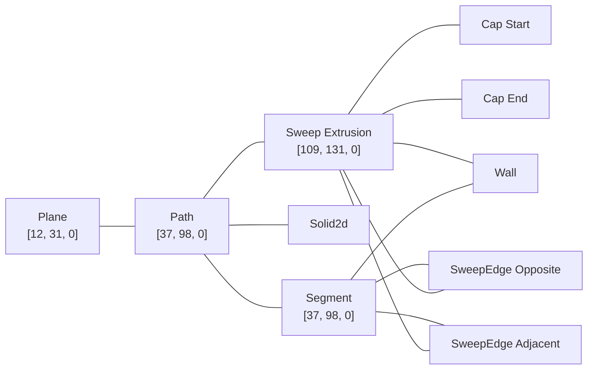

```mermaid
flowchart LR
  1["Plane<br>[12, 31, 0]"]
  2["Path<br>[37, 98, 0]"]
  3["Segment<br>[37, 98, 0]"]
  4[Solid2d]
  5["Sweep Extrusion<br>[109, 131, 0]"]
  6[Wall]
  7["Cap Start"]
  8["Cap End"]
  9["SweepEdge Opposite"]
  10["SweepEdge Adjacent"]
  3 --- 6
  2 --- 5
  2 --- 4
  2 --- 3
  1 --- 2
  5 --- 6
  5 --- 7
  5 --- 8
  5 --- 9
  5 --- 10
  3 --- 10
  3 --- 9
```
