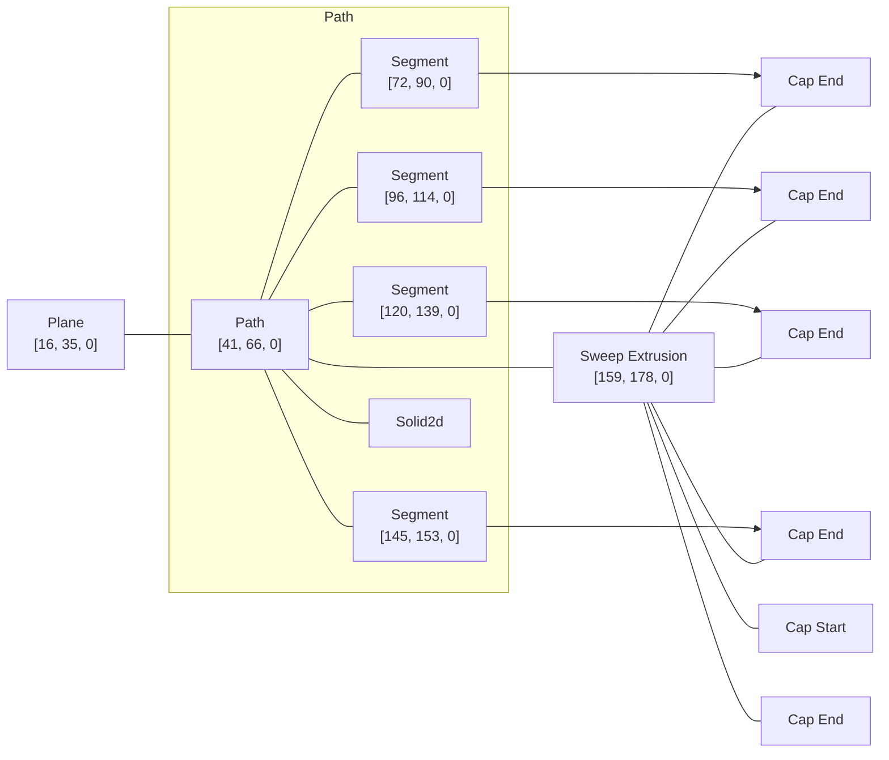

```mermaid
flowchart LR
  subgraph path2 [Path]
    2["Path<br>[41, 66, 0]"]
    3["Segment<br>[72, 90, 0]"]
    4["Segment<br>[96, 114, 0]"]
    5["Segment<br>[120, 139, 0]"]
    6["Segment<br>[145, 153, 0]"]
    7[Solid2d]
  end
  1["Plane<br>[16, 35, 0]"]
  8["Sweep Extrusion<br>[159, 178, 0]"]
  9["Cap End"]
  10["Cap End"]
  11["Cap End"]
  12["Cap End"]
  13["Cap Start"]
  14["Cap End"]
  1 --- 2
  2 --- 3
  2 --- 4
  2 --- 5
  2 --- 6
  2 ---- 8
  2 --- 7
  3 x--> 12
  4 x--> 11
  5 x--> 10
  6 x--> 9
  8 --- 9
  8 --- 10
  8 --- 11
  8 --- 12
  8 --- 13
  8 --- 14
```
