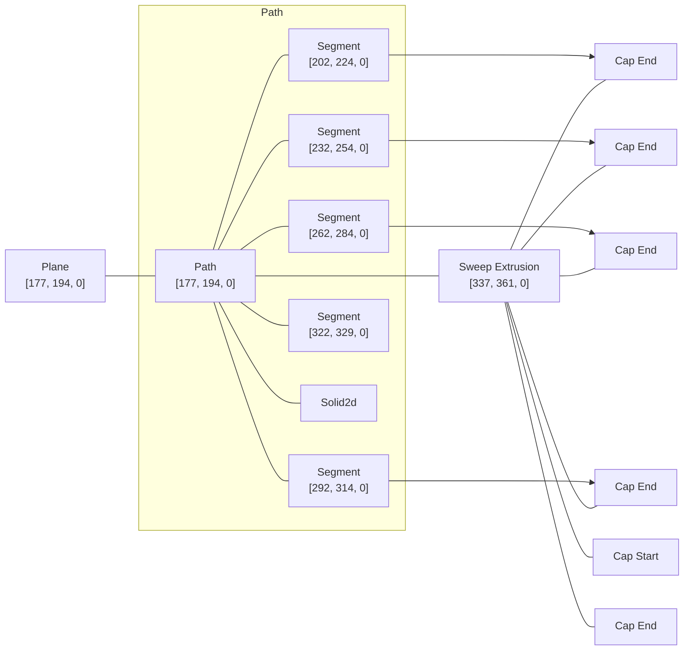

```mermaid
flowchart LR
  subgraph path2 [Path]
    2["Path<br>[177, 194, 0]"]
    3["Segment<br>[202, 224, 0]"]
    4["Segment<br>[232, 254, 0]"]
    5["Segment<br>[262, 284, 0]"]
    6["Segment<br>[292, 314, 0]"]
    7["Segment<br>[322, 329, 0]"]
    8[Solid2d]
  end
  1["Plane<br>[177, 194, 0]"]
  9["Sweep Extrusion<br>[337, 361, 0]"]
  10["Cap End"]
  11["Cap End"]
  12["Cap End"]
  13["Cap End"]
  14["Cap Start"]
  15["Cap End"]
  1 --- 2
  2 --- 3
  2 --- 4
  2 --- 5
  2 --- 6
  2 --- 7
  2 ---- 9
  2 --- 8
  3 x--> 13
  4 x--> 12
  5 x--> 11
  6 x--> 10
  9 --- 10
  9 --- 11
  9 --- 12
  9 --- 13
  9 --- 14
  9 --- 15
```
