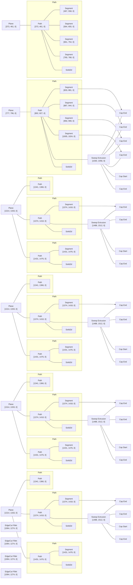

```mermaid
flowchart LR
  subgraph path2 [Path]
    2["Path<br>[373, 461, 0]"]
    3["Segment<br>[467, 558, 0]"]
    4["Segment<br>[564, 655, 0]"]
    5["Segment<br>[661, 754, 0]"]
    6["Segment<br>[760, 768, 0]"]
    7[Solid2d]
  end
  subgraph path9 [Path]
    9["Path<br>[802, 827, 0]"]
    10["Segment<br>[833, 881, 0]"]
    11["Segment<br>[887, 944, 0]"]
    12["Segment<br>[950, 999, 0]"]
    13["Segment<br>[1005, 1024, 0]"]
    14[Solid2d]
  end
  subgraph path23 [Path]
    23["Path<br>[1341, 1366, 0]"]
  end
  subgraph path24 [Path]
    24["Path<br>[1374, 1418, 0]"]
    25["Segment<br>[1374, 1418, 0]"]
    26[Solid2d]
  end
  subgraph path27 [Path]
    27["Path<br>[1431, 1476, 0]"]
    28["Segment<br>[1431, 1476, 0]"]
    29[Solid2d]
  end
  subgraph path36 [Path]
    36["Path<br>[1341, 1366, 0]"]
  end
  subgraph path37 [Path]
    37["Path<br>[1374, 1418, 0]"]
    38["Segment<br>[1374, 1418, 0]"]
    39[Solid2d]
  end
  subgraph path40 [Path]
    40["Path<br>[1431, 1476, 0]"]
    41["Segment<br>[1431, 1476, 0]"]
    42[Solid2d]
  end
  subgraph path49 [Path]
    49["Path<br>[1341, 1366, 0]"]
  end
  subgraph path50 [Path]
    50["Path<br>[1374, 1418, 0]"]
    51["Segment<br>[1374, 1418, 0]"]
    52[Solid2d]
  end
  subgraph path53 [Path]
    53["Path<br>[1431, 1476, 0]"]
    54["Segment<br>[1431, 1476, 0]"]
    55[Solid2d]
  end
  subgraph path62 [Path]
    62["Path<br>[1341, 1366, 0]"]
  end
  subgraph path63 [Path]
    63["Path<br>[1374, 1418, 0]"]
    64["Segment<br>[1374, 1418, 0]"]
    65[Solid2d]
  end
  subgraph path66 [Path]
    66["Path<br>[1431, 1476, 0]"]
    67["Segment<br>[1431, 1476, 0]"]
    68[Solid2d]
  end
  1["Plane<br>[373, 461, 0]"]
  8["Plane<br>[777, 796, 0]"]
  15["Sweep Extrusion<br>[1030, 1058, 0]"]
  16["Cap End"]
  17["Cap End"]
  18["Cap End"]
  19["Cap End"]
  20["Cap Start"]
  21["Cap End"]
  22["Plane<br>[1314, 1333, 0]"]
  30["Sweep Extrusion<br>[1488, 1512, 0]"]
  31["Cap End"]
  32["Cap End"]
  33["Cap Start"]
  34["Cap End"]
  35["Plane<br>[1314, 1333, 0]"]
  43["Sweep Extrusion<br>[1488, 1512, 0]"]
  44["Cap End"]
  45["Cap End"]
  46["Cap Start"]
  47["Cap End"]
  48["Plane<br>[1314, 1333, 0]"]
  56["Sweep Extrusion<br>[1488, 1512, 0]"]
  57["Cap End"]
  58["Cap End"]
  59["Cap Start"]
  60["Cap End"]
  61["Plane<br>[1314, 1333, 0]"]
  69["Sweep Extrusion<br>[1488, 1512, 0]"]
  70["Cap End"]
  71["Cap End"]
  72["Cap Start"]
  73["Cap End"]
  74["EdgeCut Fillet<br>[1064, 1274, 0]"]
  75["EdgeCut Fillet<br>[1064, 1274, 0]"]
  76["EdgeCut Fillet<br>[1064, 1274, 0]"]
  77["EdgeCut Fillet<br>[1064, 1274, 0]"]
  1 --- 2
  2 --- 3
  2 --- 4
  2 --- 5
  2 --- 6
  2 --- 7
  8 --- 9
  9 --- 10
  9 --- 11
  9 --- 12
  9 --- 13
  9 ---- 15
  9 --- 14
  10 x--> 16
  11 x--> 17
  12 x--> 18
  13 x--> 19
  15 --- 16
  15 --- 17
  15 --- 18
  15 --- 19
  15 --- 20
  15 --- 21
  22 --- 23
  22 --- 24
  22 --- 27
  24 --- 25
  24 ---- 30
  24 --- 26
  25 x--> 31
  27 --- 28
  27 --- 29
  30 --- 31
  30 --- 32
  30 --- 33
  30 --- 34
  35 --- 36
  35 --- 37
  35 --- 40
  37 --- 38
  37 ---- 43
  37 --- 39
  38 x--> 44
  40 --- 41
  40 --- 42
  43 --- 44
  43 --- 45
  43 --- 46
  43 --- 47
  48 --- 49
  48 --- 50
  48 --- 53
  50 --- 51
  50 ---- 56
  50 --- 52
  51 x--> 57
  53 --- 54
  53 --- 55
  56 --- 57
  56 --- 58
  56 --- 59
  56 --- 60
  61 --- 62
  61 --- 63
  61 --- 66
  63 --- 64
  63 ---- 69
  63 --- 65
  64 x--> 70
  66 --- 67
  66 --- 68
  69 --- 70
  69 --- 71
  69 --- 72
  69 --- 73
```
