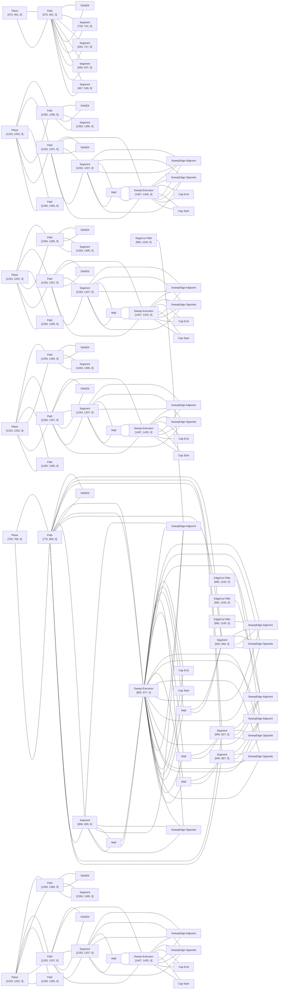

```mermaid
flowchart LR
  1["Plane<br>[373, 461, 0]"]
  2["Path<br>[373, 461, 0]"]
  3["Segment<br>[467, 549, 0]"]
  4["Segment<br>[555, 637, 0]"]
  5["Segment<br>[643, 727, 0]"]
  6["Segment<br>[733, 741, 0]"]
  7[Solid2d]
  8["Plane<br>[750, 769, 0]"]
  9["Path<br>[775, 800, 0]"]
  10["Segment<br>[806, 839, 0]"]
  11["Segment<br>[845, 887, 0]"]
  12["Segment<br>[893, 927, 0]"]
  13["Segment<br>[933, 949, 0]"]
  14[Solid2d]
  15["Sweep Extrusion<br>[955, 977, 0]"]
  16[Wall]
  17[Wall]
  18[Wall]
  19[Wall]
  20["Cap Start"]
  21["Cap End"]
  22["SweepEdge Opposite"]
  23["SweepEdge Adjacent"]
  24["SweepEdge Opposite"]
  25["SweepEdge Adjacent"]
  26["SweepEdge Opposite"]
  27["SweepEdge Adjacent"]
  28["SweepEdge Opposite"]
  29["SweepEdge Adjacent"]
  30["Plane<br>[1233, 1252, 0]"]
  31["Path<br>[1260, 1285, 0]"]
  32["Path<br>[1293, 1337, 0]"]
  33["Segment<br>[1293, 1337, 0]"]
  34[Solid2d]
  35["Path<br>[1350, 1395, 0]"]
  36["Segment<br>[1350, 1395, 0]"]
  37[Solid2d]
  38["Sweep Extrusion<br>[1407, 1425, 0]"]
  39[Wall]
  40["Cap Start"]
  41["Cap End"]
  42["SweepEdge Opposite"]
  43["SweepEdge Adjacent"]
  44["Plane<br>[1233, 1252, 0]"]
  45["Path<br>[1260, 1285, 0]"]
  46["Path<br>[1293, 1337, 0]"]
  47["Segment<br>[1293, 1337, 0]"]
  48[Solid2d]
  49["Path<br>[1350, 1395, 0]"]
  50["Segment<br>[1350, 1395, 0]"]
  51[Solid2d]
  52["Sweep Extrusion<br>[1407, 1425, 0]"]
  53[Wall]
  54["Cap Start"]
  55["Cap End"]
  56["SweepEdge Opposite"]
  57["SweepEdge Adjacent"]
  58["Plane<br>[1233, 1252, 0]"]
  59["Path<br>[1260, 1285, 0]"]
  60["Path<br>[1293, 1337, 0]"]
  61["Segment<br>[1293, 1337, 0]"]
  62[Solid2d]
  63["Path<br>[1350, 1395, 0]"]
  64["Segment<br>[1350, 1395, 0]"]
  65[Solid2d]
  66["Sweep Extrusion<br>[1407, 1425, 0]"]
  67[Wall]
  68["Cap Start"]
  69["Cap End"]
  70["SweepEdge Opposite"]
  71["SweepEdge Adjacent"]
  72["Plane<br>[1233, 1252, 0]"]
  73["Path<br>[1260, 1285, 0]"]
  74["Path<br>[1293, 1337, 0]"]
  75["Segment<br>[1293, 1337, 0]"]
  76[Solid2d]
  77["Path<br>[1350, 1395, 0]"]
  78["Segment<br>[1350, 1395, 0]"]
  79[Solid2d]
  80["Sweep Extrusion<br>[1407, 1425, 0]"]
  81[Wall]
  82["Cap Start"]
  83["Cap End"]
  84["SweepEdge Opposite"]
  85["SweepEdge Adjacent"]
  86["EdgeCut Fillet<br>[983, 1193, 0]"]
  87["EdgeCut Fillet<br>[983, 1193, 0]"]
  88["EdgeCut Fillet<br>[983, 1193, 0]"]
  89["EdgeCut Fillet<br>[983, 1193, 0]"]
  1 --- 2
  2 --- 1
  2 --- 3
  2 --- 4
  2 --- 5
  2 --- 6
  2 --- 7
  3 --- 2
  4 --- 2
  5 --- 2
  6 --- 2
  7 --- 2
  8 --- 9
  9 --- 8
  9 --- 10
  9 --- 11
  9 --- 12
  9 --- 13
  9 --- 15
  9 --- 14
  10 --- 9
  10 --- 16
  10 --- 22
  10 --- 23
  11 --- 9
  11 --- 17
  11 --- 24
  11 --- 25
  12 --- 9
  12 --- 18
  12 --- 26
  12 --- 27
  13 --- 9
  13 --- 19
  13 --- 28
  13 --- 29
  14 --- 9
  15 --- 9
  15 --- 16
  15 --- 17
  15 --- 18
  15 --- 19
  15 --- 20
  15 --- 21
  15 --- 22
  15 --- 23
  15 --- 24
  15 --- 25
  15 --- 26
  15 --- 27
  15 --- 28
  15 --- 29
  16 --- 10
  16 --- 15
  17 --- 11
  17 --- 15
  18 --- 12
  18 --- 15
  19 --- 13
  19 --- 15
  20 --- 15
  21 --- 15
  22 --- 10
  22 --- 15
  23 --- 10
  23 --- 15
  24 --- 11
  24 --- 15
  25 --- 11
  25 --- 15
  26 --- 12
  26 --- 15
  27 --- 12
  27 --- 15
  28 --- 13
  28 --- 15
  29 --- 13
  29 --- 15
  30 --- 31
  30 --- 32
  30 --- 35
  31 --- 30
  32 --- 30
  32 --- 33
  32 --- 38
  32 --- 34
  33 --- 32
  33 --- 39
  33 --- 42
  33 --- 43
  34 --- 32
  35 --- 30
  35 --- 36
  35 --- 37
  36 --- 35
  37 --- 35
  38 --- 32
  38 --- 39
  38 --- 40
  38 --- 41
  38 --- 42
  38 --- 43
  39 --- 33
  39 --- 38
  40 --- 38
  41 --- 38
  42 --- 33
  42 --- 38
  43 --- 33
  43 --- 38
  44 --- 45
  44 --- 46
  44 --- 49
  45 --- 44
  46 --- 44
  46 --- 47
  46 --- 52
  46 --- 48
  47 --- 46
  47 --- 53
  47 --- 56
  47 --- 57
  48 --- 46
  49 --- 44
  49 --- 50
  49 --- 51
  50 --- 49
  51 --- 49
  52 --- 46
  52 --- 53
  52 --- 54
  52 --- 55
  52 --- 56
  52 --- 57
  53 --- 47
  53 --- 52
  54 --- 52
  55 --- 52
  56 --- 47
  56 --- 52
  57 --- 47
  57 --- 52
  58 --- 59
  58 --- 60
  58 --- 63
  59 --- 58
  60 --- 58
  60 --- 61
  60 --- 66
  60 --- 62
  61 --- 60
  61 --- 67
  61 --- 70
  61 --- 71
  62 --- 60
  63 --- 58
  63 --- 64
  63 --- 65
  64 --- 63
  65 --- 63
  66 --- 60
  66 --- 67
  66 --- 68
  66 --- 69
  66 --- 70
  66 --- 71
  67 --- 61
  67 --- 66
  68 --- 66
  69 --- 66
  70 --- 61
  70 --- 66
  71 --- 61
  71 --- 66
  72 --- 73
  72 --- 74
  72 --- 77
  73 --- 72
  74 --- 72
  74 --- 75
  74 --- 80
  74 --- 76
  75 --- 74
  75 --- 81
  75 --- 84
  75 --- 85
  76 --- 74
  77 --- 72
  77 --- 78
  77 --- 79
  78 --- 77
  79 --- 77
  80 --- 74
  80 --- 81
  80 --- 82
  80 --- 83
  80 --- 84
  80 --- 85
  81 --- 75
  81 --- 80
  82 --- 80
  83 --- 80
  84 --- 75
  84 --- 80
  85 --- 75
  85 --- 80
  86 --- 23
  87 --- 25
  88 --- 27
  89 --- 29
```
