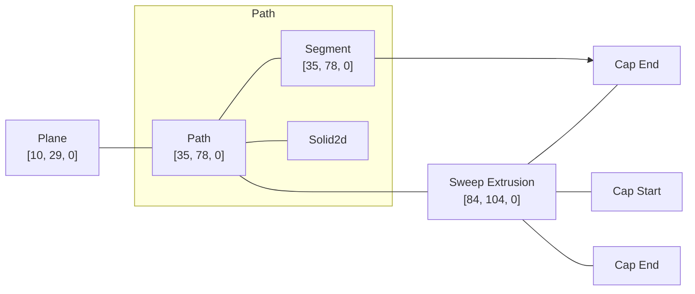

```mermaid
flowchart LR
  subgraph path2 [Path]
    2["Path<br>[35, 78, 0]"]
    3["Segment<br>[35, 78, 0]"]
    4[Solid2d]
  end
  1["Plane<br>[10, 29, 0]"]
  5["Sweep Extrusion<br>[84, 104, 0]"]
  6["Cap End"]
  7["Cap Start"]
  8["Cap End"]
  1 --- 2
  2 --- 3
  2 ---- 5
  2 --- 4
  3 x--> 6
  5 --- 6
  5 --- 7
  5 --- 8
```
