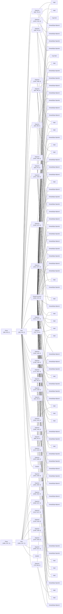

```mermaid
flowchart LR
  1["Plane<br>[399, 432, 0]"]
  2["Path<br>[399, 432, 0]"]
  3["Segment<br>[438, 475, 0]"]
  4["Segment<br>[481, 539, 0]"]
  5["Segment<br>[545, 575, 0]"]
  6["Segment<br>[581, 640, 0]"]
  7["Segment<br>[646, 705, 0]"]
  8["Segment<br>[711, 770, 0]"]
  9["Segment<br>[776, 828, 0]"]
  10["Segment<br>[834, 892, 0]"]
  11["Segment<br>[898, 934, 0]"]
  12["Segment<br>[940, 998, 0]"]
  13["Segment<br>[1004, 1034, 0]"]
  14["Segment<br>[1040, 1099, 0]"]
  15["Segment<br>[1105, 1168, 0]"]
  16["Segment<br>[1174, 1234, 0]"]
  17["Segment<br>[1240, 1273, 0]"]
  18["Segment<br>[1279, 1338, 0]"]
  19["Segment<br>[1344, 1380, 0]"]
  20["Segment<br>[1386, 1445, 0]"]
  21["Segment<br>[1451, 1506, 0]"]
  22["Segment<br>[1512, 1572, 0]"]
  23["Segment<br>[1578, 1702, 0]"]
  24["Segment<br>[1708, 1768, 0]"]
  25["Segment<br>[1774, 1807, 0]"]
  26["Segment<br>[1813, 1872, 0]"]
  27["Segment<br>[1878, 1886, 0]"]
  28[Solid2d]
  29["Plane<br>[1896, 1917, 0]"]
  30["Path<br>[1896, 1917, 0]"]
  31["Segment<br>[1923, 1936, 0]"]
  32["Segment<br>[1942, 2000, 0]"]
  33["Segment<br>[2006, 2042, 0]"]
  34["Segment<br>[2048, 2107, 0]"]
  35["Segment<br>[2113, 2127, 0]"]
  36["Segment<br>[2133, 2193, 0]"]
  37["Segment<br>[2199, 2238, 0]"]
  38["Segment<br>[2244, 2303, 0]"]
  39["Segment<br>[2309, 2317, 0]"]
  40[Solid2d]
  41["Sweep Extrusion<br>[2363, 2378, 0]"]
  42[Wall]
  43[Wall]
  44[Wall]
  45[Wall]
  46[Wall]
  47[Wall]
  48[Wall]
  49[Wall]
  50[Wall]
  51[Wall]
  52[Wall]
  53[Wall]
  54[Wall]
  55[Wall]
  56[Wall]
  57[Wall]
  58[Wall]
  59[Wall]
  60[Wall]
  61[Wall]
  62[Wall]
  63[Wall]
  64[Wall]
  65[Wall]
  66["Cap Start"]
  67["Cap End"]
  68["SweepEdge Opposite"]
  69["SweepEdge Adjacent"]
  70["SweepEdge Opposite"]
  71["SweepEdge Adjacent"]
  72["SweepEdge Opposite"]
  73["SweepEdge Adjacent"]
  74["SweepEdge Opposite"]
  75["SweepEdge Adjacent"]
  76["SweepEdge Opposite"]
  77["SweepEdge Adjacent"]
  78["SweepEdge Opposite"]
  79["SweepEdge Adjacent"]
  80["SweepEdge Opposite"]
  81["SweepEdge Adjacent"]
  82["SweepEdge Opposite"]
  83["SweepEdge Adjacent"]
  84["SweepEdge Opposite"]
  85["SweepEdge Adjacent"]
  86["SweepEdge Opposite"]
  87["SweepEdge Adjacent"]
  88["SweepEdge Opposite"]
  89["SweepEdge Adjacent"]
  90["SweepEdge Opposite"]
  91["SweepEdge Adjacent"]
  92["SweepEdge Opposite"]
  93["SweepEdge Adjacent"]
  94["SweepEdge Opposite"]
  95["SweepEdge Adjacent"]
  96["SweepEdge Opposite"]
  97["SweepEdge Adjacent"]
  98["SweepEdge Opposite"]
  99["SweepEdge Adjacent"]
  100["SweepEdge Opposite"]
  101["SweepEdge Adjacent"]
  102["SweepEdge Opposite"]
  103["SweepEdge Adjacent"]
  104["SweepEdge Opposite"]
  105["SweepEdge Adjacent"]
  106["SweepEdge Opposite"]
  107["SweepEdge Adjacent"]
  108["SweepEdge Opposite"]
  109["SweepEdge Adjacent"]
  110["SweepEdge Opposite"]
  111["SweepEdge Adjacent"]
  112["SweepEdge Opposite"]
  113["SweepEdge Adjacent"]
  114["SweepEdge Opposite"]
  115["SweepEdge Adjacent"]
  2 --- 23
  14 --- 91
  24 --- 111
  41 --- 46
  41 --- 67
  20 --- 103
  29 --- 30
  22 --- 107
  41 --- 53
  41 --- 68
  41 --- 106
  17 --- 56
  9 --- 81
  30 --- 39
  41 --- 83
  2 --- 7
  41 --- 77
  19 --- 100
  41 --- 62
  41 --- 113
  18 --- 98
  6 --- 75
  41 --- 84
  10 --- 82
  2 --- 41
  23 --- 108
  41 --- 99
  41 --- 93
  2 --- 21
  41 --- 100
  2 --- 14
  41 --- 70
  41 --- 55
  7 --- 46
  23 --- 62
  26 --- 114
  30 --- 37
  41 --- 115
  41 --- 109
  2 --- 5
  41 --- 79
  41 --- 56
  4 --- 43
  2 --- 28
  41 --- 86
  41 --- 95
  2 --- 19
  41 --- 42
  41 --- 102
  2 --- 12
  25 --- 112
  41 --- 49
  12 --- 87
  14 --- 53
  41 --- 64
  8 --- 79
  16 --- 55
  2 --- 3
  17 --- 96
  4 --- 71
  41 --- 58
  41 --- 73
  30 --- 34
  41 --- 111
  13 --- 52
  2 --- 26
  41 --- 80
  41 --- 89
  2 --- 17
  21 --- 105
  3 --- 42
  2 --- 10
  19 --- 58
  41 --- 51
  41 --- 66
  41 --- 45
  8 --- 47
  3 --- 69
  41 --- 96
  41 --- 105
  41 --- 75
  41 --- 52
  5 --- 73
  30 --- 32
  25 --- 64
  9 --- 80
  41 --- 82
  2 --- 24
  7 --- 77
  13 --- 89
  41 --- 61
  41 --- 76
  18 --- 99
  41 --- 112
  15 --- 93
  41 --- 91
  11 --- 85
  10 --- 83
  16 --- 94
  10 --- 49
  2 --- 8
  41 --- 92
  2 --- 22
  14 --- 90
  24 --- 110
  41 --- 47
  41 --- 98
  20 --- 102
  2 --- 15
  22 --- 106
  20 --- 59
  41 --- 54
  9 --- 48
  26 --- 115
  30 --- 38
  41 --- 69
  41 --- 107
  2 --- 6
  41 --- 78
  19 --- 101
  41 --- 63
  41 --- 108
  41 --- 114
  6 --- 74
  12 --- 51
  41 --- 85
  23 --- 109
  41 --- 94
  2 --- 20
  30 --- 31
  41 --- 101
  2 --- 13
  41 --- 71
  15 --- 54
  41 --- 48
  22 --- 61
  30 --- 36
  41 --- 110
  2 --- 4
  41 --- 72
  41 --- 57
  1 --- 2
  30 --- 35
  41 --- 87
  2 --- 27
  5 --- 44
  21 --- 60
  26 --- 65
  24 --- 63
  41 --- 88
  2 --- 18
  41 --- 43
  21 --- 104
  41 --- 103
  2 --- 11
  25 --- 113
  6 --- 45
  12 --- 86
  41 --- 44
  41 --- 50
  3 --- 68
  8 --- 78
  41 --- 65
  17 --- 97
  41 --- 74
  4 --- 70
  5 --- 72
  41 --- 59
  30 --- 33
  41 --- 104
  41 --- 81
  2 --- 25
  7 --- 76
  13 --- 88
  41 --- 60
  30 --- 40
  15 --- 92
  2 --- 16
  41 --- 90
  11 --- 84
  16 --- 95
  11 --- 50
  41 --- 97
  18 --- 57
  2 --- 9
```
