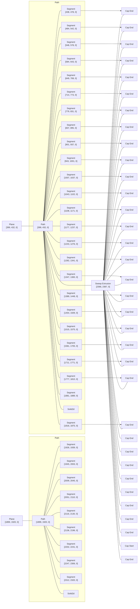

```mermaid
flowchart LR
  subgraph path2 [Path]
    2["Path<br>[399, 432, 0]"]
    3["Segment<br>[438, 478, 0]"]
    4["Segment<br>[484, 542, 0]"]
    5["Segment<br>[548, 578, 0]"]
    6["Segment<br>[584, 643, 0]"]
    7["Segment<br>[649, 708, 0]"]
    8["Segment<br>[714, 773, 0]"]
    9["Segment<br>[779, 831, 0]"]
    10["Segment<br>[837, 895, 0]"]
    11["Segment<br>[901, 937, 0]"]
    12["Segment<br>[943, 1001, 0]"]
    13["Segment<br>[1007, 1037, 0]"]
    14["Segment<br>[1043, 1102, 0]"]
    15["Segment<br>[1108, 1171, 0]"]
    16["Segment<br>[1177, 1237, 0]"]
    17["Segment<br>[1243, 1276, 0]"]
    18["Segment<br>[1282, 1341, 0]"]
    19["Segment<br>[1347, 1383, 0]"]
    20["Segment<br>[1389, 1448, 0]"]
    21["Segment<br>[1454, 1509, 0]"]
    22["Segment<br>[1515, 1575, 0]"]
    23["Segment<br>[1581, 1705, 0]"]
    24["Segment<br>[1711, 1771, 0]"]
    25["Segment<br>[1777, 1810, 0]"]
    26["Segment<br>[1816, 1875, 0]"]
    27["Segment<br>[1881, 1889, 0]"]
    28[Solid2d]
  end
  subgraph path30 [Path]
    30["Path<br>[1899, 1920, 0]"]
    31["Segment<br>[1926, 1939, 0]"]
    32["Segment<br>[1945, 2003, 0]"]
    33["Segment<br>[2009, 2045, 0]"]
    34["Segment<br>[2051, 2110, 0]"]
    35["Segment<br>[2116, 2130, 0]"]
    36["Segment<br>[2136, 2196, 0]"]
    37["Segment<br>[2202, 2241, 0]"]
    38["Segment<br>[2247, 2306, 0]"]
    39["Segment<br>[2312, 2320, 0]"]
    40[Solid2d]
  end
  1["Plane<br>[399, 432, 0]"]
  29["Plane<br>[1899, 1920, 0]"]
  41["Sweep Extrusion<br>[2366, 2387, 0]"]
  42["Cap End"]
  43["Cap End"]
  44["Cap End"]
  45["Cap End"]
  46["Cap End"]
  47["Cap End"]
  48["Cap End"]
  49["Cap End"]
  50["Cap End"]
  51["Cap End"]
  52["Cap End"]
  53["Cap End"]
  54["Cap End"]
  55["Cap End"]
  56["Cap End"]
  57["Cap End"]
  58["Cap End"]
  59["Cap End"]
  60["Cap End"]
  61["Cap End"]
  62["Cap End"]
  63["Cap End"]
  64["Cap End"]
  65["Cap End"]
  66["Cap End"]
  67["Cap End"]
  68["Cap End"]
  69["Cap End"]
  70["Cap End"]
  71["Cap End"]
  72["Cap End"]
  73["Cap End"]
  74["Cap Start"]
  75["Cap End"]
  1 --- 2
  2 --- 3
  2 --- 4
  2 --- 5
  2 --- 6
  2 --- 7
  2 --- 8
  2 --- 9
  2 --- 10
  2 --- 11
  2 --- 12
  2 --- 13
  2 --- 14
  2 --- 15
  2 --- 16
  2 --- 17
  2 --- 18
  2 --- 19
  2 --- 20
  2 --- 21
  2 --- 22
  2 --- 23
  2 --- 24
  2 --- 25
  2 --- 26
  2 --- 27
  2 ---- 41
  2 --- 28
  3 x--> 42
  4 x--> 43
  5 x--> 44
  6 x--> 45
  7 x--> 46
  8 x--> 47
  9 x--> 48
  10 x--> 49
  11 x--> 50
  12 x--> 51
  13 x--> 52
  14 x--> 53
  15 x--> 54
  16 x--> 55
  17 x--> 56
  18 x--> 57
  19 x--> 58
  20 x--> 59
  21 x--> 60
  22 x--> 61
  23 x--> 62
  24 x--> 63
  25 x--> 64
  26 x--> 65
  29 --- 30
  30 --- 31
  30 --- 32
  30 --- 33
  30 --- 34
  30 --- 35
  30 --- 36
  30 --- 37
  30 --- 38
  30 --- 39
  30 --- 40
  41 --- 42
  41 --- 43
  41 --- 44
  41 --- 45
  41 --- 46
  41 --- 47
  41 --- 48
  41 --- 49
  41 --- 50
  41 --- 51
  41 --- 52
  41 --- 53
  41 --- 54
  41 --- 55
  41 --- 56
  41 --- 57
  41 --- 58
  41 --- 59
  41 --- 60
  41 --- 61
  41 --- 62
  41 --- 63
  41 --- 64
  41 --- 65
  41 --- 66
  41 --- 67
  41 --- 68
  41 --- 69
  41 --- 70
  41 --- 71
  41 --- 72
  41 --- 73
  41 --- 74
  41 --- 75
```
