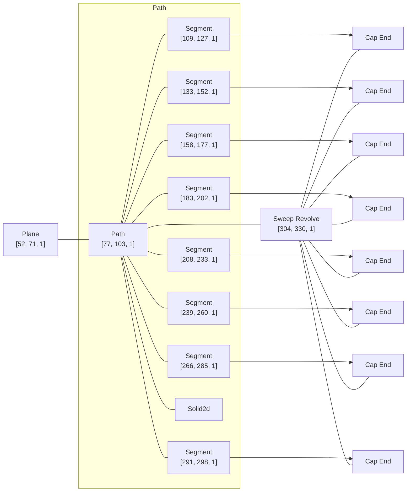

```mermaid
flowchart LR
  subgraph path2 [Path]
    2["Path<br>[77, 103, 1]"]
    3["Segment<br>[109, 127, 1]"]
    4["Segment<br>[133, 152, 1]"]
    5["Segment<br>[158, 177, 1]"]
    6["Segment<br>[183, 202, 1]"]
    7["Segment<br>[208, 233, 1]"]
    8["Segment<br>[239, 260, 1]"]
    9["Segment<br>[266, 285, 1]"]
    10["Segment<br>[291, 298, 1]"]
    11[Solid2d]
  end
  1["Plane<br>[52, 71, 1]"]
  12["Sweep Revolve<br>[304, 330, 1]"]
  13["Cap End"]
  14["Cap End"]
  15["Cap End"]
  16["Cap End"]
  17["Cap End"]
  18["Cap End"]
  19["Cap End"]
  20["Cap End"]
  1 --- 2
  2 --- 3
  2 --- 4
  2 --- 5
  2 --- 6
  2 --- 7
  2 --- 8
  2 --- 9
  2 --- 10
  2 ---- 12
  2 --- 11
  3 x--> 13
  4 x--> 14
  5 x--> 15
  6 x--> 16
  7 x--> 17
  8 x--> 18
  9 x--> 19
  10 x--> 20
  12 --- 13
  12 --- 14
  12 --- 15
  12 --- 16
  12 --- 17
  12 --- 18
  12 --- 19
  12 --- 20
```
