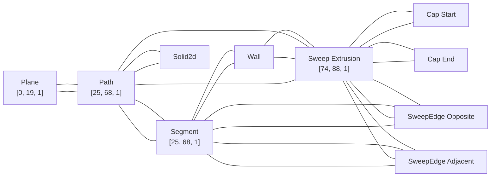

```mermaid
flowchart LR
  1["Plane<br>[0, 19, 1]"]
  2["Path<br>[25, 68, 1]"]
  3["Segment<br>[25, 68, 1]"]
  4[Solid2d]
  5["Sweep Extrusion<br>[74, 88, 1]"]
  6[Wall]
  7["Cap Start"]
  8["Cap End"]
  9["SweepEdge Opposite"]
  10["SweepEdge Adjacent"]
  1 --- 2
  2 --- 1
  2 --- 3
  2 --- 5
  2 --- 4
  3 --- 2
  3 --- 6
  3 --- 9
  3 --- 10
  4 --- 2
  5 --- 2
  5 --- 6
  5 --- 7
  5 --- 8
  5 --- 9
  5 --- 10
  6 --- 3
  6 --- 5
  7 --- 5
  8 --- 5
  9 --- 3
  9 --- 5
  10 --- 3
  10 --- 5
```
