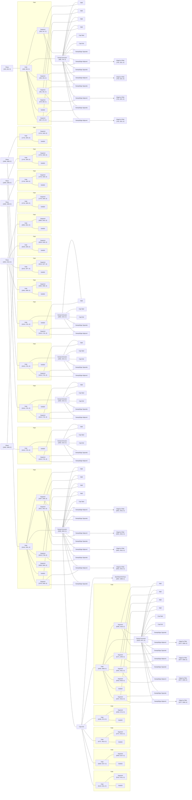

```mermaid
flowchart LR
  subgraph path2 [Path]
    2["Path<br>[268, 293, 0]"]
    3["Segment<br>[299, 347, 0]"]
    4["Segment<br>[353, 455, 0]"]
    5["Segment<br>[461, 581, 0]"]
    6["Segment<br>[587, 672, 0]"]
    7["Segment<br>[678, 685, 0]"]
    8[Solid2d]
  end
  subgraph path29 [Path]
    29["Path<br>[1616, 1731, 0]"]
    30["Segment<br>[1616, 1731, 0]"]
    31[Solid2d]
  end
  subgraph path32 [Path]
    32["Path<br>[1744, 1843, 0]"]
    33["Segment<br>[1744, 1843, 0]"]
    34[Solid2d]
  end
  subgraph path42 [Path]
    42["Path<br>[1616, 1731, 0]"]
    43["Segment<br>[1616, 1731, 0]"]
    44[Solid2d]
  end
  subgraph path45 [Path]
    45["Path<br>[1744, 1843, 0]"]
    46["Segment<br>[1744, 1843, 0]"]
    47[Solid2d]
  end
  subgraph path55 [Path]
    55["Path<br>[1616, 1731, 0]"]
    56["Segment<br>[1616, 1731, 0]"]
    57[Solid2d]
  end
  subgraph path58 [Path]
    58["Path<br>[1744, 1843, 0]"]
    59["Segment<br>[1744, 1843, 0]"]
    60[Solid2d]
  end
  subgraph path68 [Path]
    68["Path<br>[1616, 1731, 0]"]
    69["Segment<br>[1616, 1731, 0]"]
    70[Solid2d]
  end
  subgraph path71 [Path]
    71["Path<br>[1744, 1843, 0]"]
    72["Segment<br>[1744, 1843, 0]"]
    73[Solid2d]
  end
  subgraph path81 [Path]
    81["Path<br>[2416, 2451, 0]"]
    82["Segment<br>[2457, 2505, 0]"]
    83["Segment<br>[2511, 2613, 0]"]
    84["Segment<br>[2619, 2739, 0]"]
    85["Segment<br>[2745, 2830, 0]"]
    86["Segment<br>[2836, 2843, 0]"]
    87[Solid2d]
  end
  subgraph path88 [Path]
    88["Path<br>[2854, 3014, 0]"]
    89["Segment<br>[2854, 3014, 0]"]
    90[Solid2d]
  end
  subgraph path91 [Path]
    91["Path<br>[3029, 3200, 0]"]
    92["Segment<br>[3029, 3200, 0]"]
    93[Solid2d]
  end
  subgraph path94 [Path]
    94["Path<br>[3215, 3377, 0]"]
    95["Segment<br>[3215, 3377, 0]"]
    96[Solid2d]
  end
  subgraph path97 [Path]
    97["Path<br>[3392, 3565, 0]"]
    98["Segment<br>[3392, 3565, 0]"]
    99[Solid2d]
  end
  subgraph path119 [Path]
    119["Path<br>[4005, 4089, 0]"]
    120["Segment<br>[4095, 4165, 0]"]
    121["Segment<br>[4171, 4295, 0]"]
    122["Segment<br>[4301, 4421, 0]"]
    123["Segment<br>[4427, 4512, 0]"]
    124["Segment<br>[4518, 4525, 0]"]
    125[Solid2d]
  end
  subgraph path126 [Path]
    126["Path<br>[4536, 4712, 0]"]
    127["Segment<br>[4536, 4712, 0]"]
    128[Solid2d]
  end
  subgraph path129 [Path]
    129["Path<br>[4727, 4914, 0]"]
    130["Segment<br>[4727, 4914, 0]"]
    131[Solid2d]
  end
  subgraph path132 [Path]
    132["Path<br>[4929, 5107, 0]"]
    133["Segment<br>[4929, 5107, 0]"]
    134[Solid2d]
  end
  subgraph path135 [Path]
    135["Path<br>[5122, 5311, 0]"]
    136["Segment<br>[5122, 5311, 0]"]
    137[Solid2d]
  end
  1["Plane<br>[243, 262, 0]"]
  9["Sweep Extrusion<br>[699, 734, 0]"]
  10[Wall]
  11[Wall]
  12[Wall]
  13[Wall]
  14["Cap Start"]
  15["Cap End"]
  16["SweepEdge Opposite"]
  17["SweepEdge Adjacent"]
  18["SweepEdge Opposite"]
  19["SweepEdge Adjacent"]
  20["SweepEdge Opposite"]
  21["SweepEdge Adjacent"]
  22["SweepEdge Opposite"]
  23["SweepEdge Adjacent"]
  24["EdgeCut Fillet<br>[740, 1021, 0]"]
  25["EdgeCut Fillet<br>[740, 1021, 0]"]
  26["EdgeCut Fillet<br>[740, 1021, 0]"]
  27["EdgeCut Fillet<br>[740, 1021, 0]"]
  28["Plane<br>[1585, 1608, 0]"]
  35["Sweep Extrusion<br>[1863, 1914, 0]"]
  36[Wall]
  37["Cap Start"]
  38["Cap End"]
  39["SweepEdge Opposite"]
  40["SweepEdge Adjacent"]
  41["Plane<br>[1585, 1608, 0]"]
  48["Sweep Extrusion<br>[1863, 1914, 0]"]
  49[Wall]
  50["Cap Start"]
  51["Cap End"]
  52["SweepEdge Opposite"]
  53["SweepEdge Adjacent"]
  54["Plane<br>[1585, 1608, 0]"]
  61["Sweep Extrusion<br>[1863, 1914, 0]"]
  62[Wall]
  63["Cap Start"]
  64["Cap End"]
  65["SweepEdge Opposite"]
  66["SweepEdge Adjacent"]
  67["Plane<br>[1585, 1608, 0]"]
  74["Sweep Extrusion<br>[1863, 1914, 0]"]
  75[Wall]
  76["Cap Start"]
  77["Cap End"]
  78["SweepEdge Opposite"]
  79["SweepEdge Adjacent"]
  80["Plane<br>[2391, 2410, 0]"]
  100["Sweep Extrusion<br>[3583, 3625, 0]"]
  101[Wall]
  102[Wall]
  103[Wall]
  104[Wall]
  105["Cap Start"]
  106["Cap End"]
  107["SweepEdge Opposite"]
  108["SweepEdge Adjacent"]
  109["SweepEdge Opposite"]
  110["SweepEdge Adjacent"]
  111["SweepEdge Opposite"]
  112["SweepEdge Adjacent"]
  113["SweepEdge Opposite"]
  114["SweepEdge Adjacent"]
  115["EdgeCut Fillet<br>[3631, 3912, 0]"]
  116["EdgeCut Fillet<br>[3631, 3912, 0]"]
  117["EdgeCut Fillet<br>[3631, 3912, 0]"]
  118["EdgeCut Fillet<br>[3631, 3912, 0]"]
  138["Sweep Extrusion<br>[5329, 5371, 0]"]
  139[Wall]
  140[Wall]
  141[Wall]
  142[Wall]
  143["Cap Start"]
  144["Cap End"]
  145["SweepEdge Opposite"]
  146["SweepEdge Adjacent"]
  147["SweepEdge Opposite"]
  148["SweepEdge Adjacent"]
  149["SweepEdge Opposite"]
  150["SweepEdge Adjacent"]
  151["SweepEdge Opposite"]
  152["SweepEdge Adjacent"]
  153["EdgeCut Fillet<br>[5377, 5658, 0]"]
  154["EdgeCut Fillet<br>[5377, 5658, 0]"]
  155["EdgeCut Fillet<br>[5377, 5658, 0]"]
  156["EdgeCut Fillet<br>[5377, 5658, 0]"]
  157["StartSketchOnFace<br>[3967, 3999, 0]"]
  1 --- 2
  2 --- 3
  2 --- 4
  2 --- 5
  2 --- 6
  2 --- 7
  2 ---- 9
  2 --- 8
  3 --- 10
  3 --- 16
  3 --- 17
  4 --- 11
  4 --- 18
  4 --- 19
  5 --- 12
  5 --- 20
  5 --- 21
  6 --- 13
  6 --- 22
  6 --- 23
  9 --- 10
  9 --- 11
  9 --- 12
  9 --- 13
  9 --- 14
  9 --- 15
  9 --- 16
  9 --- 17
  9 --- 18
  9 --- 19
  9 --- 20
  9 --- 21
  9 --- 22
  9 --- 23
  17 <--x 24
  19 <--x 25
  21 <--x 26
  23 <--x 27
  28 --- 29
  28 --- 32
  29 --- 30
  29 ---- 35
  29 --- 31
  30 --- 36
  30 --- 39
  30 --- 40
  32 --- 33
  32 --- 34
  35 --- 36
  35 --- 37
  35 --- 38
  35 --- 39
  35 --- 40
  41 --- 42
  41 --- 45
  42 --- 43
  42 ---- 48
  42 --- 44
  43 --- 49
  43 --- 52
  43 --- 53
  45 --- 46
  45 --- 47
  48 --- 49
  48 --- 50
  48 --- 51
  48 --- 52
  48 --- 53
  54 --- 55
  54 --- 58
  55 --- 56
  55 ---- 61
  55 --- 57
  56 --- 62
  56 --- 65
  56 --- 66
  58 --- 59
  58 --- 60
  61 --- 62
  61 --- 63
  61 --- 64
  61 --- 65
  61 --- 66
  67 --- 68
  67 --- 71
  68 --- 69
  68 ---- 74
  68 --- 70
  69 --- 75
  69 --- 78
  69 --- 79
  71 --- 72
  71 --- 73
  74 --- 75
  74 --- 76
  74 --- 77
  74 --- 78
  74 --- 79
  80 --- 81
  80 --- 88
  80 --- 91
  80 --- 94
  80 --- 97
  81 --- 82
  81 --- 83
  81 --- 84
  81 --- 85
  81 --- 86
  81 ---- 100
  81 --- 87
  82 --- 101
  82 --- 107
  82 --- 108
  83 --- 102
  83 --- 109
  83 --- 110
  84 --- 103
  84 --- 111
  84 --- 112
  85 --- 104
  85 --- 113
  85 --- 114
  88 --- 89
  88 --- 90
  91 --- 92
  91 --- 93
  94 --- 95
  94 --- 96
  97 --- 98
  97 --- 99
  100 --- 101
  100 --- 102
  100 --- 103
  100 --- 104
  100 --- 105
  100 --- 106
  100 --- 107
  100 --- 108
  100 --- 109
  100 --- 110
  100 --- 111
  100 --- 112
  100 --- 113
  100 --- 114
  106 --- 119
  106 --- 126
  106 --- 129
  106 --- 132
  106 --- 135
  108 <--x 115
  110 <--x 116
  112 <--x 117
  114 <--x 118
  119 --- 120
  119 --- 121
  119 --- 122
  119 --- 123
  119 --- 124
  119 ---- 138
  119 --- 125
  120 --- 139
  120 --- 145
  120 --- 146
  121 --- 140
  121 --- 147
  121 --- 148
  122 --- 141
  122 --- 149
  122 --- 150
  123 --- 142
  123 --- 151
  123 --- 152
  126 --- 127
  126 --- 128
  129 --- 130
  129 --- 131
  132 --- 133
  132 --- 134
  135 --- 136
  135 --- 137
  138 --- 139
  138 --- 140
  138 --- 141
  138 --- 142
  138 --- 143
  138 --- 144
  138 --- 145
  138 --- 146
  138 --- 147
  138 --- 148
  138 --- 149
  138 --- 150
  138 --- 151
  138 --- 152
  146 <--x 153
  148 <--x 154
  150 <--x 155
  152 <--x 156
  106 <--x 157
```
