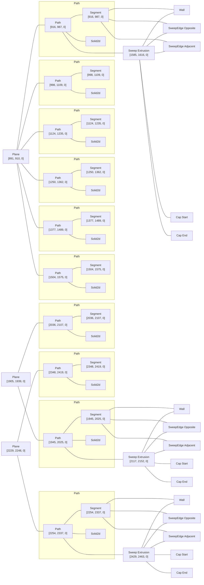

```mermaid
flowchart LR
  subgraph path2 [Path]
    2["Path<br>[916, 987, 0]"]
    3["Segment<br>[916, 987, 0]"]
    4[Solid2d]
  end
  subgraph path5 [Path]
    5["Path<br>[998, 1109, 0]"]
    6["Segment<br>[998, 1109, 0]"]
    7[Solid2d]
  end
  subgraph path8 [Path]
    8["Path<br>[1124, 1235, 0]"]
    9["Segment<br>[1124, 1235, 0]"]
    10[Solid2d]
  end
  subgraph path11 [Path]
    11["Path<br>[1250, 1362, 0]"]
    12["Segment<br>[1250, 1362, 0]"]
    13[Solid2d]
  end
  subgraph path14 [Path]
    14["Path<br>[1377, 1489, 0]"]
    15["Segment<br>[1377, 1489, 0]"]
    16[Solid2d]
  end
  subgraph path17 [Path]
    17["Path<br>[1504, 1575, 0]"]
    18["Segment<br>[1504, 1575, 0]"]
    19[Solid2d]
  end
  subgraph path27 [Path]
    27["Path<br>[1945, 2025, 0]"]
    28["Segment<br>[1945, 2025, 0]"]
    29[Solid2d]
  end
  subgraph path30 [Path]
    30["Path<br>[2036, 2107, 0]"]
    31["Segment<br>[2036, 2107, 0]"]
    32[Solid2d]
  end
  subgraph path40 [Path]
    40["Path<br>[2254, 2337, 0]"]
    41["Segment<br>[2254, 2337, 0]"]
    42[Solid2d]
  end
  subgraph path43 [Path]
    43["Path<br>[2348, 2419, 0]"]
    44["Segment<br>[2348, 2419, 0]"]
    45[Solid2d]
  end
  1["Plane<br>[891, 910, 0]"]
  20["Sweep Extrusion<br>[1585, 1616, 0]"]
  21[Wall]
  22["Cap Start"]
  23["Cap End"]
  24["SweepEdge Opposite"]
  25["SweepEdge Adjacent"]
  26["Plane<br>[1905, 1939, 0]"]
  33["Sweep Extrusion<br>[2117, 2152, 0]"]
  34[Wall]
  35["Cap Start"]
  36["Cap End"]
  37["SweepEdge Opposite"]
  38["SweepEdge Adjacent"]
  39["Plane<br>[2229, 2248, 0]"]
  46["Sweep Extrusion<br>[2429, 2463, 0]"]
  47[Wall]
  48["Cap Start"]
  49["Cap End"]
  50["SweepEdge Opposite"]
  51["SweepEdge Adjacent"]
  1 --- 2
  1 --- 5
  1 --- 8
  1 --- 11
  1 --- 14
  1 --- 17
  2 --- 3
  2 ---- 20
  2 --- 4
  3 --- 21
  3 --- 24
  3 --- 25
  5 --- 6
  5 --- 7
  8 --- 9
  8 --- 10
  11 --- 12
  11 --- 13
  14 --- 15
  14 --- 16
  17 --- 18
  17 --- 19
  20 --- 21
  20 --- 22
  20 --- 23
  20 --- 24
  20 --- 25
  26 --- 27
  26 --- 30
  27 --- 28
  27 ---- 33
  27 --- 29
  28 --- 34
  28 --- 37
  28 --- 38
  30 --- 31
  30 --- 32
  33 --- 34
  33 --- 35
  33 --- 36
  33 --- 37
  33 --- 38
  39 --- 40
  39 --- 43
  40 --- 41
  40 ---- 46
  40 --- 42
  41 --- 47
  41 --- 50
  41 --- 51
  43 --- 44
  43 --- 45
  46 --- 47
  46 --- 48
  46 --- 49
  46 --- 50
  46 --- 51
```
