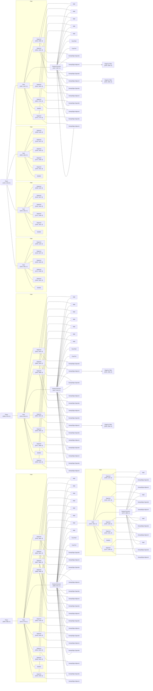

```mermaid
flowchart LR
  subgraph path2 [Path]
    2["Path<br>[1497, 1547, 0]"]
    3["Segment<br>[1553, 1585, 0]"]
    4["Segment<br>[1591, 1616, 0]"]
    5["Segment<br>[1622, 1655, 0]"]
    6["Segment<br>[1661, 1761, 0]"]
    7["Segment<br>[1767, 1774, 0]"]
    8[Solid2d]
  end
  subgraph path9 [Path]
    9["Path<br>[1020, 1061, 0]"]
    10["Segment<br>[1069, 1126, 0]"]
    11["Segment<br>[1134, 1197, 0]"]
    12["Segment<br>[1205, 1263, 0]"]
    13["Segment<br>[1271, 1336, 0]"]
    14["Segment<br>[1344, 1351, 0]"]
    15[Solid2d]
  end
  subgraph path16 [Path]
    16["Path<br>[1020, 1061, 0]"]
    17["Segment<br>[1069, 1126, 0]"]
    18["Segment<br>[1134, 1197, 0]"]
    19["Segment<br>[1205, 1263, 0]"]
    20["Segment<br>[1271, 1336, 0]"]
    21["Segment<br>[1344, 1351, 0]"]
    22[Solid2d]
  end
  subgraph path23 [Path]
    23["Path<br>[1020, 1061, 0]"]
    24["Segment<br>[1069, 1126, 0]"]
    25["Segment<br>[1134, 1197, 0]"]
    26["Segment<br>[1205, 1263, 0]"]
    27["Segment<br>[1271, 1336, 0]"]
    28["Segment<br>[1344, 1351, 0]"]
    29[Solid2d]
  end
  subgraph path49 [Path]
    49["Path<br>[2763, 2813, 0]"]
    50["Segment<br>[2819, 2878, 0]"]
    51["Segment<br>[2884, 2919, 0]"]
    52["Segment<br>[2925, 2958, 0]"]
    53["Segment<br>[2964, 3023, 0]"]
    54["Segment<br>[3029, 3065, 0]"]
    55["Segment<br>[3071, 3089, 0]"]
    56["Segment<br>[3095, 3102, 0]"]
    57[Solid2d]
  end
  subgraph path83 [Path]
    83["Path<br>[3730, 3776, 0]"]
    84["Segment<br>[3782, 3826, 0]"]
    85["Segment<br>[3832, 3931, 0]"]
    86["Segment<br>[3937, 3982, 0]"]
    87["Segment<br>[3988, 4086, 0]"]
    88["Segment<br>[4092, 4139, 0]"]
    89["Segment<br>[4145, 4245, 0]"]
    90["Segment<br>[4251, 4313, 0]"]
    91["Segment<br>[4319, 4420, 0]"]
    92["Segment<br>[4426, 4433, 0]"]
    93[Solid2d]
  end
  subgraph path121 [Path]
    121["Path<br>[1020, 1061, 0]"]
    122["Segment<br>[1069, 1126, 0]"]
    123["Segment<br>[1134, 1197, 0]"]
    124["Segment<br>[1205, 1263, 0]"]
    125["Segment<br>[1271, 1336, 0]"]
    126["Segment<br>[1344, 1351, 0]"]
    127[Solid2d]
  end
  1["Plane<br>[1424, 1443, 0]"]
  30["Sweep Extrusion<br>[2337, 2387, 0]"]
  31[Wall]
  32[Wall]
  33[Wall]
  34[Wall]
  35[Wall]
  36["Cap Start"]
  37["Cap End"]
  38["SweepEdge Opposite"]
  39["SweepEdge Adjacent"]
  40["SweepEdge Opposite"]
  41["SweepEdge Adjacent"]
  42["SweepEdge Opposite"]
  43["SweepEdge Adjacent"]
  44["SweepEdge Opposite"]
  45["SweepEdge Adjacent"]
  46["SweepEdge Opposite"]
  47["SweepEdge Adjacent"]
  48["Plane<br>[2658, 2702, 0]"]
  58["Sweep Extrusion<br>[3147, 3191, 0]"]
  59[Wall]
  60[Wall]
  61[Wall]
  62[Wall]
  63[Wall]
  64[Wall]
  65[Wall]
  66["Cap Start"]
  67["Cap End"]
  68["SweepEdge Opposite"]
  69["SweepEdge Adjacent"]
  70["SweepEdge Opposite"]
  71["SweepEdge Adjacent"]
  72["SweepEdge Opposite"]
  73["SweepEdge Adjacent"]
  74["SweepEdge Opposite"]
  75["SweepEdge Adjacent"]
  76["SweepEdge Opposite"]
  77["SweepEdge Adjacent"]
  78["SweepEdge Opposite"]
  79["SweepEdge Adjacent"]
  80["SweepEdge Opposite"]
  81["SweepEdge Adjacent"]
  82["Plane<br>[3656, 3682, 0]"]
  94["Sweep Extrusion<br>[4489, 4531, 0]"]
  95[Wall]
  96[Wall]
  97[Wall]
  98[Wall]
  99[Wall]
  100[Wall]
  101[Wall]
  102[Wall]
  103["Cap Start"]
  104["Cap End"]
  105["SweepEdge Opposite"]
  106["SweepEdge Adjacent"]
  107["SweepEdge Opposite"]
  108["SweepEdge Adjacent"]
  109["SweepEdge Opposite"]
  110["SweepEdge Adjacent"]
  111["SweepEdge Opposite"]
  112["SweepEdge Adjacent"]
  113["SweepEdge Opposite"]
  114["SweepEdge Adjacent"]
  115["SweepEdge Opposite"]
  116["SweepEdge Adjacent"]
  117["SweepEdge Opposite"]
  118["SweepEdge Adjacent"]
  119["SweepEdge Opposite"]
  120["SweepEdge Adjacent"]
  128["Sweep Extrusion<br>[4757, 4805, 0]"]
  129[Wall]
  130[Wall]
  131[Wall]
  132[Wall]
  133["SweepEdge Opposite"]
  134["SweepEdge Adjacent"]
  135["SweepEdge Opposite"]
  136["SweepEdge Adjacent"]
  137["SweepEdge Opposite"]
  138["SweepEdge Adjacent"]
  139["SweepEdge Opposite"]
  140["SweepEdge Adjacent"]
  141["EdgeCut Fillet<br>[2424, 2564, 0]"]
  142["EdgeCut Fillet<br>[2424, 2564, 0]"]
  143["EdgeCut Fillet<br>[3234, 3364, 0]"]
  144["EdgeCut Fillet<br>[3234, 3364, 0]"]
  1 --- 2
  1 --- 9
  1 --- 16
  1 --- 23
  2 --- 3
  2 --- 4
  2 --- 5
  2 --- 6
  2 --- 7
  2 ---- 30
  2 --- 8
  3 --- 31
  3 --- 38
  3 --- 39
  4 --- 32
  4 --- 40
  4 --- 41
  5 --- 33
  5 --- 42
  5 --- 43
  6 --- 34
  6 --- 44
  6 --- 45
  7 --- 35
  7 --- 46
  7 --- 47
  9 --- 10
  9 --- 11
  9 --- 12
  9 --- 13
  9 --- 14
  9 --- 15
  16 --- 17
  16 --- 18
  16 --- 19
  16 --- 20
  16 --- 21
  16 --- 22
  23 --- 24
  23 --- 25
  23 --- 26
  23 --- 27
  23 --- 28
  23 --- 29
  30 --- 31
  30 --- 32
  30 --- 33
  30 --- 34
  30 --- 35
  30 --- 36
  30 --- 37
  30 --- 38
  30 --- 39
  30 --- 40
  30 --- 41
  30 --- 42
  30 --- 43
  30 --- 44
  30 --- 45
  30 --- 46
  30 --- 47
  48 --- 49
  49 --- 50
  49 --- 51
  49 --- 52
  49 --- 53
  49 --- 54
  49 --- 55
  49 --- 56
  49 ---- 58
  49 --- 57
  50 --- 59
  50 --- 68
  50 --- 69
  51 --- 60
  51 --- 70
  51 --- 71
  52 --- 61
  52 --- 72
  52 --- 73
  53 --- 62
  53 --- 74
  53 --- 75
  54 --- 63
  54 --- 76
  54 --- 77
  55 --- 64
  55 --- 78
  55 --- 79
  56 --- 65
  56 --- 80
  56 --- 81
  58 --- 59
  58 --- 60
  58 --- 61
  58 --- 62
  58 --- 63
  58 --- 64
  58 --- 65
  58 --- 66
  58 --- 67
  58 --- 68
  58 --- 69
  58 --- 70
  58 --- 71
  58 --- 72
  58 --- 73
  58 --- 74
  58 --- 75
  58 --- 76
  58 --- 77
  58 --- 78
  58 --- 79
  58 --- 80
  58 --- 81
  82 --- 83
  83 --- 84
  83 --- 85
  83 --- 86
  83 --- 87
  83 --- 88
  83 --- 89
  83 --- 90
  83 --- 91
  83 --- 92
  83 ---- 94
  83 --- 93
  84 --- 95
  84 --- 105
  84 --- 106
  85 --- 96
  85 --- 107
  85 --- 108
  86 --- 97
  86 --- 109
  86 --- 110
  87 --- 98
  87 --- 111
  87 --- 112
  88 --- 99
  88 --- 113
  88 --- 114
  89 --- 100
  89 --- 115
  89 --- 116
  90 --- 101
  90 --- 117
  90 --- 118
  91 --- 102
  91 --- 119
  91 --- 120
  94 --- 95
  94 --- 96
  94 --- 97
  94 --- 98
  94 --- 99
  94 --- 100
  94 --- 101
  94 --- 102
  94 --- 103
  94 --- 104
  94 --- 105
  94 --- 106
  94 --- 107
  94 --- 108
  94 --- 109
  94 --- 110
  94 --- 111
  94 --- 112
  94 --- 113
  94 --- 114
  94 --- 115
  94 --- 116
  94 --- 117
  94 --- 118
  94 --- 119
  94 --- 120
  101 --- 121
  121 --- 122
  121 --- 123
  121 --- 124
  121 --- 125
  121 --- 126
  121 ---- 128
  121 --- 127
  122 --- 129
  122 --- 133
  122 --- 134
  123 --- 130
  123 --- 135
  123 --- 136
  124 --- 131
  124 --- 137
  124 --- 138
  125 --- 132
  125 --- 139
  125 --- 140
  128 --- 129
  128 --- 130
  128 --- 131
  128 --- 132
  128 --- 133
  128 --- 134
  128 --- 135
  128 --- 136
  128 --- 137
  128 --- 138
  128 --- 139
  128 --- 140
  41 <--x 141
  39 <--x 142
  69 <--x 143
  75 <--x 144
```
