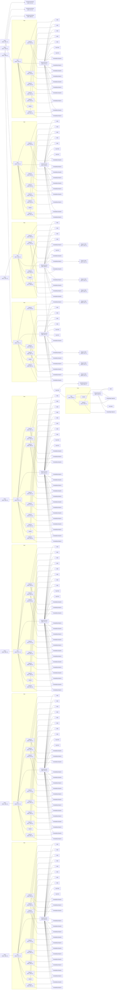

```mermaid
flowchart LR
  subgraph path2 [Path]
    2["Path<br>[1186, 1232, 0]"]
    3["Segment<br>[1240, 1256, 0]"]
    4["Segment<br>[1264, 1288, 0]"]
    5["Segment<br>[1296, 1355, 0]"]
    6["Segment<br>[1363, 1384, 0]"]
    7["Segment<br>[1392, 1451, 0]"]
    8["Segment<br>[1459, 1466, 0]"]
    9[Solid2d]
  end
  subgraph path29 [Path]
    29["Path<br>[1186, 1232, 0]"]
    30["Segment<br>[1240, 1256, 0]"]
    31["Segment<br>[1264, 1288, 0]"]
    32["Segment<br>[1296, 1355, 0]"]
    33["Segment<br>[1363, 1384, 0]"]
    34["Segment<br>[1392, 1451, 0]"]
    35["Segment<br>[1459, 1466, 0]"]
    36[Solid2d]
  end
  subgraph path56 [Path]
    56["Path<br>[2537, 2625, 0]"]
    57["Segment<br>[2631, 2695, 0]"]
    58["Segment<br>[2701, 2765, 0]"]
    59["Segment<br>[2771, 2809, 0]"]
    60["Segment<br>[2815, 2836, 0]"]
    61[Solid2d]
  end
  subgraph path81 [Path]
    81["Path<br>[3161, 3326, 0]"]
    82["Segment<br>[3161, 3326, 0]"]
    83[Solid2d]
  end
  subgraph path90 [Path]
    90["Path<br>[4695, 4720, 0]"]
    91["Segment<br>[4726, 4786, 0]"]
    92["Segment<br>[4792, 4853, 0]"]
    93["Segment<br>[4859, 4897, 0]"]
    94["Segment<br>[4903, 4924, 0]"]
    95[Solid2d]
  end
  subgraph path116 [Path]
    116["Path<br>[5392, 5417, 0]"]
    117["Segment<br>[5465, 5508, 0]"]
    118["Segment<br>[5516, 5625, 0]"]
    119["Segment<br>[5700, 5749, 0]"]
    120["Segment<br>[5757, 5776, 0]"]
    121["Segment<br>[5784, 5842, 0]"]
    122["Segment<br>[5850, 5869, 0]"]
    123["Segment<br>[5877, 5936, 0]"]
    124["Segment<br>[5944, 5951, 0]"]
    125[Solid2d]
  end
  subgraph path154 [Path]
    154["Path<br>[5392, 5417, 0]"]
    155["Segment<br>[5465, 5508, 0]"]
    156["Segment<br>[5516, 5625, 0]"]
    157["Segment<br>[5700, 5749, 0]"]
    158["Segment<br>[5757, 5776, 0]"]
    159["Segment<br>[5784, 5842, 0]"]
    160["Segment<br>[5850, 5869, 0]"]
    161["Segment<br>[5877, 5936, 0]"]
    162["Segment<br>[5944, 5951, 0]"]
    163[Solid2d]
  end
  subgraph path192 [Path]
    192["Path<br>[5392, 5417, 0]"]
    193["Segment<br>[5465, 5508, 0]"]
    194["Segment<br>[5516, 5625, 0]"]
    195["Segment<br>[5700, 5749, 0]"]
    196["Segment<br>[5757, 5776, 0]"]
    197["Segment<br>[5784, 5842, 0]"]
    198["Segment<br>[5850, 5869, 0]"]
    199["Segment<br>[5877, 5936, 0]"]
    200["Segment<br>[5944, 5951, 0]"]
    201[Solid2d]
  end
  subgraph path230 [Path]
    230["Path<br>[5392, 5417, 0]"]
    231["Segment<br>[5465, 5508, 0]"]
    232["Segment<br>[5516, 5625, 0]"]
    233["Segment<br>[5700, 5749, 0]"]
    234["Segment<br>[5757, 5776, 0]"]
    235["Segment<br>[5784, 5842, 0]"]
    236["Segment<br>[5850, 5869, 0]"]
    237["Segment<br>[5877, 5936, 0]"]
    238["Segment<br>[5944, 5951, 0]"]
    239[Solid2d]
  end
  1["Plane<br>[1552, 1601, 0]"]
  10["Sweep Extrusion<br>[1539, 1644, 0]"]
  11[Wall]
  12[Wall]
  13[Wall]
  14[Wall]
  15[Wall]
  16["Cap Start"]
  17["Cap End"]
  18["SweepEdge Opposite"]
  19["SweepEdge Adjacent"]
  20["SweepEdge Opposite"]
  21["SweepEdge Adjacent"]
  22["SweepEdge Opposite"]
  23["SweepEdge Adjacent"]
  24["SweepEdge Opposite"]
  25["SweepEdge Adjacent"]
  26["SweepEdge Opposite"]
  27["SweepEdge Adjacent"]
  28["Plane<br>[2187, 2236, 0]"]
  37["Sweep Revolve<br>[2141, 2238, 0]"]
  38[Wall]
  39[Wall]
  40[Wall]
  41[Wall]
  42[Wall]
  43["Cap Start"]
  44["Cap End"]
  45["SweepEdge Opposite"]
  46["SweepEdge Adjacent"]
  47["SweepEdge Opposite"]
  48["SweepEdge Adjacent"]
  49["SweepEdge Opposite"]
  50["SweepEdge Adjacent"]
  51["SweepEdge Opposite"]
  52["SweepEdge Adjacent"]
  53["SweepEdge Opposite"]
  54["SweepEdge Adjacent"]
  55["Plane<br>[2512, 2531, 0]"]
  62["Sweep Extrusion<br>[2842, 2866, 0]"]
  63[Wall]
  64[Wall]
  65[Wall]
  66[Wall]
  67["Cap Start"]
  68["Cap End"]
  69["SweepEdge Opposite"]
  70["SweepEdge Adjacent"]
  71["SweepEdge Opposite"]
  72["SweepEdge Adjacent"]
  73["SweepEdge Opposite"]
  74["SweepEdge Adjacent"]
  75["SweepEdge Opposite"]
  76["SweepEdge Adjacent"]
  77["EdgeCut Fillet<br>[2872, 3101, 0]"]
  78["EdgeCut Fillet<br>[2872, 3101, 0]"]
  79["EdgeCut Fillet<br>[2872, 3101, 0]"]
  80["EdgeCut Fillet<br>[2872, 3101, 0]"]
  84["Sweep Extrusion<br>[3547, 3574, 0]"]
  85[Wall]
  86["Cap Start"]
  87["SweepEdge Opposite"]
  88["SweepEdge Adjacent"]
  89["Plane<br>[4654, 4688, 0]"]
  96["Sweep Extrusion<br>[4930, 4974, 0]"]
  97[Wall]
  98[Wall]
  99[Wall]
  100[Wall]
  101["Cap Start"]
  102["Cap End"]
  103["SweepEdge Opposite"]
  104["SweepEdge Adjacent"]
  105["SweepEdge Opposite"]
  106["SweepEdge Adjacent"]
  107["SweepEdge Opposite"]
  108["SweepEdge Adjacent"]
  109["SweepEdge Opposite"]
  110["SweepEdge Adjacent"]
  111["EdgeCut Fillet<br>[4980, 5212, 0]"]
  112["EdgeCut Fillet<br>[4980, 5212, 0]"]
  113["EdgeCut Fillet<br>[4980, 5212, 0]"]
  114["EdgeCut Fillet<br>[4980, 5212, 0]"]
  115["Plane<br>[5364, 5384, 0]"]
  126["Sweep Extrusion<br>[6722, 6834, 0]"]
  127[Wall]
  128[Wall]
  129[Wall]
  130[Wall]
  131[Wall]
  132[Wall]
  133[Wall]
  134[Wall]
  135["Cap Start"]
  136["Cap End"]
  137["SweepEdge Opposite"]
  138["SweepEdge Adjacent"]
  139["SweepEdge Opposite"]
  140["SweepEdge Adjacent"]
  141["SweepEdge Opposite"]
  142["SweepEdge Adjacent"]
  143["SweepEdge Opposite"]
  144["SweepEdge Adjacent"]
  145["SweepEdge Opposite"]
  146["SweepEdge Adjacent"]
  147["SweepEdge Opposite"]
  148["SweepEdge Adjacent"]
  149["SweepEdge Opposite"]
  150["SweepEdge Adjacent"]
  151["SweepEdge Opposite"]
  152["SweepEdge Adjacent"]
  153["Plane<br>[5364, 5384, 0]"]
  164["Sweep Extrusion<br>[6900, 7014, 0]"]
  165[Wall]
  166[Wall]
  167[Wall]
  168[Wall]
  169[Wall]
  170[Wall]
  171[Wall]
  172[Wall]
  173["Cap Start"]
  174["Cap End"]
  175["SweepEdge Opposite"]
  176["SweepEdge Adjacent"]
  177["SweepEdge Opposite"]
  178["SweepEdge Adjacent"]
  179["SweepEdge Opposite"]
  180["SweepEdge Adjacent"]
  181["SweepEdge Opposite"]
  182["SweepEdge Adjacent"]
  183["SweepEdge Opposite"]
  184["SweepEdge Adjacent"]
  185["SweepEdge Opposite"]
  186["SweepEdge Adjacent"]
  187["SweepEdge Opposite"]
  188["SweepEdge Adjacent"]
  189["SweepEdge Opposite"]
  190["SweepEdge Adjacent"]
  191["Plane<br>[5364, 5384, 0]"]
  202["Sweep Revolve<br>[7854, 7913, 0]"]
  203[Wall]
  204[Wall]
  205[Wall]
  206[Wall]
  207[Wall]
  208[Wall]
  209[Wall]
  210[Wall]
  211["Cap Start"]
  212["Cap End"]
  213["SweepEdge Opposite"]
  214["SweepEdge Adjacent"]
  215["SweepEdge Opposite"]
  216["SweepEdge Adjacent"]
  217["SweepEdge Opposite"]
  218["SweepEdge Adjacent"]
  219["SweepEdge Opposite"]
  220["SweepEdge Adjacent"]
  221["SweepEdge Opposite"]
  222["SweepEdge Adjacent"]
  223["SweepEdge Opposite"]
  224["SweepEdge Adjacent"]
  225["SweepEdge Opposite"]
  226["SweepEdge Adjacent"]
  227["SweepEdge Opposite"]
  228["SweepEdge Adjacent"]
  229["Plane<br>[5364, 5384, 0]"]
  240["Sweep Revolve<br>[7975, 8033, 0]"]
  241[Wall]
  242[Wall]
  243[Wall]
  244[Wall]
  245[Wall]
  246[Wall]
  247[Wall]
  248[Wall]
  249["Cap Start"]
  250["Cap End"]
  251["SweepEdge Opposite"]
  252["SweepEdge Adjacent"]
  253["SweepEdge Opposite"]
  254["SweepEdge Adjacent"]
  255["SweepEdge Opposite"]
  256["SweepEdge Adjacent"]
  257["SweepEdge Opposite"]
  258["SweepEdge Adjacent"]
  259["SweepEdge Opposite"]
  260["SweepEdge Adjacent"]
  261["SweepEdge Opposite"]
  262["SweepEdge Adjacent"]
  263["SweepEdge Opposite"]
  264["SweepEdge Adjacent"]
  265["SweepEdge Opposite"]
  266["SweepEdge Adjacent"]
  267["StartSketchOnPlane<br>[1158, 1178, 0]"]
  268["StartSketchOnPlane<br>[1158, 1178, 0]"]
  269["StartSketchOnFace<br>[3118, 3155, 0]"]
  270["StartSketchOnPlane<br>[4640, 4689, 0]"]
  1 --- 2
  2 --- 3
  2 --- 4
  2 --- 5
  2 --- 6
  2 --- 7
  2 --- 8
  2 ---- 10
  2 --- 9
  3 --- 11
  3 --- 18
  3 --- 19
  4 --- 12
  4 --- 20
  4 --- 21
  5 --- 13
  5 --- 22
  5 --- 23
  6 --- 14
  6 --- 24
  6 --- 25
  7 --- 15
  7 --- 26
  7 --- 27
  10 --- 11
  10 --- 12
  10 --- 13
  10 --- 14
  10 --- 15
  10 --- 16
  10 --- 17
  10 --- 18
  10 --- 19
  10 --- 20
  10 --- 21
  10 --- 22
  10 --- 23
  10 --- 24
  10 --- 25
  10 --- 26
  10 --- 27
  28 --- 29
  29 --- 30
  29 --- 31
  29 --- 32
  29 --- 33
  29 --- 34
  29 --- 35
  29 ---- 37
  29 --- 36
  30 --- 38
  30 --- 45
  30 --- 46
  31 --- 39
  31 --- 47
  31 --- 48
  32 --- 40
  32 --- 49
  32 --- 50
  33 --- 41
  33 --- 51
  33 --- 52
  34 --- 42
  34 --- 53
  34 --- 54
  37 --- 38
  37 --- 39
  37 --- 40
  37 --- 41
  37 --- 42
  37 --- 43
  37 --- 44
  37 --- 45
  37 --- 46
  37 --- 47
  37 --- 48
  37 --- 49
  37 --- 50
  37 --- 51
  37 --- 52
  37 --- 53
  37 --- 54
  55 --- 56
  56 --- 57
  56 --- 58
  56 --- 59
  56 --- 60
  56 ---- 62
  56 --- 61
  57 --- 63
  57 --- 69
  57 --- 70
  58 --- 64
  58 --- 71
  58 --- 72
  59 --- 65
  59 --- 73
  59 --- 74
  60 --- 66
  60 --- 75
  60 --- 76
  62 --- 63
  62 --- 64
  62 --- 65
  62 --- 66
  62 --- 67
  62 --- 68
  62 --- 69
  62 --- 70
  62 --- 71
  62 --- 72
  62 --- 73
  62 --- 74
  62 --- 75
  62 --- 76
  67 --- 81
  70 <--x 77
  76 <--x 78
  74 <--x 79
  72 <--x 80
  81 --- 82
  81 ---- 84
  81 --- 83
  82 --- 85
  82 --- 87
  82 --- 88
  84 --- 85
  84 --- 86
  84 --- 87
  84 --- 88
  89 --- 90
  90 --- 91
  90 --- 92
  90 --- 93
  90 --- 94
  90 ---- 96
  90 --- 95
  91 --- 97
  91 --- 103
  91 --- 104
  92 --- 98
  92 --- 105
  92 --- 106
  93 --- 99
  93 --- 107
  93 --- 108
  94 --- 100
  94 --- 109
  94 --- 110
  96 --- 97
  96 --- 98
  96 --- 99
  96 --- 100
  96 --- 101
  96 --- 102
  96 --- 103
  96 --- 104
  96 --- 105
  96 --- 106
  96 --- 107
  96 --- 108
  96 --- 109
  96 --- 110
  104 <--x 111
  110 <--x 112
  108 <--x 113
  106 <--x 114
  115 --- 116
  116 --- 117
  116 --- 118
  116 --- 119
  116 --- 120
  116 --- 121
  116 --- 122
  116 --- 123
  116 --- 124
  116 ---- 126
  116 --- 125
  117 --- 134
  117 --- 151
  117 --- 152
  118 --- 133
  118 --- 149
  118 --- 150
  119 --- 132
  119 --- 147
  119 --- 148
  120 --- 131
  120 --- 145
  120 --- 146
  121 --- 130
  121 --- 143
  121 --- 144
  122 --- 129
  122 --- 141
  122 --- 142
  123 --- 128
  123 --- 139
  123 --- 140
  124 --- 127
  124 --- 137
  124 --- 138
  126 --- 127
  126 --- 128
  126 --- 129
  126 --- 130
  126 --- 131
  126 --- 132
  126 --- 133
  126 --- 134
  126 --- 135
  126 --- 136
  126 --- 137
  126 --- 138
  126 --- 139
  126 --- 140
  126 --- 141
  126 --- 142
  126 --- 143
  126 --- 144
  126 --- 145
  126 --- 146
  126 --- 147
  126 --- 148
  126 --- 149
  126 --- 150
  126 --- 151
  126 --- 152
  153 --- 154
  154 --- 155
  154 --- 156
  154 --- 157
  154 --- 158
  154 --- 159
  154 --- 160
  154 --- 161
  154 --- 162
  154 ---- 164
  154 --- 163
  155 --- 165
  155 --- 175
  155 --- 176
  156 --- 166
  156 --- 177
  156 --- 178
  157 --- 167
  157 --- 179
  157 --- 180
  158 --- 168
  158 --- 181
  158 --- 182
  159 --- 169
  159 --- 183
  159 --- 184
  160 --- 170
  160 --- 185
  160 --- 186
  161 --- 171
  161 --- 187
  161 --- 188
  162 --- 172
  162 --- 189
  162 --- 190
  164 --- 165
  164 --- 166
  164 --- 167
  164 --- 168
  164 --- 169
  164 --- 170
  164 --- 171
  164 --- 172
  164 --- 173
  164 --- 174
  164 --- 175
  164 --- 176
  164 --- 177
  164 --- 178
  164 --- 179
  164 --- 180
  164 --- 181
  164 --- 182
  164 --- 183
  164 --- 184
  164 --- 185
  164 --- 186
  164 --- 187
  164 --- 188
  164 --- 189
  164 --- 190
  191 --- 192
  192 --- 193
  192 --- 194
  192 --- 195
  192 --- 196
  192 --- 197
  192 --- 198
  192 --- 199
  192 --- 200
  192 ---- 202
  192 --- 201
  193 --- 203
  193 --- 213
  193 --- 214
  194 --- 204
  194 --- 215
  194 --- 216
  195 --- 205
  195 --- 217
  195 --- 218
  196 --- 206
  196 --- 219
  196 --- 220
  197 --- 207
  197 --- 221
  197 --- 222
  198 --- 208
  198 --- 223
  198 --- 224
  199 --- 209
  199 --- 225
  199 --- 226
  200 --- 210
  200 --- 227
  200 --- 228
  202 --- 203
  202 --- 204
  202 --- 205
  202 --- 206
  202 --- 207
  202 --- 208
  202 --- 209
  202 --- 210
  202 --- 211
  202 --- 212
  202 --- 213
  202 --- 214
  202 --- 215
  202 --- 216
  202 --- 217
  202 --- 218
  202 --- 219
  202 --- 220
  202 --- 221
  202 --- 222
  202 --- 223
  202 --- 224
  202 --- 225
  202 --- 226
  202 --- 227
  202 --- 228
  229 --- 230
  230 --- 231
  230 --- 232
  230 --- 233
  230 --- 234
  230 --- 235
  230 --- 236
  230 --- 237
  230 --- 238
  230 ---- 240
  230 --- 239
  231 --- 241
  231 --- 251
  231 --- 252
  232 --- 242
  232 --- 253
  232 --- 254
  233 --- 243
  233 --- 255
  233 --- 256
  234 --- 244
  234 --- 257
  234 --- 258
  235 --- 245
  235 --- 259
  235 --- 260
  236 --- 246
  236 --- 261
  236 --- 262
  237 --- 247
  237 --- 263
  237 --- 264
  238 --- 248
  238 --- 265
  238 --- 266
  240 --- 241
  240 --- 242
  240 --- 243
  240 --- 244
  240 --- 245
  240 --- 246
  240 --- 247
  240 --- 248
  240 --- 249
  240 --- 250
  240 --- 251
  240 --- 252
  240 --- 253
  240 --- 254
  240 --- 255
  240 --- 256
  240 --- 257
  240 --- 258
  240 --- 259
  240 --- 260
  240 --- 261
  240 --- 262
  240 --- 263
  240 --- 264
  240 --- 265
  240 --- 266
  1 <--x 267
  28 <--x 268
  67 <--x 269
  89 <--x 270
```
