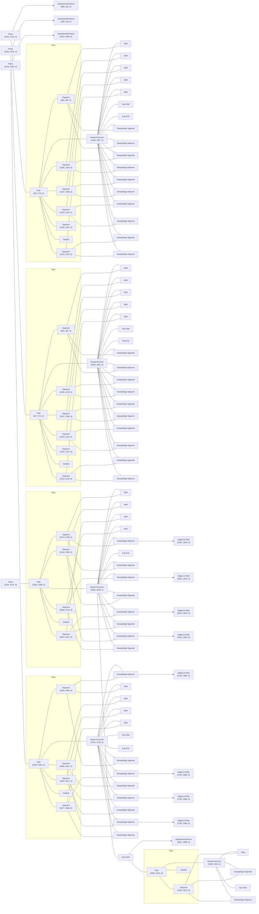

```mermaid
flowchart LR
  subgraph path2 [Path]
    2["Path<br>[927, 973, 0]"]
    3["Segment<br>[981, 997, 0]"]
    4["Segment<br>[1005, 1029, 0]"]
    5["Segment<br>[1037, 1096, 0]"]
    6["Segment<br>[1104, 1125, 0]"]
    7["Segment<br>[1133, 1192, 0]"]
    8["Segment<br>[1200, 1207, 0]"]
    9[Solid2d]
  end
  subgraph path29 [Path]
    29["Path<br>[927, 973, 0]"]
    30["Segment<br>[981, 997, 0]"]
    31["Segment<br>[1005, 1029, 0]"]
    32["Segment<br>[1037, 1096, 0]"]
    33["Segment<br>[1104, 1125, 0]"]
    34["Segment<br>[1133, 1192, 0]"]
    35["Segment<br>[1200, 1207, 0]"]
    36[Solid2d]
  end
  subgraph path56 [Path]
    56["Path<br>[2280, 2368, 0]"]
    57["Segment<br>[2374, 2438, 0]"]
    58["Segment<br>[2444, 2508, 0]"]
    59["Segment<br>[2514, 2552, 0]"]
    60["Segment<br>[2558, 2579, 0]"]
    61[Solid2d]
  end
  subgraph path81 [Path]
    81["Path<br>[2904, 3074, 0]"]
    82["Segment<br>[2904, 3074, 0]"]
    83[Solid2d]
  end
  subgraph path90 [Path]
    90["Path<br>[4469, 4494, 0]"]
    91["Segment<br>[4500, 4560, 0]"]
    92["Segment<br>[4566, 4627, 0]"]
    93["Segment<br>[4633, 4671, 0]"]
    94["Segment<br>[4677, 4698, 0]"]
    95[Solid2d]
  end
  1["Plane<br>[1293, 1342, 0]"]
  10["Sweep Extrusion<br>[1280, 1387, 0]"]
  11[Wall]
  12[Wall]
  13[Wall]
  14[Wall]
  15[Wall]
  16["Cap Start"]
  17["Cap End"]
  18["SweepEdge Opposite"]
  19["SweepEdge Adjacent"]
  20["SweepEdge Opposite"]
  21["SweepEdge Adjacent"]
  22["SweepEdge Opposite"]
  23["SweepEdge Adjacent"]
  24["SweepEdge Opposite"]
  25["SweepEdge Adjacent"]
  26["SweepEdge Opposite"]
  27["SweepEdge Adjacent"]
  28["Plane<br>[1930, 1979, 0]"]
  37["Sweep Revolve<br>[1884, 1981, 0]"]
  38[Wall]
  39[Wall]
  40[Wall]
  41[Wall]
  42[Wall]
  43["Cap Start"]
  44["Cap End"]
  45["SweepEdge Opposite"]
  46["SweepEdge Adjacent"]
  47["SweepEdge Opposite"]
  48["SweepEdge Adjacent"]
  49["SweepEdge Opposite"]
  50["SweepEdge Adjacent"]
  51["SweepEdge Opposite"]
  52["SweepEdge Adjacent"]
  53["SweepEdge Opposite"]
  54["SweepEdge Adjacent"]
  55["Plane<br>[2255, 2274, 0]"]
  62["Sweep Extrusion<br>[2585, 2609, 0]"]
  63[Wall]
  64[Wall]
  65[Wall]
  66[Wall]
  67["Cap Start"]
  68["Cap End"]
  69["SweepEdge Opposite"]
  70["SweepEdge Adjacent"]
  71["SweepEdge Opposite"]
  72["SweepEdge Adjacent"]
  73["SweepEdge Opposite"]
  74["SweepEdge Adjacent"]
  75["SweepEdge Opposite"]
  76["SweepEdge Adjacent"]
  77["EdgeCut Fillet<br>[2615, 2844, 0]"]
  78["EdgeCut Fillet<br>[2615, 2844, 0]"]
  79["EdgeCut Fillet<br>[2615, 2844, 0]"]
  80["EdgeCut Fillet<br>[2615, 2844, 0]"]
  84["Sweep Extrusion<br>[3295, 3322, 0]"]
  85[Wall]
  86["Cap Start"]
  87["SweepEdge Opposite"]
  88["SweepEdge Adjacent"]
  89["Plane<br>[4428, 4462, 0]"]
  96["Sweep Extrusion<br>[4704, 4748, 0]"]
  97[Wall]
  98[Wall]
  99[Wall]
  100[Wall]
  101["Cap Start"]
  102["Cap End"]
  103["SweepEdge Opposite"]
  104["SweepEdge Adjacent"]
  105["SweepEdge Opposite"]
  106["SweepEdge Adjacent"]
  107["SweepEdge Opposite"]
  108["SweepEdge Adjacent"]
  109["SweepEdge Opposite"]
  110["SweepEdge Adjacent"]
  111["EdgeCut Fillet<br>[4754, 4986, 0]"]
  112["EdgeCut Fillet<br>[4754, 4986, 0]"]
  113["EdgeCut Fillet<br>[4754, 4986, 0]"]
  114["EdgeCut Fillet<br>[4754, 4986, 0]"]
  115["StartSketchOnPlane<br>[899, 919, 0]"]
  116["StartSketchOnPlane<br>[899, 919, 0]"]
  117["StartSketchOnFace<br>[2861, 2898, 0]"]
  118["StartSketchOnPlane<br>[4414, 4463, 0]"]
  1 --- 2
  2 --- 3
  2 --- 4
  2 --- 5
  2 --- 6
  2 --- 7
  2 --- 8
  2 ---- 10
  2 --- 9
  3 --- 11
  3 --- 18
  3 --- 19
  4 --- 12
  4 --- 20
  4 --- 21
  5 --- 13
  5 --- 22
  5 --- 23
  6 --- 14
  6 --- 24
  6 --- 25
  7 --- 15
  7 --- 26
  7 --- 27
  10 --- 11
  10 --- 12
  10 --- 13
  10 --- 14
  10 --- 15
  10 --- 16
  10 --- 17
  10 --- 18
  10 --- 19
  10 --- 20
  10 --- 21
  10 --- 22
  10 --- 23
  10 --- 24
  10 --- 25
  10 --- 26
  10 --- 27
  28 --- 29
  29 --- 30
  29 --- 31
  29 --- 32
  29 --- 33
  29 --- 34
  29 --- 35
  29 ---- 37
  29 --- 36
  30 --- 38
  30 --- 45
  30 --- 46
  31 --- 39
  31 --- 47
  31 --- 48
  32 --- 40
  32 --- 49
  32 --- 50
  33 --- 41
  33 --- 51
  33 --- 52
  34 --- 42
  34 --- 53
  34 --- 54
  37 --- 38
  37 --- 39
  37 --- 40
  37 --- 41
  37 --- 42
  37 --- 43
  37 --- 44
  37 --- 45
  37 --- 46
  37 --- 47
  37 --- 48
  37 --- 49
  37 --- 50
  37 --- 51
  37 --- 52
  37 --- 53
  37 --- 54
  55 --- 56
  56 --- 57
  56 --- 58
  56 --- 59
  56 --- 60
  56 ---- 62
  56 --- 61
  57 --- 63
  57 --- 69
  57 --- 70
  58 --- 64
  58 --- 71
  58 --- 72
  59 --- 65
  59 --- 73
  59 --- 74
  60 --- 66
  60 --- 75
  60 --- 76
  62 --- 63
  62 --- 64
  62 --- 65
  62 --- 66
  62 --- 67
  62 --- 68
  62 --- 69
  62 --- 70
  62 --- 71
  62 --- 72
  62 --- 73
  62 --- 74
  62 --- 75
  62 --- 76
  67 --- 81
  70 <--x 77
  76 <--x 78
  74 <--x 79
  72 <--x 80
  81 --- 82
  81 ---- 84
  81 --- 83
  82 --- 85
  82 --- 87
  82 --- 88
  84 --- 85
  84 --- 86
  84 --- 87
  84 --- 88
  89 --- 90
  90 --- 91
  90 --- 92
  90 --- 93
  90 --- 94
  90 ---- 96
  90 --- 95
  91 --- 97
  91 --- 103
  91 --- 104
  92 --- 98
  92 --- 105
  92 --- 106
  93 --- 99
  93 --- 107
  93 --- 108
  94 --- 100
  94 --- 109
  94 --- 110
  96 --- 97
  96 --- 98
  96 --- 99
  96 --- 100
  96 --- 101
  96 --- 102
  96 --- 103
  96 --- 104
  96 --- 105
  96 --- 106
  96 --- 107
  96 --- 108
  96 --- 109
  96 --- 110
  104 <--x 111
  110 <--x 112
  108 <--x 113
  106 <--x 114
  1 <--x 115
  28 <--x 116
  67 <--x 117
  89 <--x 118
```
