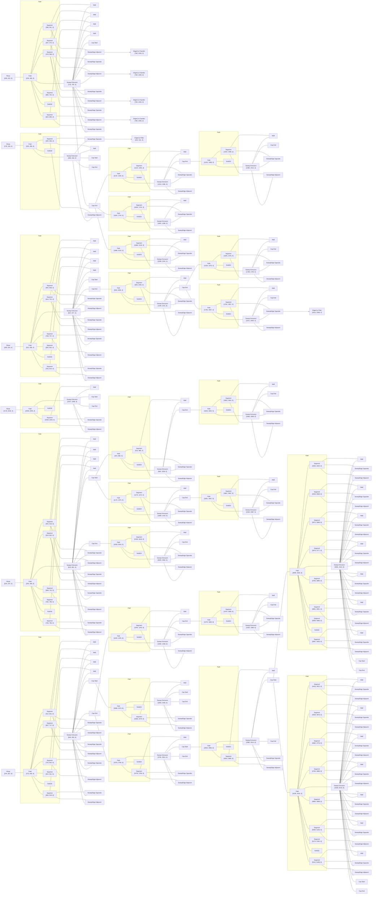

```mermaid
flowchart LR
  subgraph path2 [Path]
    2["Path<br>[228, 283, 3]"]
    3["Segment<br>[289, 351, 3]"]
    4["Segment<br>[357, 472, 3]"]
    5["Segment<br>[478, 598, 3]"]
    6["Segment<br>[604, 689, 3]"]
    7["Segment<br>[695, 702, 3]"]
    8[Solid2d]
  end
  subgraph path28 [Path]
    28["Path<br>[1142, 1200, 3]"]
    29["Segment<br>[1142, 1200, 3]"]
    30[Solid2d]
  end
  subgraph path36 [Path]
    36["Path<br>[1424, 1468, 3]"]
    37["Segment<br>[1424, 1468, 3]"]
    38[Solid2d]
  end
  subgraph path44 [Path]
    44["Path<br>[1600, 1744, 3]"]
    45["Segment<br>[1600, 1744, 3]"]
    46[Solid2d]
  end
  subgraph path51 [Path]
    51["Path<br>[1989, 2133, 3]"]
    52["Segment<br>[1989, 2133, 3]"]
    53[Solid2d]
  end
  subgraph path59 [Path]
    59["Path<br>[205, 266, 4]"]
    60["Segment<br>[205, 266, 4]"]
    61[Solid2d]
  end
  subgraph path69 [Path]
    69["Path<br>[522, 558, 4]"]
    70["Segment<br>[564, 608, 4]"]
    71["Segment<br>[614, 702, 4]"]
    72["Segment<br>[708, 757, 4]"]
    73["Segment<br>[763, 819, 4]"]
    74["Segment<br>[825, 832, 4]"]
    75[Solid2d]
  end
  subgraph path91 [Path]
    91["Path<br>[929, 1095, 4]"]
    92["Segment<br>[929, 1095, 4]"]
    93[Solid2d]
  end
  subgraph path99 [Path]
    99["Path<br>[1325, 1476, 4]"]
    100["Segment<br>[1325, 1476, 4]"]
    101[Solid2d]
  end
  subgraph path107 [Path]
    107["Path<br>[1792, 1957, 4]"]
    108["Segment<br>[1792, 1957, 4]"]
    109[Solid2d]
  end
  subgraph path116 [Path]
    116["Path<br>[2208, 2255, 4]"]
    117["Segment<br>[2208, 2255, 4]"]
    118[Solid2d]
  end
  subgraph path128 [Path]
    128["Path<br>[253, 396, 5]"]
    129["Segment<br>[402, 518, 5]"]
    130["Segment<br>[524, 602, 5]"]
    131["Segment<br>[608, 724, 5]"]
    132["Segment<br>[730, 786, 5]"]
    133["Segment<br>[792, 799, 5]"]
    134[Solid2d]
  end
  subgraph path150 [Path]
    150["Path<br>[915, 980, 5]"]
    151["Segment<br>[915, 980, 5]"]
    152[Solid2d]
  end
  subgraph path158 [Path]
    158["Path<br>[1175, 1374, 5]"]
    159["Segment<br>[1175, 1374, 5]"]
    160[Solid2d]
  end
  subgraph path166 [Path]
    166["Path<br>[1603, 1654, 5]"]
    167["Segment<br>[1603, 1654, 5]"]
    168[Solid2d]
  end
  subgraph path174 [Path]
    174["Path<br>[1891, 2087, 5]"]
    175["Segment<br>[1891, 2087, 5]"]
    176[Solid2d]
  end
  subgraph path182 [Path]
    182["Path<br>[2439, 2618, 5]"]
    183["Segment<br>[2439, 2618, 5]"]
    184[Solid2d]
  end
  subgraph path191 [Path]
    191["Path<br>[273, 506, 6]"]
    192["Segment<br>[512, 631, 6]"]
    193["Segment<br>[637, 717, 6]"]
    194["Segment<br>[723, 842, 6]"]
    195["Segment<br>[848, 918, 6]"]
    196["Segment<br>[924, 931, 6]"]
    197[Solid2d]
  end
  subgraph path213 [Path]
    213["Path<br>[1045, 1245, 6]"]
    214["Segment<br>[1045, 1245, 6]"]
    215[Solid2d]
  end
  subgraph path221 [Path]
    221["Path<br>[1476, 1669, 6]"]
    222["Segment<br>[1476, 1669, 6]"]
    223[Solid2d]
  end
  subgraph path229 [Path]
    229["Path<br>[2089, 2379, 6]"]
    230["Segment<br>[2089, 2379, 6]"]
    231[Solid2d]
  end
  subgraph path238 [Path]
    238["Path<br>[2478, 2766, 6]"]
    239["Segment<br>[2478, 2766, 6]"]
    240[Solid2d]
  end
  subgraph path247 [Path]
    247["Path<br>[2920, 2965, 6]"]
    248["Segment<br>[2920, 2965, 6]"]
    249[Solid2d]
  end
  subgraph path256 [Path]
    256["Path<br>[3095, 3320, 6]"]
    257["Segment<br>[3326, 3420, 6]"]
    258["Segment<br>[3426, 3569, 6]"]
    259["Segment<br>[3575, 3669, 6]"]
    260["Segment<br>[3675, 3777, 6]"]
    261["Segment<br>[3783, 3885, 6]"]
    262["Segment<br>[3891, 3991, 6]"]
    263["Segment<br>[3997, 4053, 6]"]
    264["Segment<br>[4059, 4066, 6]"]
    265[Solid2d]
  end
  subgraph path290 [Path]
    290["Path<br>[4195, 4420, 6]"]
    291["Segment<br>[4426, 4522, 6]"]
    292["Segment<br>[4528, 4676, 6]"]
    293["Segment<br>[4682, 4778, 6]"]
    294["Segment<br>[4784, 4888, 6]"]
    295["Segment<br>[4894, 4998, 6]"]
    296["Segment<br>[5004, 5106, 6]"]
    297["Segment<br>[5112, 5168, 6]"]
    298["Segment<br>[5174, 5181, 6]"]
    299[Solid2d]
  end
  1["Plane<br>[203, 222, 3]"]
  9["Sweep Extrusion<br>[716, 763, 3]"]
  10[Wall]
  11[Wall]
  12[Wall]
  13[Wall]
  14["Cap Start"]
  15["Cap End"]
  16["SweepEdge Opposite"]
  17["SweepEdge Adjacent"]
  18["SweepEdge Opposite"]
  19["SweepEdge Adjacent"]
  20["SweepEdge Opposite"]
  21["SweepEdge Adjacent"]
  22["SweepEdge Opposite"]
  23["SweepEdge Adjacent"]
  24["EdgeCut Chamfer<br>[769, 1050, 3]"]
  25["EdgeCut Chamfer<br>[769, 1050, 3]"]
  26["EdgeCut Chamfer<br>[769, 1050, 3]"]
  27["EdgeCut Chamfer<br>[769, 1050, 3]"]
  31["Sweep Extrusion<br>[1214, 1280, 3]"]
  32[Wall]
  33["Cap End"]
  34["SweepEdge Opposite"]
  35["SweepEdge Adjacent"]
  39["Sweep Extrusion<br>[1482, 1512, 3]"]
  40[Wall]
  41["Cap End"]
  42["SweepEdge Opposite"]
  43["SweepEdge Adjacent"]
  47["Sweep Extrusion<br>[1891, 1938, 3]"]
  48[Wall]
  49["SweepEdge Opposite"]
  50["SweepEdge Adjacent"]
  54["Sweep Extrusion<br>[2268, 2315, 3]"]
  55[Wall]
  56["SweepEdge Opposite"]
  57["SweepEdge Adjacent"]
  58["Plane<br>[176, 199, 4]"]
  62["Sweep Extrusion<br>[280, 318, 4]"]
  63[Wall]
  64["Cap Start"]
  65["Cap End"]
  66["SweepEdge Opposite"]
  67["SweepEdge Adjacent"]
  68["Plane<br>[493, 516, 4]"]
  76["Sweep Extrusion<br>[847, 877, 4]"]
  77[Wall]
  78[Wall]
  79[Wall]
  80[Wall]
  81["Cap Start"]
  82["Cap End"]
  83["SweepEdge Opposite"]
  84["SweepEdge Adjacent"]
  85["SweepEdge Opposite"]
  86["SweepEdge Adjacent"]
  87["SweepEdge Opposite"]
  88["SweepEdge Adjacent"]
  89["SweepEdge Opposite"]
  90["SweepEdge Adjacent"]
  94["Sweep Extrusion<br>[1109, 1141, 4]"]
  95[Wall]
  96["Cap End"]
  97["SweepEdge Opposite"]
  98["SweepEdge Adjacent"]
  102["Sweep Extrusion<br>[1708, 1740, 4]"]
  103[Wall]
  104["Cap End"]
  105["SweepEdge Opposite"]
  106["SweepEdge Adjacent"]
  110["Sweep Extrusion<br>[1971, 2004, 4]"]
  111[Wall]
  112["Cap End"]
  113["SweepEdge Opposite"]
  114["SweepEdge Adjacent"]
  115["Plane<br>[2179, 2202, 4]"]
  119["Sweep Extrusion<br>[2257, 2288, 4]"]
  120[Wall]
  121["Cap Start"]
  122["Cap End"]
  123["SweepEdge Opposite"]
  124["SweepEdge Adjacent"]
  125["EdgeCut Fillet<br>[324, 412, 4]"]
  126["EdgeCut Fillet<br>[2010, 2098, 4]"]
  127["Plane<br>[224, 247, 5]"]
  135["Sweep Extrusion<br>[813, 861, 5]"]
  136[Wall]
  137[Wall]
  138[Wall]
  139[Wall]
  140["Cap Start"]
  141["Cap End"]
  142["SweepEdge Opposite"]
  143["SweepEdge Adjacent"]
  144["SweepEdge Opposite"]
  145["SweepEdge Adjacent"]
  146["SweepEdge Opposite"]
  147["SweepEdge Adjacent"]
  148["SweepEdge Opposite"]
  149["SweepEdge Adjacent"]
  153["Sweep Extrusion<br>[995, 1028, 5]"]
  154[Wall]
  155["Cap End"]
  156["SweepEdge Opposite"]
  157["SweepEdge Adjacent"]
  161["Sweep Extrusion<br>[1389, 1419, 5]"]
  162[Wall]
  163["Cap End"]
  164["SweepEdge Opposite"]
  165["SweepEdge Adjacent"]
  169["Sweep Extrusion<br>[1806, 1839, 5]"]
  170[Wall]
  171["Cap End"]
  172["SweepEdge Opposite"]
  173["SweepEdge Adjacent"]
  177["Sweep Extrusion<br>[2354, 2387, 5]"]
  178[Wall]
  179["Cap End"]
  180["SweepEdge Opposite"]
  181["SweepEdge Adjacent"]
  185["Sweep Extrusion<br>[2620, 2650, 5]"]
  186[Wall]
  187["Cap End"]
  188["SweepEdge Opposite"]
  189["SweepEdge Adjacent"]
  190["Plane<br>[244, 267, 6]"]
  198["Sweep Extrusion<br>[945, 993, 6]"]
  199[Wall]
  200[Wall]
  201[Wall]
  202[Wall]
  203["Cap Start"]
  204["Cap End"]
  205["SweepEdge Opposite"]
  206["SweepEdge Adjacent"]
  207["SweepEdge Opposite"]
  208["SweepEdge Adjacent"]
  209["SweepEdge Opposite"]
  210["SweepEdge Adjacent"]
  211["SweepEdge Opposite"]
  212["SweepEdge Adjacent"]
  216["Sweep Extrusion<br>[1260, 1293, 6]"]
  217[Wall]
  218["Cap End"]
  219["SweepEdge Opposite"]
  220["SweepEdge Adjacent"]
  224["Sweep Extrusion<br>[1933, 1966, 6]"]
  225[Wall]
  226["Cap End"]
  227["SweepEdge Opposite"]
  228["SweepEdge Adjacent"]
  232["Sweep Extrusion<br>[2393, 2426, 6]"]
  233[Wall]
  234["Cap Start"]
  235["Cap End"]
  236["SweepEdge Opposite"]
  237["SweepEdge Adjacent"]
  241["Sweep Extrusion<br>[2781, 2814, 6]"]
  242[Wall]
  243["Cap Start"]
  244["Cap End"]
  245["SweepEdge Opposite"]
  246["SweepEdge Adjacent"]
  250["Sweep Extrusion<br>[2980, 3014, 6]"]
  251[Wall]
  252["Cap Start"]
  253["Cap End"]
  254["SweepEdge Opposite"]
  255["SweepEdge Adjacent"]
  266["Sweep Extrusion<br>[4081, 4114, 6]"]
  267[Wall]
  268[Wall]
  269[Wall]
  270[Wall]
  271[Wall]
  272[Wall]
  273[Wall]
  274["Cap Start"]
  275["Cap End"]
  276["SweepEdge Opposite"]
  277["SweepEdge Adjacent"]
  278["SweepEdge Opposite"]
  279["SweepEdge Adjacent"]
  280["SweepEdge Opposite"]
  281["SweepEdge Adjacent"]
  282["SweepEdge Opposite"]
  283["SweepEdge Adjacent"]
  284["SweepEdge Opposite"]
  285["SweepEdge Adjacent"]
  286["SweepEdge Opposite"]
  287["SweepEdge Adjacent"]
  288["SweepEdge Opposite"]
  289["SweepEdge Adjacent"]
  300["Sweep Extrusion<br>[5183, 5216, 6]"]
  301[Wall]
  302[Wall]
  303[Wall]
  304[Wall]
  305[Wall]
  306[Wall]
  307[Wall]
  308["Cap Start"]
  309["Cap End"]
  310["SweepEdge Opposite"]
  311["SweepEdge Adjacent"]
  312["SweepEdge Opposite"]
  313["SweepEdge Adjacent"]
  314["SweepEdge Opposite"]
  315["SweepEdge Adjacent"]
  316["SweepEdge Opposite"]
  317["SweepEdge Adjacent"]
  318["SweepEdge Opposite"]
  319["SweepEdge Adjacent"]
  320["SweepEdge Opposite"]
  321["SweepEdge Adjacent"]
  322["SweepEdge Opposite"]
  323["SweepEdge Adjacent"]
  1 --- 2
  2 --- 3
  2 --- 4
  2 --- 5
  2 --- 6
  2 --- 7
  2 ---- 9
  2 --- 8
  3 --- 10
  3 --- 16
  3 --- 17
  4 --- 11
  4 --- 18
  4 --- 19
  5 --- 12
  5 --- 20
  5 --- 21
  6 --- 13
  6 --- 22
  6 --- 23
  9 --- 10
  9 --- 11
  9 --- 12
  9 --- 13
  9 --- 14
  9 --- 15
  9 --- 16
  9 --- 17
  9 --- 18
  9 --- 19
  9 --- 20
  9 --- 21
  9 --- 22
  9 --- 23
  15 --- 28
  15 --- 44
  15 --- 51
  17 <--x 24
  19 <--x 25
  21 <--x 26
  23 <--x 27
  28 --- 29
  28 ---- 31
  28 --- 30
  29 --- 32
  29 --- 34
  29 --- 35
  31 --- 32
  31 --- 33
  31 --- 34
  31 --- 35
  33 --- 36
  36 --- 37
  36 ---- 39
  36 --- 38
  37 --- 40
  37 --- 42
  37 --- 43
  39 --- 40
  39 --- 41
  39 --- 42
  39 --- 43
  44 --- 45
  44 ---- 47
  44 --- 46
  45 --- 48
  45 --- 49
  45 --- 50
  47 --- 48
  47 --- 49
  47 --- 50
  51 --- 52
  51 ---- 54
  51 --- 53
  52 --- 55
  52 --- 56
  52 --- 57
  54 --- 55
  54 --- 56
  54 --- 57
  58 --- 59
  59 --- 60
  59 ---- 62
  59 --- 61
  60 --- 63
  60 --- 66
  60 --- 67
  62 --- 63
  62 --- 64
  62 --- 65
  62 --- 66
  62 --- 67
  68 --- 69
  69 --- 70
  69 --- 71
  69 --- 72
  69 --- 73
  69 --- 74
  69 ---- 76
  69 --- 75
  70 --- 77
  70 --- 83
  70 --- 84
  71 --- 78
  71 --- 85
  71 --- 86
  72 --- 79
  72 --- 87
  72 --- 88
  73 --- 80
  73 --- 89
  73 --- 90
  76 --- 77
  76 --- 78
  76 --- 79
  76 --- 80
  76 --- 81
  76 --- 82
  76 --- 83
  76 --- 84
  76 --- 85
  76 --- 86
  76 --- 87
  76 --- 88
  76 --- 89
  76 --- 90
  82 --- 91
  91 --- 92
  91 ---- 94
  91 --- 93
  92 --- 95
  92 --- 97
  92 --- 98
  94 --- 95
  94 --- 96
  94 --- 97
  94 --- 98
  96 --- 99
  96 --- 107
  99 --- 100
  99 ---- 102
  99 --- 101
  100 --- 103
  100 --- 105
  100 --- 106
  102 --- 103
  102 --- 104
  102 --- 105
  102 --- 106
  107 --- 108
  107 ---- 110
  107 --- 109
  108 --- 111
  108 --- 113
  108 --- 114
  110 --- 111
  110 --- 112
  110 --- 113
  110 --- 114
  115 --- 116
  116 --- 117
  116 ---- 119
  116 --- 118
  117 --- 120
  117 --- 123
  117 --- 124
  119 --- 120
  119 --- 121
  119 --- 122
  119 --- 123
  119 --- 124
  66 <--x 125
  113 <--x 126
  127 --- 128
  128 --- 129
  128 --- 130
  128 --- 131
  128 --- 132
  128 --- 133
  128 ---- 135
  128 --- 134
  129 --- 136
  129 --- 142
  129 --- 143
  130 --- 137
  130 --- 144
  130 --- 145
  131 --- 138
  131 --- 146
  131 --- 147
  132 --- 139
  132 --- 148
  132 --- 149
  135 --- 136
  135 --- 137
  135 --- 138
  135 --- 139
  135 --- 140
  135 --- 141
  135 --- 142
  135 --- 143
  135 --- 144
  135 --- 145
  135 --- 146
  135 --- 147
  135 --- 148
  135 --- 149
  140 --- 150
  140 --- 158
  141 --- 182
  150 --- 151
  150 ---- 153
  150 --- 152
  151 --- 154
  151 --- 156
  151 --- 157
  153 --- 154
  153 --- 155
  153 --- 156
  153 --- 157
  155 --- 166
  158 --- 159
  158 ---- 161
  158 --- 160
  159 --- 162
  159 --- 164
  159 --- 165
  161 --- 162
  161 --- 163
  161 --- 164
  161 --- 165
  163 --- 174
  166 --- 167
  166 ---- 169
  166 --- 168
  167 --- 170
  167 --- 172
  167 --- 173
  169 --- 170
  169 --- 171
  169 --- 172
  169 --- 173
  174 --- 175
  174 ---- 177
  174 --- 176
  175 --- 178
  175 --- 180
  175 --- 181
  177 --- 178
  177 --- 179
  177 --- 180
  177 --- 181
  182 --- 183
  182 ---- 185
  182 --- 184
  183 --- 186
  183 --- 188
  183 --- 189
  185 --- 186
  185 --- 187
  185 --- 188
  185 --- 189
  190 --- 191
  191 --- 192
  191 --- 193
  191 --- 194
  191 --- 195
  191 --- 196
  191 ---- 198
  191 --- 197
  192 --- 199
  192 --- 205
  192 --- 206
  193 --- 200
  193 --- 207
  193 --- 208
  194 --- 201
  194 --- 209
  194 --- 210
  195 --- 202
  195 --- 211
  195 --- 212
  198 --- 199
  198 --- 200
  198 --- 201
  198 --- 202
  198 --- 203
  198 --- 204
  198 --- 205
  198 --- 206
  198 --- 207
  198 --- 208
  198 --- 209
  198 --- 210
  198 --- 211
  198 --- 212
  203 --- 229
  204 --- 213
  204 --- 238
  213 --- 214
  213 ---- 216
  213 --- 215
  214 --- 217
  214 --- 219
  214 --- 220
  216 --- 217
  216 --- 218
  216 --- 219
  216 --- 220
  218 --- 221
  221 --- 222
  221 ---- 224
  221 --- 223
  222 --- 225
  222 --- 227
  222 --- 228
  224 --- 225
  224 --- 226
  224 --- 227
  224 --- 228
  229 --- 230
  229 ---- 232
  229 --- 231
  230 --- 233
  230 --- 236
  230 --- 237
  232 --- 233
  232 --- 234
  232 --- 235
  232 --- 236
  232 --- 237
  238 --- 239
  238 ---- 241
  238 --- 240
  239 --- 242
  239 --- 245
  239 --- 246
  241 --- 242
  241 --- 243
  241 --- 244
  241 --- 245
  241 --- 246
  243 --- 247
  247 --- 248
  247 ---- 250
  247 --- 249
  248 --- 251
  248 --- 254
  248 --- 255
  250 --- 251
  250 --- 252
  250 --- 253
  250 --- 254
  250 --- 255
  252 --- 256
  252 --- 290
  256 --- 257
  256 --- 258
  256 --- 259
  256 --- 260
  256 --- 261
  256 --- 262
  256 --- 263
  256 --- 264
  256 ---- 266
  256 --- 265
  257 --- 267
  257 --- 276
  257 --- 277
  258 --- 268
  258 --- 278
  258 --- 279
  259 --- 269
  259 --- 280
  259 --- 281
  260 --- 270
  260 --- 282
  260 --- 283
  261 --- 271
  261 --- 284
  261 --- 285
  262 --- 272
  262 --- 286
  262 --- 287
  263 --- 273
  263 --- 288
  263 --- 289
  266 --- 267
  266 --- 268
  266 --- 269
  266 --- 270
  266 --- 271
  266 --- 272
  266 --- 273
  266 --- 274
  266 --- 275
  266 --- 276
  266 --- 277
  266 --- 278
  266 --- 279
  266 --- 280
  266 --- 281
  266 --- 282
  266 --- 283
  266 --- 284
  266 --- 285
  266 --- 286
  266 --- 287
  266 --- 288
  266 --- 289
  290 --- 291
  290 --- 292
  290 --- 293
  290 --- 294
  290 --- 295
  290 --- 296
  290 --- 297
  290 --- 298
  290 ---- 300
  290 --- 299
  291 --- 307
  291 --- 322
  291 --- 323
  292 --- 306
  292 --- 320
  292 --- 321
  293 --- 305
  293 --- 318
  293 --- 319
  294 --- 304
  294 --- 316
  294 --- 317
  295 --- 303
  295 --- 314
  295 --- 315
  296 --- 302
  296 --- 312
  296 --- 313
  297 --- 301
  297 --- 310
  297 --- 311
  300 --- 301
  300 --- 302
  300 --- 303
  300 --- 304
  300 --- 305
  300 --- 306
  300 --- 307
  300 --- 308
  300 --- 309
  300 --- 310
  300 --- 311
  300 --- 312
  300 --- 313
  300 --- 314
  300 --- 315
  300 --- 316
  300 --- 317
  300 --- 318
  300 --- 319
  300 --- 320
  300 --- 321
  300 --- 322
  300 --- 323
```
