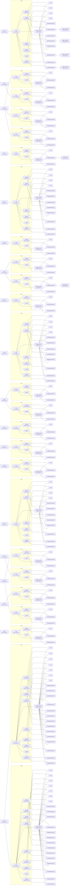

```mermaid
flowchart LR
  subgraph path2 [Path]
    2["Path<br>[228, 283, 3]"]
    3["Segment<br>[289, 351, 3]"]
    4["Segment<br>[357, 472, 3]"]
    5["Segment<br>[478, 598, 3]"]
    6["Segment<br>[604, 689, 3]"]
    7["Segment<br>[695, 702, 3]"]
    8[Solid2d]
  end
  subgraph path27 [Path]
    27["Path<br>[1137, 1195, 3]"]
    28["Segment<br>[1137, 1195, 3]"]
    29[Solid2d]
  end
  subgraph path35 [Path]
    35["Path<br>[1414, 1458, 3]"]
    36["Segment<br>[1414, 1458, 3]"]
    37[Solid2d]
  end
  subgraph path42 [Path]
    42["Path<br>[1590, 1734, 3]"]
    43["Segment<br>[1590, 1734, 3]"]
    44[Solid2d]
  end
  subgraph path49 [Path]
    49["Path<br>[1979, 2123, 3]"]
    50["Segment<br>[1979, 2123, 3]"]
    51[Solid2d]
  end
  subgraph path57 [Path]
    57["Path<br>[205, 266, 4]"]
    58["Segment<br>[205, 266, 4]"]
    59[Solid2d]
  end
  subgraph path65 [Path]
    65["Path<br>[517, 553, 4]"]
    66["Segment<br>[559, 603, 4]"]
    67["Segment<br>[609, 697, 4]"]
    68["Segment<br>[703, 752, 4]"]
    69["Segment<br>[758, 814, 4]"]
    70["Segment<br>[820, 827, 4]"]
    71[Solid2d]
  end
  subgraph path86 [Path]
    86["Path<br>[924, 1090, 4]"]
    87["Segment<br>[924, 1090, 4]"]
    88[Solid2d]
  end
  subgraph path94 [Path]
    94["Path<br>[1315, 1466, 4]"]
    95["Segment<br>[1315, 1466, 4]"]
    96[Solid2d]
  end
  subgraph path101 [Path]
    101["Path<br>[1782, 1947, 4]"]
    102["Segment<br>[1782, 1947, 4]"]
    103[Solid2d]
  end
  subgraph path109 [Path]
    109["Path<br>[2193, 2240, 4]"]
    110["Segment<br>[2193, 2240, 4]"]
    111[Solid2d]
  end
  subgraph path119 [Path]
    119["Path<br>[253, 396, 5]"]
    120["Segment<br>[402, 518, 5]"]
    121["Segment<br>[524, 602, 5]"]
    122["Segment<br>[608, 724, 5]"]
    123["Segment<br>[730, 786, 5]"]
    124["Segment<br>[792, 799, 5]"]
    125[Solid2d]
  end
  subgraph path140 [Path]
    140["Path<br>[915, 980, 5]"]
    141["Segment<br>[915, 980, 5]"]
    142[Solid2d]
  end
  subgraph path147 [Path]
    147["Path<br>[1170, 1369, 5]"]
    148["Segment<br>[1170, 1369, 5]"]
    149[Solid2d]
  end
  subgraph path155 [Path]
    155["Path<br>[1593, 1644, 5]"]
    156["Segment<br>[1593, 1644, 5]"]
    157[Solid2d]
  end
  subgraph path163 [Path]
    163["Path<br>[1881, 2077, 5]"]
    164["Segment<br>[1881, 2077, 5]"]
    165[Solid2d]
  end
  subgraph path171 [Path]
    171["Path<br>[2429, 2608, 5]"]
    172["Segment<br>[2429, 2608, 5]"]
    173[Solid2d]
  end
  subgraph path179 [Path]
    179["Path<br>[273, 506, 6]"]
    180["Segment<br>[512, 631, 6]"]
    181["Segment<br>[637, 717, 6]"]
    182["Segment<br>[723, 842, 6]"]
    183["Segment<br>[848, 918, 6]"]
    184["Segment<br>[924, 931, 6]"]
    185[Solid2d]
  end
  subgraph path200 [Path]
    200["Path<br>[1045, 1245, 6]"]
    201["Segment<br>[1045, 1245, 6]"]
    202[Solid2d]
  end
  subgraph path208 [Path]
    208["Path<br>[1471, 1664, 6]"]
    209["Segment<br>[1471, 1664, 6]"]
    210[Solid2d]
  end
  subgraph path216 [Path]
    216["Path<br>[2084, 2374, 6]"]
    217["Segment<br>[2084, 2374, 6]"]
    218[Solid2d]
  end
  subgraph path223 [Path]
    223["Path<br>[2473, 2761, 6]"]
    224["Segment<br>[2473, 2761, 6]"]
    225[Solid2d]
  end
  subgraph path231 [Path]
    231["Path<br>[2915, 2960, 6]"]
    232["Segment<br>[2915, 2960, 6]"]
    233[Solid2d]
  end
  subgraph path239 [Path]
    239["Path<br>[3090, 3315, 6]"]
    240["Segment<br>[3321, 3415, 6]"]
    241["Segment<br>[3421, 3564, 6]"]
    242["Segment<br>[3570, 3664, 6]"]
    243["Segment<br>[3670, 3772, 6]"]
    244["Segment<br>[3778, 3880, 6]"]
    245["Segment<br>[3886, 3986, 6]"]
    246["Segment<br>[3992, 4048, 6]"]
    247["Segment<br>[4054, 4061, 6]"]
    248[Solid2d]
  end
  subgraph path271 [Path]
    271["Path<br>[4190, 4415, 6]"]
    272["Segment<br>[4421, 4517, 6]"]
    273["Segment<br>[4523, 4671, 6]"]
    274["Segment<br>[4677, 4773, 6]"]
    275["Segment<br>[4779, 4883, 6]"]
    276["Segment<br>[4889, 4993, 6]"]
    277["Segment<br>[4999, 5101, 6]"]
    278["Segment<br>[5107, 5163, 6]"]
    279["Segment<br>[5169, 5176, 6]"]
    280[Solid2d]
  end
  1["Plane<br>[203, 222, 3]"]
  9["Sweep Extrusion<br>[716, 763, 3]"]
  10[Wall]
  11[Wall]
  12[Wall]
  13[Wall]
  14["SweepEdge Opposite"]
  15["SweepEdge Adjacent"]
  16["SweepEdge Opposite"]
  17["SweepEdge Adjacent"]
  18["SweepEdge Opposite"]
  19["SweepEdge Adjacent"]
  20["SweepEdge Opposite"]
  21["SweepEdge Adjacent"]
  22["EdgeCut Chamfer<br>[769, 1045, 3]"]
  23["EdgeCut Chamfer<br>[769, 1045, 3]"]
  24["EdgeCut Chamfer<br>[769, 1045, 3]"]
  25["EdgeCut Chamfer<br>[769, 1045, 3]"]
  26["Plane<br>[1137, 1195, 3]"]
  30["Sweep Extrusion<br>[1209, 1275, 3]"]
  31[Wall]
  32["SweepEdge Opposite"]
  33["SweepEdge Adjacent"]
  34["Plane<br>[1414, 1458, 3]"]
  38["Sweep Extrusion<br>[1472, 1502, 3]"]
  39[Wall]
  40["SweepEdge Opposite"]
  41["SweepEdge Adjacent"]
  45["Sweep Extrusion<br>[1881, 1928, 3]"]
  46[Wall]
  47["SweepEdge Opposite"]
  48["SweepEdge Adjacent"]
  52["Sweep Extrusion<br>[2258, 2305, 3]"]
  53[Wall]
  54["SweepEdge Opposite"]
  55["SweepEdge Adjacent"]
  56["Plane<br>[176, 199, 4]"]
  60["Sweep Extrusion<br>[280, 318, 4]"]
  61[Wall]
  62["SweepEdge Opposite"]
  63["SweepEdge Adjacent"]
  64["Plane<br>[488, 511, 4]"]
  72["Sweep Extrusion<br>[842, 872, 4]"]
  73[Wall]
  74[Wall]
  75[Wall]
  76[Wall]
  77["SweepEdge Opposite"]
  78["SweepEdge Adjacent"]
  79["SweepEdge Opposite"]
  80["SweepEdge Adjacent"]
  81["SweepEdge Opposite"]
  82["SweepEdge Adjacent"]
  83["SweepEdge Opposite"]
  84["SweepEdge Adjacent"]
  85["Plane<br>[924, 1090, 4]"]
  89["Sweep Extrusion<br>[1104, 1136, 4]"]
  90[Wall]
  91["SweepEdge Opposite"]
  92["SweepEdge Adjacent"]
  93["Plane<br>[1315, 1466, 4]"]
  97["Sweep Extrusion<br>[1698, 1730, 4]"]
  98[Wall]
  99["SweepEdge Opposite"]
  100["SweepEdge Adjacent"]
  104["Sweep Extrusion<br>[1961, 1994, 4]"]
  105[Wall]
  106["SweepEdge Opposite"]
  107["SweepEdge Adjacent"]
  108["Plane<br>[2164, 2187, 4]"]
  112["Sweep Extrusion<br>[2242, 2273, 4]"]
  113[Wall]
  114["SweepEdge Opposite"]
  115["SweepEdge Adjacent"]
  116["EdgeCut Fillet<br>[324, 407, 4]"]
  117["EdgeCut Fillet<br>[2000, 2083, 4]"]
  118["Plane<br>[224, 247, 5]"]
  126["Sweep Extrusion<br>[813, 861, 5]"]
  127[Wall]
  128[Wall]
  129[Wall]
  130[Wall]
  131["SweepEdge Opposite"]
  132["SweepEdge Adjacent"]
  133["SweepEdge Opposite"]
  134["SweepEdge Adjacent"]
  135["SweepEdge Opposite"]
  136["SweepEdge Adjacent"]
  137["SweepEdge Opposite"]
  138["SweepEdge Adjacent"]
  139["Plane<br>[915, 980, 5]"]
  143["Sweep Extrusion<br>[995, 1028, 5]"]
  144[Wall]
  145["SweepEdge Opposite"]
  146["SweepEdge Adjacent"]
  150["Sweep Extrusion<br>[1384, 1414, 5]"]
  151[Wall]
  152["SweepEdge Opposite"]
  153["SweepEdge Adjacent"]
  154["Plane<br>[1593, 1644, 5]"]
  158["Sweep Extrusion<br>[1796, 1829, 5]"]
  159[Wall]
  160["SweepEdge Opposite"]
  161["SweepEdge Adjacent"]
  162["Plane<br>[1881, 2077, 5]"]
  166["Sweep Extrusion<br>[2344, 2377, 5]"]
  167[Wall]
  168["SweepEdge Opposite"]
  169["SweepEdge Adjacent"]
  170["Plane<br>[2429, 2608, 5]"]
  174["Sweep Extrusion<br>[2610, 2640, 5]"]
  175[Wall]
  176["SweepEdge Opposite"]
  177["SweepEdge Adjacent"]
  178["Plane<br>[244, 267, 6]"]
  186["Sweep Extrusion<br>[945, 993, 6]"]
  187[Wall]
  188[Wall]
  189[Wall]
  190[Wall]
  191["SweepEdge Opposite"]
  192["SweepEdge Adjacent"]
  193["SweepEdge Opposite"]
  194["SweepEdge Adjacent"]
  195["SweepEdge Opposite"]
  196["SweepEdge Adjacent"]
  197["SweepEdge Opposite"]
  198["SweepEdge Adjacent"]
  199["Plane<br>[1045, 1245, 6]"]
  203["Sweep Extrusion<br>[1260, 1293, 6]"]
  204[Wall]
  205["SweepEdge Opposite"]
  206["SweepEdge Adjacent"]
  207["Plane<br>[1471, 1664, 6]"]
  211["Sweep Extrusion<br>[1928, 1961, 6]"]
  212[Wall]
  213["SweepEdge Opposite"]
  214["SweepEdge Adjacent"]
  215["Plane<br>[2084, 2374, 6]"]
  219["Sweep Extrusion<br>[2388, 2421, 6]"]
  220[Wall]
  221["SweepEdge Opposite"]
  222["SweepEdge Adjacent"]
  226["Sweep Extrusion<br>[2776, 2809, 6]"]
  227[Wall]
  228["SweepEdge Opposite"]
  229["SweepEdge Adjacent"]
  230["Plane<br>[2915, 2960, 6]"]
  234["Sweep Extrusion<br>[2975, 3009, 6]"]
  235[Wall]
  236["SweepEdge Opposite"]
  237["SweepEdge Adjacent"]
  238["Plane<br>[3090, 3315, 6]"]
  249["Sweep Extrusion<br>[4076, 4109, 6]"]
  250[Wall]
  251[Wall]
  252[Wall]
  253[Wall]
  254[Wall]
  255[Wall]
  256[Wall]
  257["SweepEdge Opposite"]
  258["SweepEdge Adjacent"]
  259["SweepEdge Opposite"]
  260["SweepEdge Adjacent"]
  261["SweepEdge Opposite"]
  262["SweepEdge Adjacent"]
  263["SweepEdge Opposite"]
  264["SweepEdge Adjacent"]
  265["SweepEdge Opposite"]
  266["SweepEdge Adjacent"]
  267["SweepEdge Opposite"]
  268["SweepEdge Adjacent"]
  269["SweepEdge Opposite"]
  270["SweepEdge Adjacent"]
  281["Sweep Extrusion<br>[5178, 5211, 6]"]
  282[Wall]
  283[Wall]
  284[Wall]
  285[Wall]
  286[Wall]
  287[Wall]
  288[Wall]
  289["SweepEdge Opposite"]
  290["SweepEdge Adjacent"]
  291["SweepEdge Opposite"]
  292["SweepEdge Adjacent"]
  293["SweepEdge Opposite"]
  294["SweepEdge Adjacent"]
  295["SweepEdge Opposite"]
  296["SweepEdge Adjacent"]
  297["SweepEdge Opposite"]
  298["SweepEdge Adjacent"]
  299["SweepEdge Opposite"]
  300["SweepEdge Adjacent"]
  301["SweepEdge Opposite"]
  302["SweepEdge Adjacent"]
  1 --- 2
  2 --- 3
  2 --- 4
  2 --- 5
  2 --- 6
  2 --- 7
  2 ---- 9
  2 --- 8
  3 --- 10
  3 --- 14
  3 --- 15
  4 --- 11
  4 --- 16
  4 --- 17
  5 --- 12
  5 --- 18
  5 --- 19
  6 --- 13
  6 --- 20
  6 --- 21
  9 --- 10
  9 --- 11
  9 --- 12
  9 --- 13
  9 --- 14
  9 --- 15
  9 --- 16
  9 --- 17
  9 --- 18
  9 --- 19
  9 --- 20
  9 --- 21
  17 <--x 22
  21 <--x 23
  15 <--x 24
  19 <--x 25
  26 --- 27
  26 --- 42
  26 --- 49
  27 --- 28
  27 ---- 30
  27 --- 29
  28 --- 31
  28 --- 32
  28 --- 33
  30 --- 31
  30 --- 32
  30 --- 33
  34 --- 35
  35 --- 36
  35 ---- 38
  35 --- 37
  36 --- 39
  36 --- 40
  36 --- 41
  38 --- 39
  38 --- 40
  38 --- 41
  42 --- 43
  42 ---- 45
  42 --- 44
  43 --- 46
  43 --- 47
  43 --- 48
  45 --- 46
  45 --- 47
  45 --- 48
  49 --- 50
  49 ---- 52
  49 --- 51
  50 --- 53
  50 --- 54
  50 --- 55
  52 --- 53
  52 --- 54
  52 --- 55
  56 --- 57
  57 --- 58
  57 ---- 60
  57 --- 59
  58 --- 61
  58 --- 62
  58 --- 63
  60 --- 61
  60 --- 62
  60 --- 63
  64 --- 65
  65 --- 66
  65 --- 67
  65 --- 68
  65 --- 69
  65 --- 70
  65 ---- 72
  65 --- 71
  66 --- 73
  66 --- 77
  66 --- 78
  67 --- 74
  67 --- 79
  67 --- 80
  68 --- 75
  68 --- 81
  68 --- 82
  69 --- 76
  69 --- 83
  69 --- 84
  72 --- 73
  72 --- 74
  72 --- 75
  72 --- 76
  72 --- 77
  72 --- 78
  72 --- 79
  72 --- 80
  72 --- 81
  72 --- 82
  72 --- 83
  72 --- 84
  85 --- 86
  86 --- 87
  86 ---- 89
  86 --- 88
  87 --- 90
  87 --- 91
  87 --- 92
  89 --- 90
  89 --- 91
  89 --- 92
  93 --- 94
  93 --- 101
  94 --- 95
  94 ---- 97
  94 --- 96
  95 --- 98
  95 --- 99
  95 --- 100
  97 --- 98
  97 --- 99
  97 --- 100
  101 --- 102
  101 ---- 104
  101 --- 103
  102 --- 105
  102 --- 106
  102 --- 107
  104 --- 105
  104 --- 106
  104 --- 107
  108 --- 109
  109 --- 110
  109 ---- 112
  109 --- 111
  110 --- 113
  110 --- 114
  110 --- 115
  112 --- 113
  112 --- 114
  112 --- 115
  62 <--x 116
  106 <--x 117
  118 --- 119
  119 --- 120
  119 --- 121
  119 --- 122
  119 --- 123
  119 --- 124
  119 ---- 126
  119 --- 125
  120 --- 127
  120 --- 131
  120 --- 132
  121 --- 128
  121 --- 133
  121 --- 134
  122 --- 129
  122 --- 135
  122 --- 136
  123 --- 130
  123 --- 137
  123 --- 138
  126 --- 127
  126 --- 128
  126 --- 129
  126 --- 130
  126 --- 131
  126 --- 132
  126 --- 133
  126 --- 134
  126 --- 135
  126 --- 136
  126 --- 137
  126 --- 138
  139 --- 140
  139 --- 147
  140 --- 141
  140 ---- 143
  140 --- 142
  141 --- 144
  141 --- 145
  141 --- 146
  143 --- 144
  143 --- 145
  143 --- 146
  147 --- 148
  147 ---- 150
  147 --- 149
  148 --- 151
  148 --- 152
  148 --- 153
  150 --- 151
  150 --- 152
  150 --- 153
  154 --- 155
  155 --- 156
  155 ---- 158
  155 --- 157
  156 --- 159
  156 --- 160
  156 --- 161
  158 --- 159
  158 --- 160
  158 --- 161
  162 --- 163
  163 --- 164
  163 ---- 166
  163 --- 165
  164 --- 167
  164 --- 168
  164 --- 169
  166 --- 167
  166 --- 168
  166 --- 169
  170 --- 171
  171 --- 172
  171 ---- 174
  171 --- 173
  172 --- 175
  172 --- 176
  172 --- 177
  174 --- 175
  174 --- 176
  174 --- 177
  178 --- 179
  179 --- 180
  179 --- 181
  179 --- 182
  179 --- 183
  179 --- 184
  179 ---- 186
  179 --- 185
  180 --- 187
  180 --- 191
  180 --- 192
  181 --- 188
  181 --- 193
  181 --- 194
  182 --- 189
  182 --- 195
  182 --- 196
  183 --- 190
  183 --- 197
  183 --- 198
  186 --- 187
  186 --- 188
  186 --- 189
  186 --- 190
  186 --- 191
  186 --- 192
  186 --- 193
  186 --- 194
  186 --- 195
  186 --- 196
  186 --- 197
  186 --- 198
  199 --- 200
  199 --- 223
  200 --- 201
  200 ---- 203
  200 --- 202
  201 --- 204
  201 --- 205
  201 --- 206
  203 --- 204
  203 --- 205
  203 --- 206
  207 --- 208
  208 --- 209
  208 ---- 211
  208 --- 210
  209 --- 212
  209 --- 213
  209 --- 214
  211 --- 212
  211 --- 213
  211 --- 214
  215 --- 216
  216 --- 217
  216 ---- 219
  216 --- 218
  217 --- 220
  217 --- 221
  217 --- 222
  219 --- 220
  219 --- 221
  219 --- 222
  223 --- 224
  223 ---- 226
  223 --- 225
  224 --- 227
  224 --- 228
  224 --- 229
  226 --- 227
  226 --- 228
  226 --- 229
  230 --- 231
  231 --- 232
  231 ---- 234
  231 --- 233
  232 --- 235
  232 --- 236
  232 --- 237
  234 --- 235
  234 --- 236
  234 --- 237
  238 --- 239
  238 --- 271
  239 --- 240
  239 --- 241
  239 --- 242
  239 --- 243
  239 --- 244
  239 --- 245
  239 --- 246
  239 --- 247
  239 ---- 249
  239 --- 248
  240 --- 250
  240 --- 257
  240 --- 258
  241 --- 251
  241 --- 259
  241 --- 260
  242 --- 252
  242 --- 261
  242 --- 262
  243 --- 253
  243 --- 263
  243 --- 264
  244 --- 254
  244 --- 265
  244 --- 266
  245 --- 255
  245 --- 267
  245 --- 268
  246 --- 256
  246 --- 269
  246 --- 270
  249 --- 250
  249 --- 251
  249 --- 252
  249 --- 253
  249 --- 254
  249 --- 255
  249 --- 256
  249 --- 257
  249 --- 258
  249 --- 259
  249 --- 260
  249 --- 261
  249 --- 262
  249 --- 263
  249 --- 264
  249 --- 265
  249 --- 266
  249 --- 267
  249 --- 268
  249 --- 269
  249 --- 270
  271 --- 272
  271 --- 273
  271 --- 274
  271 --- 275
  271 --- 276
  271 --- 277
  271 --- 278
  271 --- 279
  271 ---- 281
  271 --- 280
  272 --- 282
  272 --- 301
  272 --- 302
  273 --- 283
  273 --- 299
  273 --- 300
  274 --- 284
  274 --- 297
  274 --- 298
  275 --- 285
  275 --- 295
  275 --- 296
  276 --- 286
  276 --- 293
  276 --- 294
  277 --- 287
  277 --- 291
  277 --- 292
  278 --- 288
  278 --- 289
  278 --- 290
  281 --- 282
  281 --- 283
  281 --- 284
  281 --- 285
  281 --- 286
  281 --- 287
  281 --- 288
  281 --- 289
  281 --- 290
  281 --- 291
  281 --- 292
  281 --- 293
  281 --- 294
  281 --- 295
  281 --- 296
  281 --- 297
  281 --- 298
  281 --- 299
  281 --- 300
  281 --- 301
  281 --- 302
```
