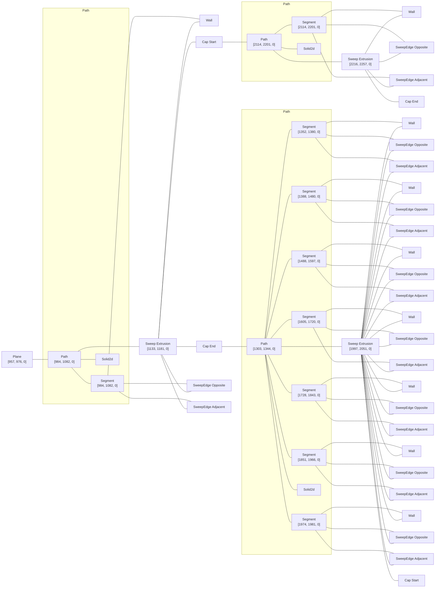

```mermaid
flowchart LR
  subgraph path2 [Path]
    2["Path<br>[984, 1082, 0]"]
    3["Segment<br>[984, 1082, 0]"]
    4[Solid2d]
  end
  subgraph path11 [Path]
    11["Path<br>[1303, 1344, 0]"]
    12["Segment<br>[1352, 1380, 0]"]
    13["Segment<br>[1388, 1480, 0]"]
    14["Segment<br>[1488, 1597, 0]"]
    15["Segment<br>[1605, 1720, 0]"]
    16["Segment<br>[1728, 1843, 0]"]
    17["Segment<br>[1851, 1966, 0]"]
    18["Segment<br>[1974, 1981, 0]"]
    19[Solid2d]
  end
  subgraph path43 [Path]
    43["Path<br>[2114, 2201, 0]"]
    44["Segment<br>[2114, 2201, 0]"]
    45[Solid2d]
  end
  1["Plane<br>[957, 976, 0]"]
  5["Sweep Extrusion<br>[1133, 1181, 0]"]
  6[Wall]
  7["Cap Start"]
  8["Cap End"]
  9["SweepEdge Opposite"]
  10["SweepEdge Adjacent"]
  20["Sweep Extrusion<br>[1997, 2051, 0]"]
  21[Wall]
  22[Wall]
  23[Wall]
  24[Wall]
  25[Wall]
  26[Wall]
  27[Wall]
  28["Cap Start"]
  29["SweepEdge Opposite"]
  30["SweepEdge Adjacent"]
  31["SweepEdge Opposite"]
  32["SweepEdge Adjacent"]
  33["SweepEdge Opposite"]
  34["SweepEdge Adjacent"]
  35["SweepEdge Opposite"]
  36["SweepEdge Adjacent"]
  37["SweepEdge Opposite"]
  38["SweepEdge Adjacent"]
  39["SweepEdge Opposite"]
  40["SweepEdge Adjacent"]
  41["SweepEdge Opposite"]
  42["SweepEdge Adjacent"]
  46["Sweep Extrusion<br>[2216, 2257, 0]"]
  47[Wall]
  48["Cap End"]
  49["SweepEdge Opposite"]
  50["SweepEdge Adjacent"]
  1 --- 2
  2 --- 3
  2 ---- 5
  2 --- 4
  3 --- 6
  3 --- 9
  3 --- 10
  5 --- 6
  5 --- 7
  5 --- 8
  5 --- 9
  5 --- 10
  7 --- 43
  8 --- 11
  11 --- 12
  11 --- 13
  11 --- 14
  11 --- 15
  11 --- 16
  11 --- 17
  11 --- 18
  11 ---- 20
  11 --- 19
  12 --- 27
  12 --- 41
  12 --- 42
  13 --- 26
  13 --- 39
  13 --- 40
  14 --- 25
  14 --- 37
  14 --- 38
  15 --- 24
  15 --- 35
  15 --- 36
  16 --- 23
  16 --- 33
  16 --- 34
  17 --- 22
  17 --- 31
  17 --- 32
  18 --- 21
  18 --- 29
  18 --- 30
  20 --- 21
  20 --- 22
  20 --- 23
  20 --- 24
  20 --- 25
  20 --- 26
  20 --- 27
  20 --- 28
  20 --- 29
  20 --- 30
  20 --- 31
  20 --- 32
  20 --- 33
  20 --- 34
  20 --- 35
  20 --- 36
  20 --- 37
  20 --- 38
  20 --- 39
  20 --- 40
  20 --- 41
  20 --- 42
  43 --- 44
  43 ---- 46
  43 --- 45
  44 --- 47
  44 --- 49
  44 --- 50
  46 --- 47
  46 --- 48
  46 --- 49
  46 --- 50
```
