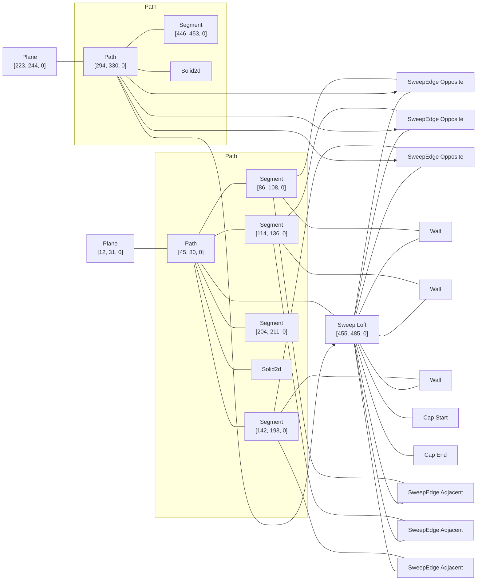

```mermaid
flowchart LR
  subgraph path2 [Path]
    2["Path<br>[45, 80, 0]"]
    3["Segment<br>[86, 108, 0]"]
    4["Segment<br>[114, 136, 0]"]
    5["Segment<br>[142, 198, 0]"]
    6["Segment<br>[204, 211, 0]"]
    7[Solid2d]
  end
  subgraph path9 [Path]
    9["Path<br>[294, 330, 0]"]
    13["Segment<br>[446, 453, 0]"]
    14[Solid2d]
  end
  1["Plane<br>[12, 31, 0]"]
  8["Plane<br>[223, 244, 0]"]
  10["SweepEdge Opposite"]
  11["SweepEdge Opposite"]
  12["SweepEdge Opposite"]
  15["Sweep Loft<br>[455, 485, 0]"]
  16[Wall]
  17[Wall]
  18[Wall]
  19["Cap Start"]
  20["Cap End"]
  21["SweepEdge Adjacent"]
  22["SweepEdge Adjacent"]
  23["SweepEdge Adjacent"]
  1 --- 2
  2 --- 3
  2 --- 4
  2 --- 5
  2 --- 6
  2 ---- 15
  2 --- 7
  3 --- 16
  3 --- 10
  3 --- 21
  4 --- 17
  4 --- 11
  4 --- 22
  5 --- 18
  5 --- 12
  5 --- 23
  8 --- 9
  9 x--> 10
  9 x--> 11
  9 x--> 12
  9 --- 13
  9 x---> 15
  9 --- 14
  15 --- 10
  15 --- 11
  15 --- 12
  15 --- 16
  15 --- 17
  15 --- 18
  15 --- 19
  15 --- 20
  15 --- 21
  15 --- 22
  15 --- 23
```
