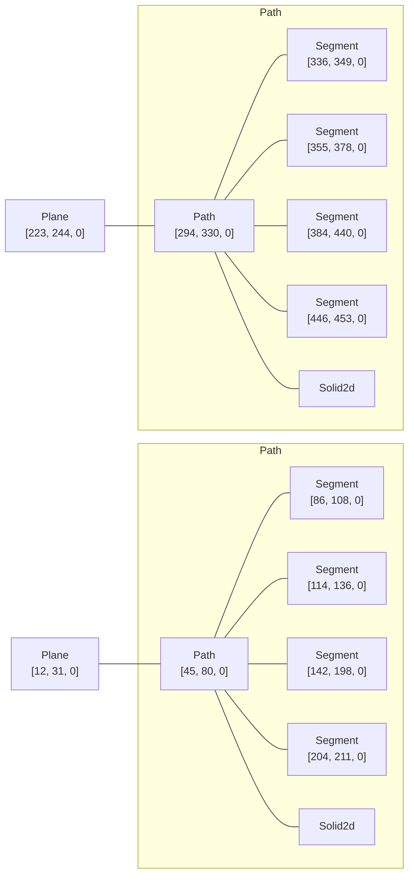

```mermaid
flowchart LR
  subgraph path2 [Path]
    2["Path<br>[45, 80, 0]"]
    3["Segment<br>[86, 108, 0]"]
    4["Segment<br>[114, 136, 0]"]
    5["Segment<br>[142, 198, 0]"]
    6["Segment<br>[204, 211, 0]"]
    7[Solid2d]
  end
  subgraph path9 [Path]
    9["Path<br>[294, 330, 0]"]
    10["Segment<br>[336, 349, 0]"]
    11["Segment<br>[355, 378, 0]"]
    12["Segment<br>[384, 440, 0]"]
    13["Segment<br>[446, 453, 0]"]
    14[Solid2d]
  end
  1["Plane<br>[12, 31, 0]"]
  8["Plane<br>[223, 244, 0]"]
  1 --- 2
  2 --- 3
  2 --- 4
  2 --- 5
  2 --- 6
  2 --- 7
  8 --- 9
  9 --- 10
  9 --- 11
  9 --- 12
  9 --- 13
  9 --- 14
```
