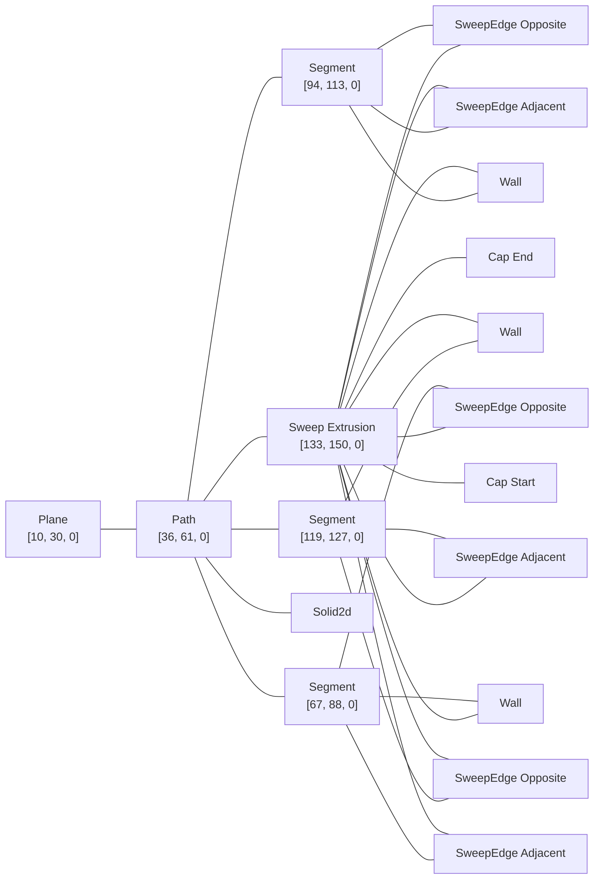

```mermaid
flowchart LR
  1["Plane<br>[10, 30, 0]"]
  2["Path<br>[36, 61, 0]"]
  3["Segment<br>[67, 88, 0]"]
  4["Segment<br>[94, 113, 0]"]
  5["Segment<br>[119, 127, 0]"]
  6[Solid2d]
  7["Sweep Extrusion<br>[133, 150, 0]"]
  8[Wall]
  9[Wall]
  10[Wall]
  11["Cap Start"]
  12["Cap End"]
  13["SweepEdge Opposite"]
  14["SweepEdge Adjacent"]
  15["SweepEdge Opposite"]
  16["SweepEdge Adjacent"]
  17["SweepEdge Opposite"]
  18["SweepEdge Adjacent"]
  7 --- 15
  2 --- 6
  2 --- 4
  7 --- 17
  1 --- 2
  3 --- 17
  5 --- 8
  7 --- 10
  7 --- 8
  3 --- 10
  7 --- 14
  5 --- 14
  7 --- 12
  2 --- 7
  4 --- 16
  2 --- 5
  7 --- 16
  2 --- 3
  3 --- 18
  7 --- 18
  4 --- 9
  7 --- 11
  7 --- 9
  5 --- 13
  4 --- 15
  7 --- 13
```
