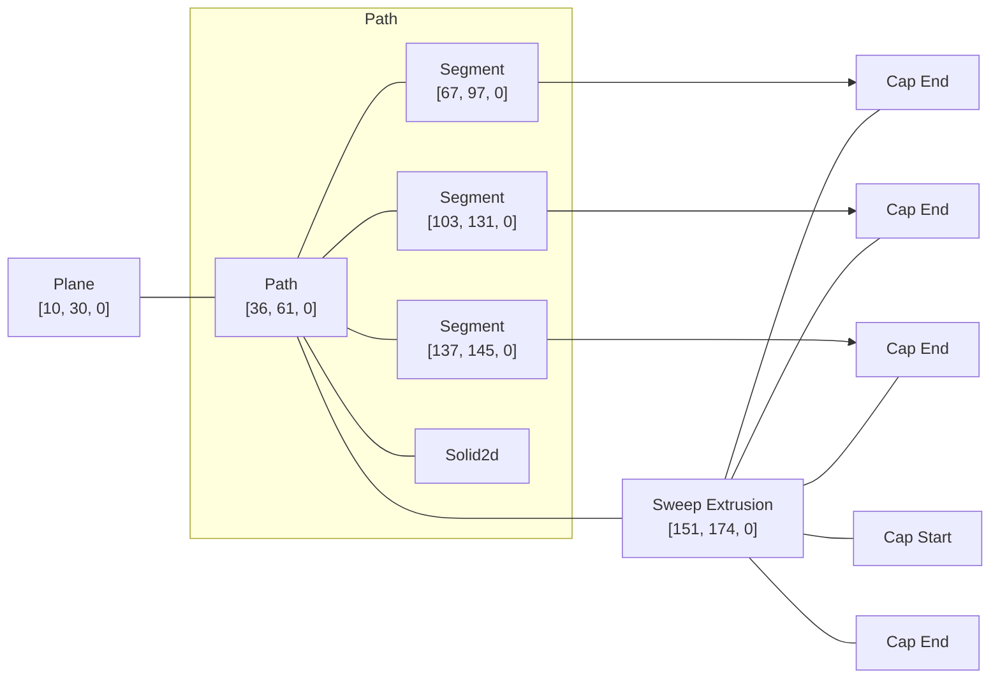

```mermaid
flowchart LR
  subgraph path2 [Path]
    2["Path<br>[36, 61, 0]"]
    3["Segment<br>[67, 97, 0]"]
    4["Segment<br>[103, 131, 0]"]
    5["Segment<br>[137, 145, 0]"]
    6[Solid2d]
  end
  1["Plane<br>[10, 30, 0]"]
  7["Sweep Extrusion<br>[151, 174, 0]"]
  8["Cap End"]
  9["Cap End"]
  10["Cap End"]
  11["Cap Start"]
  12["Cap End"]
  1 --- 2
  2 --- 3
  2 --- 4
  2 --- 5
  2 ---- 7
  2 --- 6
  3 x--> 10
  4 x--> 9
  5 x--> 8
  7 --- 8
  7 --- 9
  7 --- 10
  7 --- 11
  7 --- 12
```
