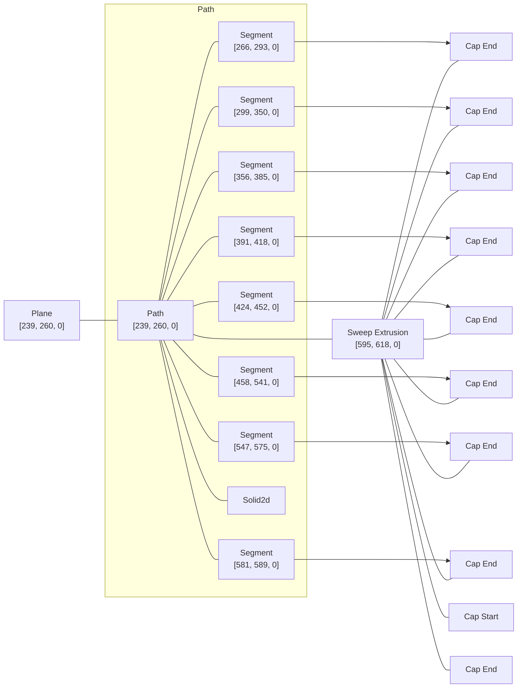

```mermaid
flowchart LR
  subgraph path2 [Path]
    2["Path<br>[239, 260, 0]"]
    3["Segment<br>[266, 293, 0]"]
    4["Segment<br>[299, 350, 0]"]
    5["Segment<br>[356, 385, 0]"]
    6["Segment<br>[391, 418, 0]"]
    7["Segment<br>[424, 452, 0]"]
    8["Segment<br>[458, 541, 0]"]
    9["Segment<br>[547, 575, 0]"]
    10["Segment<br>[581, 589, 0]"]
    11[Solid2d]
  end
  1["Plane<br>[239, 260, 0]"]
  12["Sweep Extrusion<br>[595, 618, 0]"]
  13["Cap End"]
  14["Cap End"]
  15["Cap End"]
  16["Cap End"]
  17["Cap End"]
  18["Cap End"]
  19["Cap End"]
  20["Cap End"]
  21["Cap Start"]
  22["Cap End"]
  1 --- 2
  2 --- 3
  2 --- 4
  2 --- 5
  2 --- 6
  2 --- 7
  2 --- 8
  2 --- 9
  2 --- 10
  2 ---- 12
  2 --- 11
  3 x--> 13
  4 x--> 14
  5 x--> 15
  6 x--> 16
  7 x--> 17
  8 x--> 18
  9 x--> 19
  10 x--> 20
  12 --- 13
  12 --- 14
  12 --- 15
  12 --- 16
  12 --- 17
  12 --- 18
  12 --- 19
  12 --- 20
  12 --- 21
  12 --- 22
```
