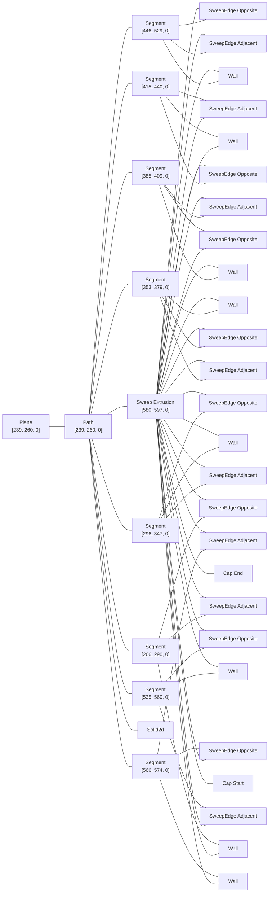

```mermaid
flowchart LR
  1["Plane<br>[239, 260, 0]"]
  2["Path<br>[239, 260, 0]"]
  3["Segment<br>[266, 290, 0]"]
  4["Segment<br>[296, 347, 0]"]
  5["Segment<br>[353, 379, 0]"]
  6["Segment<br>[385, 409, 0]"]
  7["Segment<br>[415, 440, 0]"]
  8["Segment<br>[446, 529, 0]"]
  9["Segment<br>[535, 560, 0]"]
  10["Segment<br>[566, 574, 0]"]
  11[Solid2d]
  12["Sweep Extrusion<br>[580, 597, 0]"]
  13[Wall]
  14[Wall]
  15[Wall]
  16[Wall]
  17[Wall]
  18[Wall]
  19[Wall]
  20[Wall]
  21["Cap Start"]
  22["Cap End"]
  23["SweepEdge Opposite"]
  24["SweepEdge Adjacent"]
  25["SweepEdge Opposite"]
  26["SweepEdge Adjacent"]
  27["SweepEdge Opposite"]
  28["SweepEdge Adjacent"]
  29["SweepEdge Opposite"]
  30["SweepEdge Adjacent"]
  31["SweepEdge Opposite"]
  32["SweepEdge Adjacent"]
  33["SweepEdge Opposite"]
  34["SweepEdge Adjacent"]
  35["SweepEdge Opposite"]
  36["SweepEdge Adjacent"]
  37["SweepEdge Opposite"]
  38["SweepEdge Adjacent"]
  7 --- 32
  7 --- 17
  12 --- 31
  12 --- 23
  2 --- 8
  2 --- 7
  12 --- 38
  12 --- 15
  12 --- 30
  12 --- 33
  8 --- 33
  6 --- 30
  5 --- 15
  12 --- 22
  2 --- 6
  3 --- 23
  12 --- 25
  12 --- 14
  4 --- 25
  12 --- 17
  12 --- 32
  7 --- 31
  6 --- 29
  4 --- 14
  12 --- 24
  2 --- 5
  12 --- 16
  12 --- 35
  3 --- 13
  10 --- 20
  9 --- 35
  12 --- 27
  2 --- 4
  1 --- 2
  9 --- 36
  10 --- 38
  12 --- 19
  2 --- 12
  12 --- 34
  8 --- 34
  12 --- 26
  2 --- 3
  10 --- 37
  4 --- 26
  2 --- 11
  12 --- 18
  12 --- 37
  8 --- 18
  12 --- 29
  5 --- 27
  12 --- 21
  2 --- 10
  12 --- 36
  9 --- 19
  6 --- 16
  12 --- 13
  12 --- 28
  5 --- 28
  12 --- 20
  3 --- 24
  2 --- 9
```
