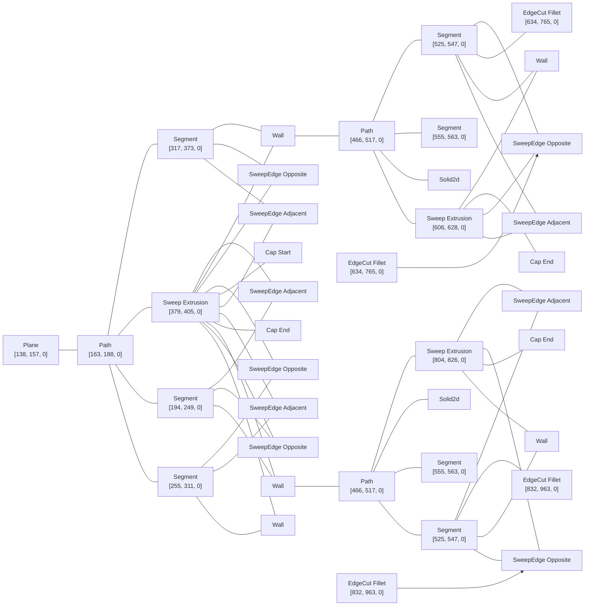

```mermaid
flowchart LR
  1["Plane<br>[138, 157, 0]"]
  2["Path<br>[163, 188, 0]"]
  3["Segment<br>[194, 249, 0]"]
  4["Segment<br>[255, 311, 0]"]
  5["Segment<br>[317, 373, 0]"]
  6["Sweep Extrusion<br>[379, 405, 0]"]
  7[Wall]
  8[Wall]
  9[Wall]
  10["Cap Start"]
  11["Cap End"]
  12["SweepEdge Opposite"]
  13["SweepEdge Adjacent"]
  14["SweepEdge Opposite"]
  15["SweepEdge Adjacent"]
  16["SweepEdge Opposite"]
  17["SweepEdge Adjacent"]
  18["Path<br>[466, 517, 0]"]
  19["Segment<br>[525, 547, 0]"]
  20["Segment<br>[555, 563, 0]"]
  21[Solid2d]
  22["Sweep Extrusion<br>[606, 628, 0]"]
  23[Wall]
  24["Cap End"]
  25["SweepEdge Opposite"]
  26["SweepEdge Adjacent"]
  27["EdgeCut Fillet<br>[634, 765, 0]"]
  28["EdgeCut Fillet<br>[634, 765, 0]"]
  29["Path<br>[466, 517, 0]"]
  30["Segment<br>[525, 547, 0]"]
  31["Segment<br>[555, 563, 0]"]
  32[Solid2d]
  33["Sweep Extrusion<br>[804, 826, 0]"]
  34[Wall]
  35["Cap End"]
  36["SweepEdge Opposite"]
  37["SweepEdge Adjacent"]
  38["EdgeCut Fillet<br>[832, 963, 0]"]
  39["EdgeCut Fillet<br>[832, 963, 0]"]
  30 --- 36
  5 --- 17
  18 --- 22
  2 --- 4
  1 --- 2
  29 --- 30
  33 --- 34
  4 --- 8
  22 --- 26
  6 --- 8
  19 --- 26
  6 --- 12
  7 --- 29
  3 --- 7
  18 --- 21
  19 --- 23
  2 --- 3
  6 --- 7
  39 x--> 36
  29 --- 31
  6 --- 11
  29 --- 32
  22 --- 25
  30 --- 34
  6 --- 15
  19 --- 27
  9 --- 18
  4 --- 15
  28 x--> 25
  2 --- 6
  6 --- 17
  18 --- 20
  30 --- 38
  33 --- 35
  33 --- 36
  6 --- 10
  3 --- 12
  22 --- 24
  29 --- 33
  6 --- 14
  30 --- 37
  4 --- 14
  5 --- 16
  33 --- 37
  2 --- 5
  6 --- 16
  18 --- 19
  22 --- 23
  5 --- 9
  6 --- 9
  3 --- 13
  6 --- 13
  19 --- 25
```
