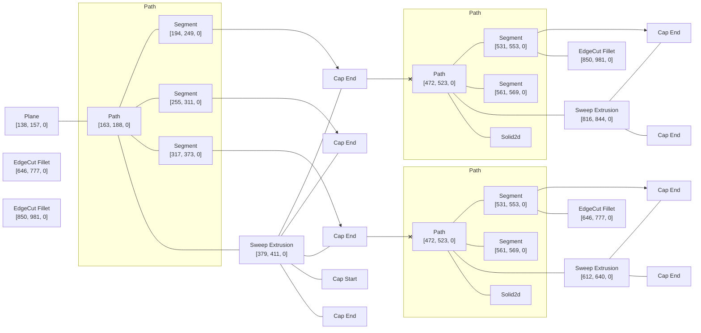

```mermaid
flowchart LR
  subgraph path2 [Path]
    2["Path<br>[163, 188, 0]"]
    3["Segment<br>[194, 249, 0]"]
    4["Segment<br>[255, 311, 0]"]
    5["Segment<br>[317, 373, 0]"]
  end
  subgraph path12 [Path]
    12["Path<br>[472, 523, 0]"]
    13["Segment<br>[531, 553, 0]"]
    14["Segment<br>[561, 569, 0]"]
    15[Solid2d]
  end
  subgraph path21 [Path]
    21["Path<br>[472, 523, 0]"]
    22["Segment<br>[531, 553, 0]"]
    23["Segment<br>[561, 569, 0]"]
    24[Solid2d]
  end
  1["Plane<br>[138, 157, 0]"]
  6["Sweep Extrusion<br>[379, 411, 0]"]
  7["Cap End"]
  8["Cap End"]
  9["Cap End"]
  10["Cap Start"]
  11["Cap End"]
  16["Sweep Extrusion<br>[612, 640, 0]"]
  17["Cap End"]
  18["Cap End"]
  19["EdgeCut Fillet<br>[646, 777, 0]"]
  20["EdgeCut Fillet<br>[646, 777, 0]"]
  25["Sweep Extrusion<br>[816, 844, 0]"]
  26["Cap End"]
  27["Cap End"]
  28["EdgeCut Fillet<br>[850, 981, 0]"]
  29["EdgeCut Fillet<br>[850, 981, 0]"]
  1 --- 2
  2 --- 3
  2 --- 4
  2 --- 5
  2 ---- 6
  3 x--> 7
  4 x--> 8
  5 x--> 9
  6 --- 7
  6 --- 8
  6 --- 9
  6 --- 10
  6 --- 11
  9 <--x 12
  12 --- 13
  12 --- 14
  12 ---- 16
  12 --- 15
  13 x--> 17
  13 --- 19
  16 --- 17
  16 --- 18
  7 <--x 21
  21 --- 22
  21 --- 23
  21 ---- 25
  21 --- 24
  22 x--> 26
  22 --- 28
  25 --- 26
  25 --- 27
```
