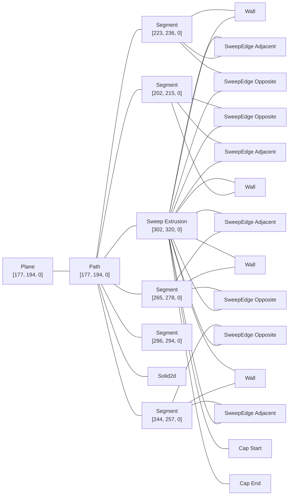

```mermaid
flowchart LR
  1["Plane<br>[177, 194, 0]"]
  2["Path<br>[177, 194, 0]"]
  3["Segment<br>[202, 215, 0]"]
  4["Segment<br>[223, 236, 0]"]
  5["Segment<br>[244, 257, 0]"]
  6["Segment<br>[265, 278, 0]"]
  7["Segment<br>[286, 294, 0]"]
  8[Solid2d]
  9["Sweep Extrusion<br>[302, 320, 0]"]
  10[Wall]
  11[Wall]
  12[Wall]
  13[Wall]
  14["Cap Start"]
  15["Cap End"]
  16["SweepEdge Opposite"]
  17["SweepEdge Adjacent"]
  18["SweepEdge Opposite"]
  19["SweepEdge Adjacent"]
  20["SweepEdge Opposite"]
  21["SweepEdge Adjacent"]
  22["SweepEdge Opposite"]
  23["SweepEdge Adjacent"]
  9 --- 14
  2 --- 4
  1 --- 2
  9 --- 10
  9 --- 21
  4 --- 12
  9 --- 17
  2 --- 8
  2 --- 7
  3 --- 22
  5 --- 18
  9 --- 15
  2 --- 3
  9 --- 11
  9 --- 22
  5 --- 11
  9 --- 18
  9 --- 12
  2 --- 6
  3 --- 23
  5 --- 19
  4 --- 21
  6 --- 17
  6 --- 10
  9 --- 23
  9 --- 19
  9 --- 13
  2 --- 5
  6 --- 16
  4 --- 20
  9 --- 20
  3 --- 13
  9 --- 16
  2 --- 9
```
