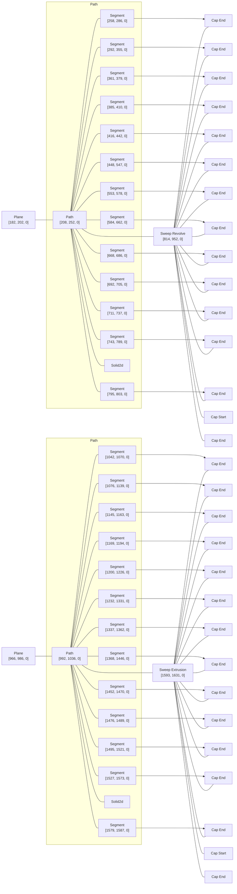

```mermaid
flowchart LR
  subgraph path2 [Path]
    2["Path<br>[208, 252, 0]"]
    3["Segment<br>[258, 286, 0]"]
    4["Segment<br>[292, 355, 0]"]
    5["Segment<br>[361, 379, 0]"]
    6["Segment<br>[385, 410, 0]"]
    7["Segment<br>[416, 442, 0]"]
    8["Segment<br>[448, 547, 0]"]
    9["Segment<br>[553, 578, 0]"]
    10["Segment<br>[584, 662, 0]"]
    11["Segment<br>[668, 686, 0]"]
    12["Segment<br>[692, 705, 0]"]
    13["Segment<br>[711, 737, 0]"]
    14["Segment<br>[743, 789, 0]"]
    15["Segment<br>[795, 803, 0]"]
    16[Solid2d]
  end
  subgraph path34 [Path]
    34["Path<br>[992, 1036, 0]"]
    35["Segment<br>[1042, 1070, 0]"]
    36["Segment<br>[1076, 1139, 0]"]
    37["Segment<br>[1145, 1163, 0]"]
    38["Segment<br>[1169, 1194, 0]"]
    39["Segment<br>[1200, 1226, 0]"]
    40["Segment<br>[1232, 1331, 0]"]
    41["Segment<br>[1337, 1362, 0]"]
    42["Segment<br>[1368, 1446, 0]"]
    43["Segment<br>[1452, 1470, 0]"]
    44["Segment<br>[1476, 1489, 0]"]
    45["Segment<br>[1495, 1521, 0]"]
    46["Segment<br>[1527, 1573, 0]"]
    47["Segment<br>[1579, 1587, 0]"]
    48[Solid2d]
  end
  1["Plane<br>[182, 202, 0]"]
  17["Sweep Revolve<br>[814, 952, 0]"]
  18["Cap End"]
  19["Cap End"]
  20["Cap End"]
  21["Cap End"]
  22["Cap End"]
  23["Cap End"]
  24["Cap End"]
  25["Cap End"]
  26["Cap End"]
  27["Cap End"]
  28["Cap End"]
  29["Cap End"]
  30["Cap End"]
  31["Cap Start"]
  32["Cap End"]
  33["Plane<br>[966, 986, 0]"]
  49["Sweep Extrusion<br>[1593, 1631, 0]"]
  50["Cap End"]
  51["Cap End"]
  52["Cap End"]
  53["Cap End"]
  54["Cap End"]
  55["Cap End"]
  56["Cap End"]
  57["Cap End"]
  58["Cap End"]
  59["Cap End"]
  60["Cap End"]
  61["Cap End"]
  62["Cap End"]
  63["Cap Start"]
  64["Cap End"]
  1 --- 2
  2 --- 3
  2 --- 4
  2 --- 5
  2 --- 6
  2 --- 7
  2 --- 8
  2 --- 9
  2 --- 10
  2 --- 11
  2 --- 12
  2 --- 13
  2 --- 14
  2 --- 15
  2 ---- 17
  2 --- 16
  3 x--> 18
  4 x--> 19
  5 x--> 20
  6 x--> 21
  7 x--> 22
  8 x--> 23
  9 x--> 24
  10 x--> 25
  11 x--> 26
  12 x--> 27
  13 x--> 28
  14 x--> 29
  15 x--> 30
  17 --- 18
  17 --- 19
  17 --- 20
  17 --- 21
  17 --- 22
  17 --- 23
  17 --- 24
  17 --- 25
  17 --- 26
  17 --- 27
  17 --- 28
  17 --- 29
  17 --- 30
  17 --- 31
  17 --- 32
  33 --- 34
  34 --- 35
  34 --- 36
  34 --- 37
  34 --- 38
  34 --- 39
  34 --- 40
  34 --- 41
  34 --- 42
  34 --- 43
  34 --- 44
  34 --- 45
  34 --- 46
  34 --- 47
  34 ---- 49
  34 --- 48
  35 x--> 50
  36 x--> 51
  37 x--> 52
  38 x--> 53
  39 x--> 54
  40 x--> 55
  41 x--> 56
  42 x--> 57
  43 x--> 58
  44 x--> 59
  45 x--> 60
  46 x--> 61
  47 x--> 62
  49 --- 50
  49 --- 51
  49 --- 52
  49 --- 53
  49 --- 54
  49 --- 55
  49 --- 56
  49 --- 57
  49 --- 58
  49 --- 59
  49 --- 60
  49 --- 61
  49 --- 62
  49 --- 63
  49 --- 64
```
