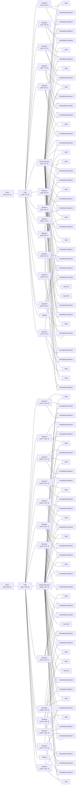

```mermaid
flowchart LR
  1["Plane<br>[182, 202, 0]"]
  2["Path<br>[208, 252, 0]"]
  3["Segment<br>[258, 286, 0]"]
  4["Segment<br>[292, 355, 0]"]
  5["Segment<br>[361, 379, 0]"]
  6["Segment<br>[385, 410, 0]"]
  7["Segment<br>[416, 442, 0]"]
  8["Segment<br>[448, 547, 0]"]
  9["Segment<br>[553, 578, 0]"]
  10["Segment<br>[584, 662, 0]"]
  11["Segment<br>[668, 686, 0]"]
  12["Segment<br>[692, 705, 0]"]
  13["Segment<br>[711, 737, 0]"]
  14["Segment<br>[743, 789, 0]"]
  15["Segment<br>[795, 803, 0]"]
  16[Solid2d]
  17["Sweep Revolve<br>[814, 952, 0]"]
  18[Wall]
  19[Wall]
  20[Wall]
  21[Wall]
  22[Wall]
  23[Wall]
  24[Wall]
  25[Wall]
  26[Wall]
  27[Wall]
  28[Wall]
  29[Wall]
  30[Wall]
  31["Cap Start"]
  32["Cap End"]
  33["SweepEdge Opposite"]
  34["SweepEdge Adjacent"]
  35["SweepEdge Opposite"]
  36["SweepEdge Adjacent"]
  37["SweepEdge Opposite"]
  38["SweepEdge Adjacent"]
  39["SweepEdge Opposite"]
  40["SweepEdge Adjacent"]
  41["SweepEdge Opposite"]
  42["SweepEdge Adjacent"]
  43["SweepEdge Opposite"]
  44["SweepEdge Adjacent"]
  45["SweepEdge Opposite"]
  46["SweepEdge Adjacent"]
  47["SweepEdge Opposite"]
  48["SweepEdge Adjacent"]
  49["SweepEdge Opposite"]
  50["SweepEdge Adjacent"]
  51["SweepEdge Opposite"]
  52["SweepEdge Adjacent"]
  53["SweepEdge Opposite"]
  54["SweepEdge Adjacent"]
  55["SweepEdge Opposite"]
  56["SweepEdge Adjacent"]
  57["SweepEdge Opposite"]
  58["SweepEdge Adjacent"]
  59["Plane<br>[966, 986, 0]"]
  60["Path<br>[992, 1036, 0]"]
  61["Segment<br>[1042, 1070, 0]"]
  62["Segment<br>[1076, 1139, 0]"]
  63["Segment<br>[1145, 1163, 0]"]
  64["Segment<br>[1169, 1194, 0]"]
  65["Segment<br>[1200, 1226, 0]"]
  66["Segment<br>[1232, 1331, 0]"]
  67["Segment<br>[1337, 1362, 0]"]
  68["Segment<br>[1368, 1446, 0]"]
  69["Segment<br>[1452, 1470, 0]"]
  70["Segment<br>[1476, 1489, 0]"]
  71["Segment<br>[1495, 1521, 0]"]
  72["Segment<br>[1527, 1573, 0]"]
  73["Segment<br>[1579, 1587, 0]"]
  74[Solid2d]
  75["Sweep Extrusion<br>[1593, 1625, 0]"]
  76[Wall]
  77[Wall]
  78[Wall]
  79[Wall]
  80[Wall]
  81[Wall]
  82[Wall]
  83[Wall]
  84[Wall]
  85[Wall]
  86[Wall]
  87[Wall]
  88[Wall]
  89["Cap Start"]
  90["Cap End"]
  91["SweepEdge Opposite"]
  92["SweepEdge Adjacent"]
  93["SweepEdge Opposite"]
  94["SweepEdge Adjacent"]
  95["SweepEdge Opposite"]
  96["SweepEdge Adjacent"]
  97["SweepEdge Opposite"]
  98["SweepEdge Adjacent"]
  99["SweepEdge Opposite"]
  100["SweepEdge Adjacent"]
  101["SweepEdge Opposite"]
  102["SweepEdge Adjacent"]
  103["SweepEdge Opposite"]
  104["SweepEdge Adjacent"]
  105["SweepEdge Opposite"]
  106["SweepEdge Adjacent"]
  107["SweepEdge Opposite"]
  108["SweepEdge Adjacent"]
  109["SweepEdge Opposite"]
  110["SweepEdge Adjacent"]
  111["SweepEdge Opposite"]
  112["SweepEdge Adjacent"]
  113["SweepEdge Opposite"]
  114["SweepEdge Adjacent"]
  115["SweepEdge Opposite"]
  116["SweepEdge Adjacent"]
  75 --- 78
  17 --- 39
  61 --- 92
  60 --- 62
  75 --- 89
  8 --- 23
  17 --- 30
  17 --- 56
  60 --- 67
  75 --- 96
  2 --- 7
  75 --- 94
  71 --- 112
  14 --- 56
  15 --- 30
  17 --- 23
  17 --- 49
  60 --- 74
  61 --- 76
  68 --- 105
  64 --- 79
  71 --- 86
  17 --- 40
  75 --- 105
  75 --- 112
  10 --- 48
  75 --- 110
  75 --- 76
  17 --- 33
  6 --- 21
  2 --- 14
  75 --- 87
  6 --- 40
  14 --- 55
  17 --- 24
  17 --- 58
  60 --- 69
  67 --- 103
  2 --- 5
  75 --- 92
  6 --- 39
  9 --- 24
  63 --- 78
  17 --- 51
  65 --- 80
  75 --- 103
  69 --- 107
  71 --- 111
  17 --- 42
  72 --- 114
  17 --- 52
  12 --- 27
  75 --- 108
  17 --- 35
  64 --- 98
  2 --- 12
  75 --- 85
  17 --- 26
  60 --- 71
  17 --- 36
  9 --- 45
  66 --- 101
  2 --- 3
  11 --- 26
  60 --- 61
  17 --- 19
  75 --- 90
  75 --- 101
  12 --- 52
  70 --- 109
  60 --- 73
  17 --- 20
  17 --- 54
  75 --- 106
  4 --- 36
  2 --- 17
  5 --- 38
  62 --- 77
  17 --- 45
  66 --- 81
  2 --- 10
  75 --- 83
  17 --- 38
  61 --- 91
  5 --- 20
  69 --- 84
  60 --- 63
  62 --- 93
  75 --- 88
  17 --- 29
  60 --- 64
  63 --- 96
  75 --- 99
  13 --- 54
  17 --- 22
  60 --- 75
  17 --- 48
  75 --- 104
  72 --- 87
  17 --- 47
  72 --- 113
  75 --- 115
  67 --- 104
  2 --- 8
  75 --- 81
  75 --- 79
  7 --- 22
  17 --- 32
  64 --- 97
  3 --- 33
  2 --- 15
  75 --- 86
  7 --- 41
  17 --- 31
  17 --- 57
  60 --- 66
  75 --- 97
  2 --- 6
  75 --- 95
  15 --- 57
  14 --- 29
  17 --- 50
  70 --- 85
  75 --- 102
  12 --- 51
  17 --- 41
  11 --- 49
  10 --- 47
  75 --- 111
  4 --- 35
  75 --- 77
  73 --- 88
  63 --- 95
  8 --- 43
  17 --- 34
  65 --- 99
  75 --- 113
  2 --- 13
  75 --- 84
  17 --- 25
  60 --- 68
  65 --- 100
  66 --- 102
  4 --- 19
  2 --- 4
  68 --- 83
  75 --- 93
  1 --- 2
  17 --- 18
  75 --- 100
  68 --- 106
  69 --- 108
  70 --- 110
  17 --- 43
  73 --- 115
  17 --- 53
  75 --- 109
  3 --- 18
  5 --- 37
  67 --- 82
  17 --- 44
  73 --- 116
  75 --- 116
  2 --- 11
  75 --- 82
  17 --- 27
  60 --- 70
  8 --- 44
  9 --- 46
  17 --- 37
  3 --- 34
  59 --- 60
  10 --- 25
  62 --- 94
  60 --- 65
  7 --- 42
  17 --- 28
  75 --- 91
  75 --- 98
  13 --- 53
  15 --- 58
  17 --- 21
  60 --- 72
  17 --- 55
  13 --- 28
  75 --- 107
  2 --- 16
  17 --- 46
  11 --- 50
  75 --- 114
  2 --- 9
  75 --- 80
```
