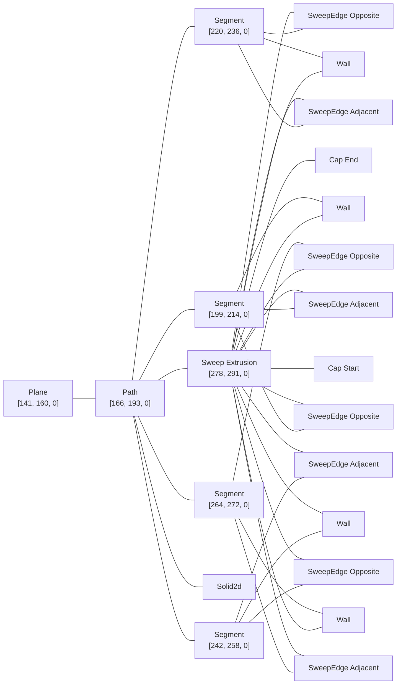

```mermaid
flowchart LR
  1["Plane<br>[141, 160, 0]"]
  2["Path<br>[166, 193, 0]"]
  3["Segment<br>[199, 214, 0]"]
  4["Segment<br>[220, 236, 0]"]
  5["Segment<br>[242, 258, 0]"]
  6["Segment<br>[264, 272, 0]"]
  7[Solid2d]
  8["Sweep Extrusion<br>[278, 291, 0]"]
  9[Wall]
  10[Wall]
  11[Wall]
  12[Wall]
  13["Cap Start"]
  14["Cap End"]
  15["SweepEdge Opposite"]
  16["SweepEdge Adjacent"]
  17["SweepEdge Opposite"]
  18["SweepEdge Adjacent"]
  19["SweepEdge Opposite"]
  20["SweepEdge Adjacent"]
  21["SweepEdge Opposite"]
  22["SweepEdge Adjacent"]
  5 --- 17
  4 --- 19
  2 --- 4
  3 --- 21
  8 --- 12
  1 --- 2
  5 --- 10
  8 --- 19
  2 --- 8
  2 --- 7
  3 --- 22
  5 --- 18
  8 --- 15
  2 --- 3
  8 --- 11
  4 --- 11
  8 --- 22
  6 --- 15
  8 --- 18
  2 --- 6
  8 --- 14
  8 --- 10
  8 --- 21
  3 --- 12
  8 --- 17
  8 --- 13
  2 --- 5
  6 --- 16
  8 --- 9
  4 --- 20
  8 --- 20
  6 --- 9
  8 --- 16
```
