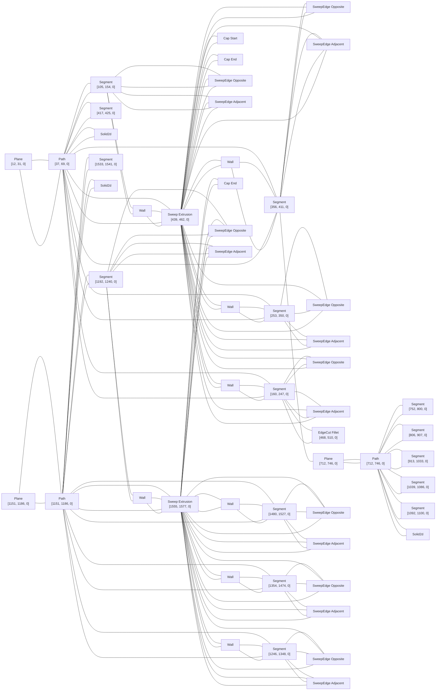

```mermaid
flowchart LR
  1["Plane<br>[12, 31, 0]"]
  2["Path<br>[37, 69, 0]"]
  3["Segment<br>[105, 154, 0]"]
  4["Segment<br>[160, 247, 0]"]
  5["Segment<br>[253, 350, 0]"]
  6["Segment<br>[356, 411, 0]"]
  7["Segment<br>[417, 425, 0]"]
  8[Solid2d]
  9["Sweep Extrusion<br>[439, 462, 0]"]
  10[Wall]
  11[Wall]
  12[Wall]
  13[Wall]
  14["Cap Start"]
  15["Cap End"]
  16["SweepEdge Opposite"]
  17["SweepEdge Adjacent"]
  18["SweepEdge Opposite"]
  19["SweepEdge Adjacent"]
  20["SweepEdge Opposite"]
  21["SweepEdge Adjacent"]
  22["SweepEdge Opposite"]
  23["SweepEdge Adjacent"]
  24["EdgeCut Fillet<br>[468, 510, 0]"]
  25["Plane<br>[1151, 1186, 0]"]
  26["Plane<br>[712, 746, 0]"]
  27["Path<br>[712, 746, 0]"]
  28["Segment<br>[752, 800, 0]"]
  29["Segment<br>[806, 907, 0]"]
  30["Segment<br>[913, 1033, 0]"]
  31["Segment<br>[1039, 1086, 0]"]
  32["Segment<br>[1092, 1100, 0]"]
  33[Solid2d]
  34["Path<br>[1151, 1186, 0]"]
  35["Segment<br>[1192, 1240, 0]"]
  36["Segment<br>[1246, 1348, 0]"]
  37["Segment<br>[1354, 1474, 0]"]
  38["Segment<br>[1480, 1527, 0]"]
  39["Segment<br>[1533, 1541, 0]"]
  40[Solid2d]
  41["Sweep Extrusion<br>[1555, 1577, 0]"]
  42[Wall]
  43[Wall]
  44[Wall]
  45[Wall]
  46["Cap End"]
  47["SweepEdge Opposite"]
  48["SweepEdge Adjacent"]
  49["SweepEdge Opposite"]
  50["SweepEdge Adjacent"]
  51["SweepEdge Opposite"]
  52["SweepEdge Adjacent"]
  53["SweepEdge Opposite"]
  54["SweepEdge Adjacent"]
  1 --- 2
  2 --- 1
  2 --- 3
  2 --- 4
  2 --- 5
  2 --- 6
  2 --- 7
  2 --- 9
  2 --- 8
  3 --- 2
  3 --- 13
  3 --- 22
  3 --- 23
  4 --- 2
  4 --- 12
  4 --- 20
  4 --- 21
  4 --- 24
  5 --- 2
  5 --- 11
  5 --- 18
  5 --- 19
  6 --- 2
  6 --- 10
  6 --- 16
  6 --- 17
  6 --- 26
  7 --- 2
  8 --- 2
  9 --- 2
  9 --- 10
  9 --- 11
  9 --- 12
  9 --- 13
  9 --- 14
  9 --- 15
  9 --- 16
  9 --- 17
  9 --- 18
  9 --- 19
  9 --- 20
  9 --- 21
  9 --- 22
  9 --- 23
  10 --- 6
  10 --- 9
  11 --- 5
  11 --- 9
  12 --- 4
  12 --- 9
  13 --- 3
  13 --- 9
  14 --- 9
  15 --- 9
  16 --- 6
  16 --- 9
  17 --- 6
  17 --- 9
  18 --- 5
  18 --- 9
  19 --- 5
  19 --- 9
  20 --- 4
  20 --- 9
  21 --- 4
  21 --- 9
  22 --- 3
  22 --- 9
  23 --- 3
  23 --- 9
  24 --- 4
  25 --- 34
  26 --- 27
  27 --- 26
  27 --- 28
  27 --- 29
  27 --- 30
  27 --- 31
  27 --- 32
  27 --- 33
  28 --- 27
  29 --- 27
  30 --- 27
  31 --- 27
  32 --- 27
  33 --- 27
  34 --- 25
  34 --- 35
  34 --- 36
  34 --- 37
  34 --- 38
  34 --- 39
  34 --- 41
  34 --- 40
  35 --- 34
  35 --- 45
  35 --- 53
  35 --- 54
  36 --- 34
  36 --- 44
  36 --- 51
  36 --- 52
  37 --- 34
  37 --- 43
  37 --- 49
  37 --- 50
  38 --- 34
  38 --- 42
  38 --- 47
  38 --- 48
  39 --- 34
  40 --- 34
  41 --- 34
  41 --- 42
  41 --- 43
  41 --- 44
  41 --- 45
  41 --- 46
  41 --- 47
  41 --- 48
  41 --- 49
  41 --- 50
  41 --- 51
  41 --- 52
  41 --- 53
  41 --- 54
  42 --- 38
  42 --- 41
  43 --- 37
  43 --- 41
  44 --- 36
  44 --- 41
  45 --- 35
  45 --- 41
  46 --- 41
  47 --- 38
  47 --- 41
  48 --- 38
  48 --- 41
  49 --- 37
  49 --- 41
  50 --- 37
  50 --- 41
  51 --- 36
  51 --- 41
  52 --- 36
  52 --- 41
  53 --- 35
  53 --- 41
  54 --- 35
  54 --- 41
```
