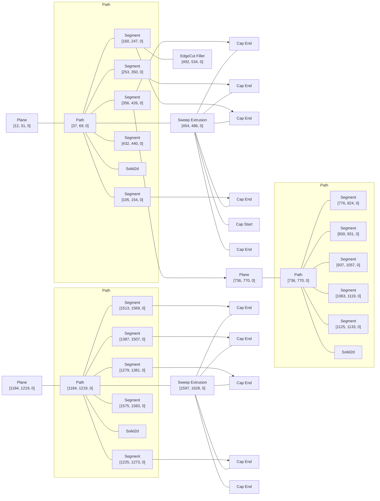

```mermaid
flowchart LR
  subgraph path2 [Path]
    2["Path<br>[37, 69, 0]"]
    3["Segment<br>[105, 154, 0]"]
    4["Segment<br>[160, 247, 0]"]
    5["Segment<br>[253, 350, 0]"]
    6["Segment<br>[356, 426, 0]"]
    7["Segment<br>[432, 440, 0]"]
    8[Solid2d]
  end
  subgraph path19 [Path]
    19["Path<br>[736, 770, 0]"]
    20["Segment<br>[776, 824, 0]"]
    21["Segment<br>[830, 931, 0]"]
    22["Segment<br>[937, 1057, 0]"]
    23["Segment<br>[1063, 1119, 0]"]
    24["Segment<br>[1125, 1133, 0]"]
    25[Solid2d]
  end
  subgraph path26 [Path]
    26["Path<br>[1184, 1219, 0]"]
    27["Segment<br>[1225, 1273, 0]"]
    28["Segment<br>[1279, 1381, 0]"]
    29["Segment<br>[1387, 1507, 0]"]
    30["Segment<br>[1513, 1569, 0]"]
    31["Segment<br>[1575, 1583, 0]"]
    32[Solid2d]
  end
  1["Plane<br>[12, 31, 0]"]
  9["Sweep Extrusion<br>[454, 486, 0]"]
  10["Cap End"]
  11["Cap End"]
  12["Cap End"]
  13["Cap End"]
  14["Cap Start"]
  15["Cap End"]
  16["EdgeCut Fillet<br>[492, 534, 0]"]
  17["Plane<br>[1184, 1219, 0]"]
  18["Plane<br>[736, 770, 0]"]
  33["Sweep Extrusion<br>[1597, 1628, 0]"]
  34["Cap End"]
  35["Cap End"]
  36["Cap End"]
  37["Cap End"]
  38["Cap End"]
  1 --- 2
  2 --- 3
  2 --- 4
  2 --- 5
  2 --- 6
  2 --- 7
  2 ---- 9
  2 --- 8
  3 x--> 13
  4 x--> 12
  4 --- 16
  5 x--> 11
  6 x--> 10
  6 x--> 18
  9 --- 10
  9 --- 11
  9 --- 12
  9 --- 13
  9 --- 14
  9 --- 15
  17 --- 26
  18 --- 19
  19 --- 20
  19 --- 21
  19 --- 22
  19 --- 23
  19 --- 24
  19 --- 25
  26 --- 27
  26 --- 28
  26 --- 29
  26 --- 30
  26 --- 31
  26 ---- 33
  26 --- 32
  27 x--> 37
  28 x--> 36
  29 x--> 35
  30 x--> 34
  33 --- 34
  33 --- 35
  33 --- 36
  33 --- 37
  33 --- 38
```
