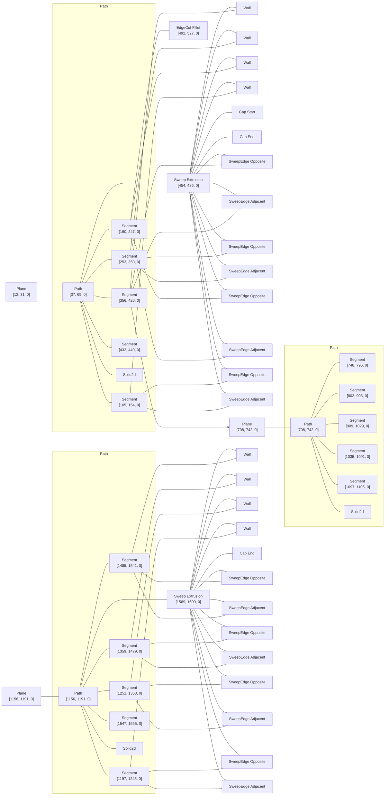

```mermaid
flowchart LR
  subgraph path2 [Path]
    2["Path<br>[37, 69, 0]"]
    3["Segment<br>[105, 154, 0]"]
    4["Segment<br>[160, 247, 0]"]
    5["Segment<br>[253, 350, 0]"]
    6["Segment<br>[356, 426, 0]"]
    7["Segment<br>[432, 440, 0]"]
    8[Solid2d]
  end
  subgraph path27 [Path]
    27["Path<br>[708, 742, 0]"]
    28["Segment<br>[748, 796, 0]"]
    29["Segment<br>[802, 903, 0]"]
    30["Segment<br>[909, 1029, 0]"]
    31["Segment<br>[1035, 1091, 0]"]
    32["Segment<br>[1097, 1105, 0]"]
    33[Solid2d]
  end
  subgraph path34 [Path]
    34["Path<br>[1156, 1191, 0]"]
    35["Segment<br>[1197, 1245, 0]"]
    36["Segment<br>[1251, 1353, 0]"]
    37["Segment<br>[1359, 1479, 0]"]
    38["Segment<br>[1485, 1541, 0]"]
    39["Segment<br>[1547, 1555, 0]"]
    40[Solid2d]
  end
  1["Plane<br>[12, 31, 0]"]
  9["Sweep Extrusion<br>[454, 486, 0]"]
  10[Wall]
  11[Wall]
  12[Wall]
  13[Wall]
  14["Cap Start"]
  15["Cap End"]
  16["SweepEdge Opposite"]
  17["SweepEdge Adjacent"]
  18["SweepEdge Opposite"]
  19["SweepEdge Adjacent"]
  20["SweepEdge Opposite"]
  21["SweepEdge Adjacent"]
  22["SweepEdge Opposite"]
  23["SweepEdge Adjacent"]
  24["EdgeCut Fillet<br>[492, 527, 0]"]
  25["Plane<br>[1156, 1191, 0]"]
  26["Plane<br>[708, 742, 0]"]
  41["Sweep Extrusion<br>[1569, 1600, 0]"]
  42[Wall]
  43[Wall]
  44[Wall]
  45[Wall]
  46["Cap End"]
  47["SweepEdge Opposite"]
  48["SweepEdge Adjacent"]
  49["SweepEdge Opposite"]
  50["SweepEdge Adjacent"]
  51["SweepEdge Opposite"]
  52["SweepEdge Adjacent"]
  53["SweepEdge Opposite"]
  54["SweepEdge Adjacent"]
  1 --- 2
  2 --- 3
  2 --- 4
  2 --- 5
  2 --- 6
  2 --- 7
  2 ---- 9
  2 --- 8
  3 --- 13
  3 --- 22
  3 --- 23
  4 --- 12
  4 --- 20
  4 --- 21
  4 --- 24
  5 --- 11
  5 --- 18
  5 --- 19
  6 --- 10
  6 --- 16
  6 --- 17
  6 x--> 26
  9 --- 10
  9 --- 11
  9 --- 12
  9 --- 13
  9 --- 14
  9 --- 15
  9 --- 16
  9 --- 17
  9 --- 18
  9 --- 19
  9 --- 20
  9 --- 21
  9 --- 22
  9 --- 23
  25 --- 34
  26 --- 27
  27 --- 28
  27 --- 29
  27 --- 30
  27 --- 31
  27 --- 32
  27 --- 33
  34 --- 35
  34 --- 36
  34 --- 37
  34 --- 38
  34 --- 39
  34 ---- 41
  34 --- 40
  35 --- 45
  35 --- 53
  35 --- 54
  36 --- 44
  36 --- 51
  36 --- 52
  37 --- 43
  37 --- 49
  37 --- 50
  38 --- 42
  38 --- 47
  38 --- 48
  41 --- 42
  41 --- 43
  41 --- 44
  41 --- 45
  41 --- 46
  41 --- 47
  41 --- 48
  41 --- 49
  41 --- 50
  41 --- 51
  41 --- 52
  41 --- 53
  41 --- 54
```
