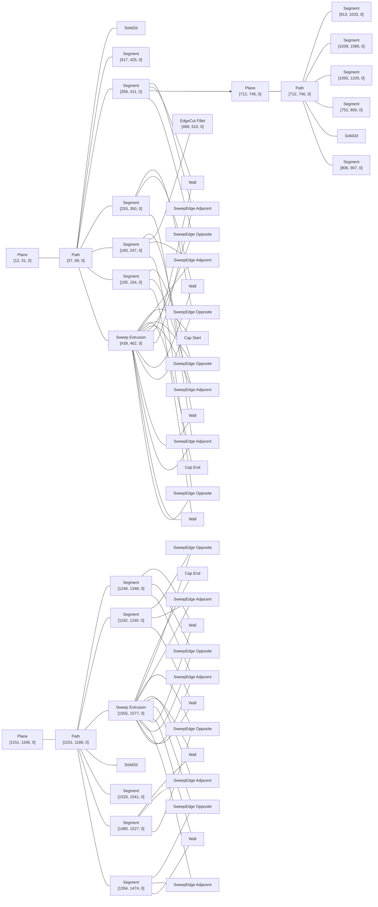

```mermaid
flowchart LR
  1["Plane<br>[12, 31, 0]"]
  2["Path<br>[37, 69, 0]"]
  3["Segment<br>[105, 154, 0]"]
  4["Segment<br>[160, 247, 0]"]
  5["Segment<br>[253, 350, 0]"]
  6["Segment<br>[356, 411, 0]"]
  7["Segment<br>[417, 425, 0]"]
  8[Solid2d]
  9["Sweep Extrusion<br>[439, 462, 0]"]
  10[Wall]
  11[Wall]
  12[Wall]
  13[Wall]
  14["Cap Start"]
  15["Cap End"]
  16["SweepEdge Opposite"]
  17["SweepEdge Adjacent"]
  18["SweepEdge Opposite"]
  19["SweepEdge Adjacent"]
  20["SweepEdge Opposite"]
  21["SweepEdge Adjacent"]
  22["SweepEdge Opposite"]
  23["SweepEdge Adjacent"]
  24["EdgeCut Fillet<br>[468, 510, 0]"]
  25["Plane<br>[712, 746, 0]"]
  26["Plane<br>[1151, 1186, 0]"]
  27["Path<br>[712, 746, 0]"]
  28["Segment<br>[752, 800, 0]"]
  29["Segment<br>[806, 907, 0]"]
  30["Segment<br>[913, 1033, 0]"]
  31["Segment<br>[1039, 1086, 0]"]
  32["Segment<br>[1092, 1100, 0]"]
  33[Solid2d]
  34["Path<br>[1151, 1186, 0]"]
  35["Segment<br>[1192, 1240, 0]"]
  36["Segment<br>[1246, 1348, 0]"]
  37["Segment<br>[1354, 1474, 0]"]
  38["Segment<br>[1480, 1527, 0]"]
  39["Segment<br>[1533, 1541, 0]"]
  40[Solid2d]
  41["Sweep Extrusion<br>[1555, 1577, 0]"]
  42[Wall]
  43[Wall]
  44[Wall]
  45[Wall]
  46["Cap End"]
  47["SweepEdge Opposite"]
  48["SweepEdge Adjacent"]
  49["SweepEdge Opposite"]
  50["SweepEdge Adjacent"]
  51["SweepEdge Opposite"]
  52["SweepEdge Adjacent"]
  53["SweepEdge Opposite"]
  54["SweepEdge Adjacent"]
  27 --- 30
  9 --- 14
  34 --- 36
  35 --- 53
  41 --- 46
  9 --- 21
  41 --- 53
  4 --- 12
  36 --- 44
  2 --- 8
  2 --- 7
  3 --- 22
  27 --- 31
  9 --- 15
  34 --- 35
  41 --- 47
  9 --- 22
  41 --- 54
  27 --- 32
  2 --- 6
  3 --- 23
  27 --- 28
  38 --- 42
  9 --- 23
  27 --- 33
  2 --- 5
  27 --- 29
  38 --- 48
  4 --- 24
  3 --- 13
  9 --- 16
  41 --- 48
  34 --- 41
  37 --- 49
  36 --- 51
  2 --- 4
  1 --- 2
  9 --- 10
  41 --- 42
  9 --- 17
  41 --- 49
  34 --- 40
  34 --- 39
  35 --- 54
  5 --- 18
  37 --- 50
  2 --- 3
  9 --- 11
  25 --- 27
  41 --- 43
  5 --- 11
  37 --- 43
  26 --- 34
  9 --- 18
  38 --- 47
  9 --- 12
  34 --- 38
  6 --- 17
  5 --- 19
  4 --- 21
  41 --- 44
  41 --- 50
  6 --- 10
  6 x--> 25
  9 --- 19
  41 --- 51
  9 --- 13
  34 --- 37
  6 --- 16
  41 --- 45
  4 --- 20
  36 --- 52
  9 --- 20
  41 --- 52
  35 --- 45
  2 --- 9
```
