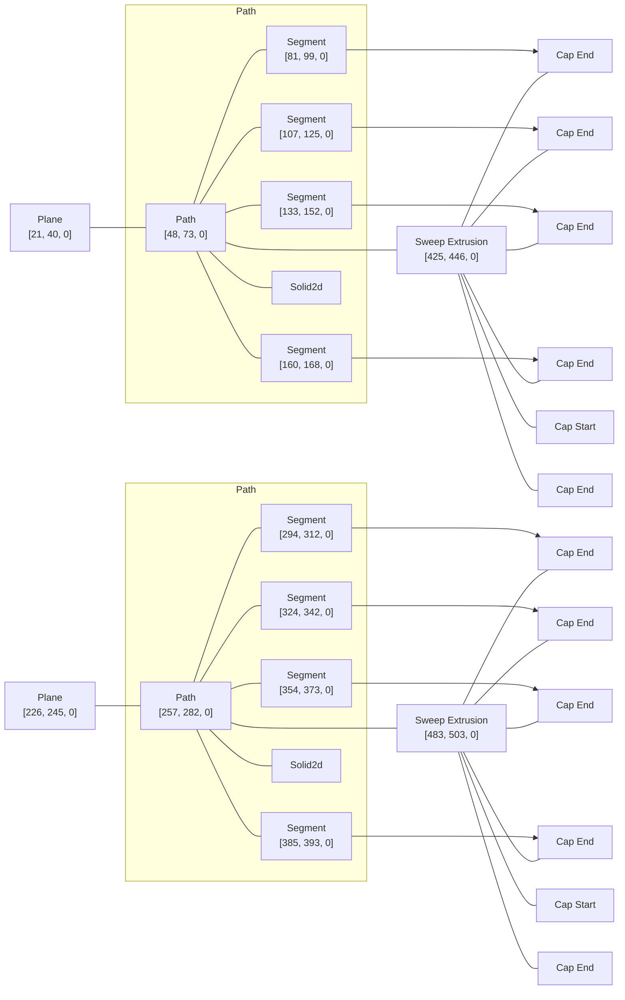

```mermaid
flowchart LR
  subgraph path2 [Path]
    2["Path<br>[48, 73, 0]"]
    3["Segment<br>[81, 99, 0]"]
    4["Segment<br>[107, 125, 0]"]
    5["Segment<br>[133, 152, 0]"]
    6["Segment<br>[160, 168, 0]"]
    7[Solid2d]
  end
  subgraph path16 [Path]
    16["Path<br>[257, 282, 0]"]
    17["Segment<br>[294, 312, 0]"]
    18["Segment<br>[324, 342, 0]"]
    19["Segment<br>[354, 373, 0]"]
    20["Segment<br>[385, 393, 0]"]
    21[Solid2d]
  end
  1["Plane<br>[21, 40, 0]"]
  8["Sweep Extrusion<br>[425, 446, 0]"]
  9["Cap End"]
  10["Cap End"]
  11["Cap End"]
  12["Cap End"]
  13["Cap Start"]
  14["Cap End"]
  15["Plane<br>[226, 245, 0]"]
  22["Sweep Extrusion<br>[483, 503, 0]"]
  23["Cap End"]
  24["Cap End"]
  25["Cap End"]
  26["Cap End"]
  27["Cap Start"]
  28["Cap End"]
  1 --- 2
  2 --- 3
  2 --- 4
  2 --- 5
  2 --- 6
  2 ---- 8
  2 --- 7
  3 x--> 12
  4 x--> 11
  5 x--> 10
  6 x--> 9
  8 --- 9
  8 --- 10
  8 --- 11
  8 --- 12
  8 --- 13
  8 --- 14
  15 --- 16
  16 --- 17
  16 --- 18
  16 --- 19
  16 --- 20
  16 ---- 22
  16 --- 21
  17 x--> 26
  18 x--> 25
  19 x--> 24
  20 x--> 23
  22 --- 23
  22 --- 24
  22 --- 25
  22 --- 26
  22 --- 27
  22 --- 28
```
