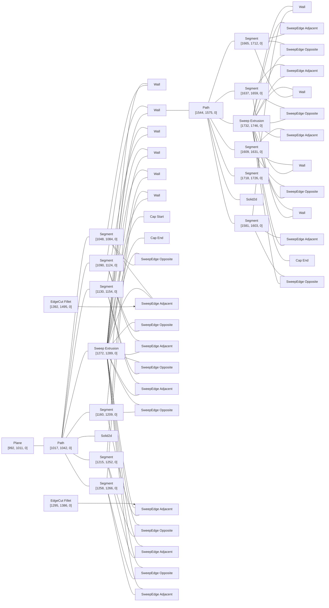

```mermaid
flowchart LR
  1["Plane<br>[992, 1011, 0]"]
  2["Path<br>[1017, 1042, 0]"]
  3["Segment<br>[1048, 1084, 0]"]
  4["Segment<br>[1090, 1124, 0]"]
  5["Segment<br>[1130, 1154, 0]"]
  6["Segment<br>[1160, 1209, 0]"]
  7["Segment<br>[1215, 1252, 0]"]
  8["Segment<br>[1258, 1266, 0]"]
  9[Solid2d]
  10["Sweep Extrusion<br>[1272, 1289, 0]"]
  11[Wall]
  12[Wall]
  13[Wall]
  14[Wall]
  15[Wall]
  16[Wall]
  17["Cap Start"]
  18["Cap End"]
  19["SweepEdge Opposite"]
  20["SweepEdge Adjacent"]
  21["SweepEdge Opposite"]
  22["SweepEdge Adjacent"]
  23["SweepEdge Opposite"]
  24["SweepEdge Adjacent"]
  25["SweepEdge Opposite"]
  26["SweepEdge Adjacent"]
  27["SweepEdge Opposite"]
  28["SweepEdge Adjacent"]
  29["SweepEdge Opposite"]
  30["SweepEdge Adjacent"]
  31["EdgeCut Fillet<br>[1295, 1386, 0]"]
  32["EdgeCut Fillet<br>[1392, 1495, 0]"]
  33["Path<br>[1544, 1575, 0]"]
  34["Segment<br>[1581, 1603, 0]"]
  35["Segment<br>[1609, 1631, 0]"]
  36["Segment<br>[1637, 1659, 0]"]
  37["Segment<br>[1665, 1712, 0]"]
  38["Segment<br>[1718, 1726, 0]"]
  39[Solid2d]
  40["Sweep Extrusion<br>[1732, 1746, 0]"]
  41[Wall]
  42[Wall]
  43[Wall]
  44[Wall]
  45["Cap End"]
  46["SweepEdge Opposite"]
  47["SweepEdge Adjacent"]
  48["SweepEdge Opposite"]
  49["SweepEdge Adjacent"]
  50["SweepEdge Opposite"]
  51["SweepEdge Adjacent"]
  52["SweepEdge Opposite"]
  53["SweepEdge Adjacent"]
  40 --- 44
  33 --- 38
  10 --- 23
  34 --- 44
  4 --- 12
  37 --- 46
  2 --- 8
  2 --- 7
  10 --- 15
  10 --- 30
  8 --- 30
  33 --- 39
  35 --- 50
  40 --- 47
  4 --- 22
  12 --- 33
  10 --- 22
  7 --- 15
  35 --- 43
  37 --- 47
  36 --- 49
  2 --- 6
  10 --- 14
  10 --- 29
  40 --- 46
  35 --- 51
  5 --- 23
  10 --- 21
  33 --- 40
  6 --- 14
  40 --- 49
  31 x--> 26
  36 --- 48
  2 --- 5
  3 --- 20
  10 --- 13
  10 --- 28
  40 --- 41
  5 --- 24
  37 --- 41
  10 --- 20
  8 --- 16
  7 --- 28
  40 --- 48
  2 --- 4
  10 --- 12
  10 --- 27
  1 --- 2
  33 --- 34
  10 --- 19
  40 --- 51
  2 --- 3
  10 --- 11
  10 --- 26
  33 --- 35
  40 --- 43
  6 --- 26
  3 --- 11
  10 --- 18
  40 --- 50
  8 --- 29
  33 --- 36
  34 --- 53
  4 --- 21
  3 --- 19
  10 --- 25
  40 --- 42
  40 --- 53
  7 --- 27
  6 --- 25
  36 --- 42
  2 --- 10
  10 --- 17
  40 --- 45
  32 x--> 20
  33 --- 37
  34 --- 52
  10 --- 24
  40 --- 52
  5 --- 13
  2 --- 9
  10 --- 16
```
