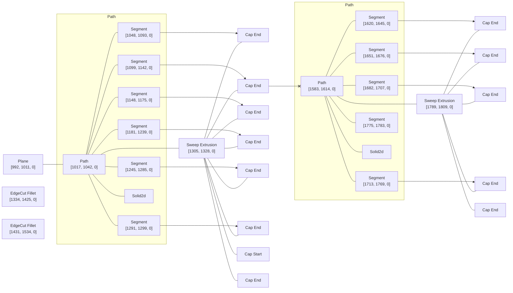

```mermaid
flowchart LR
  subgraph path2 [Path]
    2["Path<br>[1017, 1042, 0]"]
    3["Segment<br>[1048, 1093, 0]"]
    4["Segment<br>[1099, 1142, 0]"]
    5["Segment<br>[1148, 1175, 0]"]
    6["Segment<br>[1181, 1239, 0]"]
    7["Segment<br>[1245, 1285, 0]"]
    8["Segment<br>[1291, 1299, 0]"]
    9[Solid2d]
  end
  subgraph path21 [Path]
    21["Path<br>[1583, 1614, 0]"]
    22["Segment<br>[1620, 1645, 0]"]
    23["Segment<br>[1651, 1676, 0]"]
    24["Segment<br>[1682, 1707, 0]"]
    25["Segment<br>[1713, 1769, 0]"]
    26["Segment<br>[1775, 1783, 0]"]
    27[Solid2d]
  end
  1["Plane<br>[992, 1011, 0]"]
  10["Sweep Extrusion<br>[1305, 1328, 0]"]
  11["Cap End"]
  12["Cap End"]
  13["Cap End"]
  14["Cap End"]
  15["Cap End"]
  16["Cap End"]
  17["Cap Start"]
  18["Cap End"]
  19["EdgeCut Fillet<br>[1334, 1425, 0]"]
  20["EdgeCut Fillet<br>[1431, 1534, 0]"]
  28["Sweep Extrusion<br>[1789, 1809, 0]"]
  29["Cap End"]
  30["Cap End"]
  31["Cap End"]
  32["Cap End"]
  33["Cap End"]
  1 --- 2
  2 --- 3
  2 --- 4
  2 --- 5
  2 --- 6
  2 --- 7
  2 --- 8
  2 ---- 10
  2 --- 9
  3 x--> 11
  4 x--> 12
  5 x--> 13
  6 x--> 14
  7 x--> 15
  8 x--> 16
  10 --- 11
  10 --- 12
  10 --- 13
  10 --- 14
  10 --- 15
  10 --- 16
  10 --- 17
  10 --- 18
  12 <--x 21
  21 --- 22
  21 --- 23
  21 --- 24
  21 --- 25
  21 --- 26
  21 ---- 28
  21 --- 27
  22 x--> 32
  23 x--> 31
  24 x--> 30
  25 x--> 29
  28 --- 29
  28 --- 30
  28 --- 31
  28 --- 32
  28 --- 33
```
