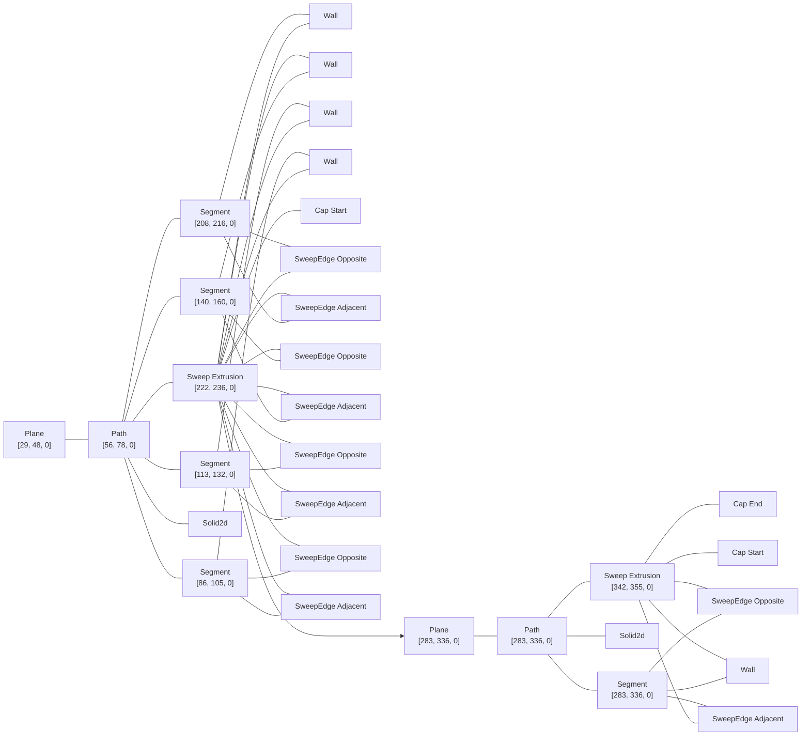

```mermaid
flowchart LR
  1["Plane<br>[29, 48, 0]"]
  2["Path<br>[56, 78, 0]"]
  3["Segment<br>[86, 105, 0]"]
  4["Segment<br>[113, 132, 0]"]
  5["Segment<br>[140, 160, 0]"]
  6["Segment<br>[208, 216, 0]"]
  7[Solid2d]
  8["Sweep Extrusion<br>[222, 236, 0]"]
  9[Wall]
  10[Wall]
  11[Wall]
  12[Wall]
  13["Cap Start"]
  14["Plane<br>[283, 336, 0]"]
  15["SweepEdge Opposite"]
  16["SweepEdge Adjacent"]
  17["SweepEdge Opposite"]
  18["SweepEdge Adjacent"]
  19["SweepEdge Opposite"]
  20["SweepEdge Adjacent"]
  21["SweepEdge Opposite"]
  22["SweepEdge Adjacent"]
  23["Path<br>[283, 336, 0]"]
  24["Segment<br>[283, 336, 0]"]
  25[Solid2d]
  26["Sweep Extrusion<br>[342, 355, 0]"]
  27[Wall]
  28["Cap Start"]
  29["Cap End"]
  30["SweepEdge Opposite"]
  31["SweepEdge Adjacent"]
  5 --- 17
  4 --- 19
  2 --- 4
  3 --- 21
  8 --- 12
  1 --- 2
  24 --- 30
  23 --- 26
  26 --- 30
  5 --- 10
  14 --- 23
  8 --- 19
  2 --- 8
  2 --- 7
  3 --- 22
  5 --- 18
  8 --- 15
  2 --- 3
  26 --- 29
  8 --- 11
  4 --- 11
  8 --- 22
  6 --- 15
  8 --- 18
  2 --- 6
  8 x--> 14
  26 --- 28
  8 --- 10
  8 --- 21
  3 --- 12
  23 --- 24
  8 --- 17
  8 --- 13
  26 --- 31
  2 --- 5
  6 --- 16
  8 --- 9
  4 --- 20
  24 --- 27
  24 --- 31
  26 --- 27
  8 --- 20
  6 --- 9
  23 --- 25
  8 --- 16
```
