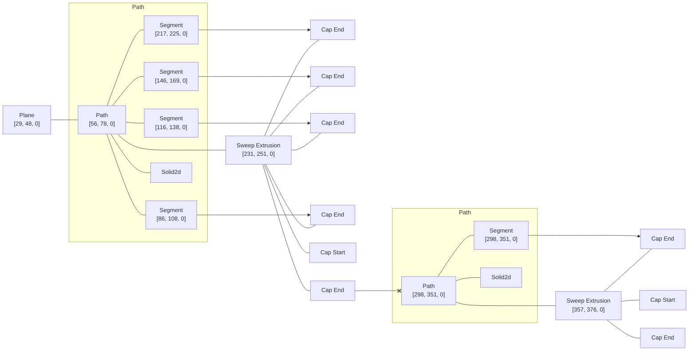

```mermaid
flowchart LR
  subgraph path2 [Path]
    2["Path<br>[56, 78, 0]"]
    3["Segment<br>[86, 108, 0]"]
    4["Segment<br>[116, 138, 0]"]
    5["Segment<br>[146, 169, 0]"]
    6["Segment<br>[217, 225, 0]"]
    7[Solid2d]
  end
  subgraph path15 [Path]
    15["Path<br>[298, 351, 0]"]
    16["Segment<br>[298, 351, 0]"]
    17[Solid2d]
  end
  1["Plane<br>[29, 48, 0]"]
  8["Sweep Extrusion<br>[231, 251, 0]"]
  9["Cap End"]
  10["Cap End"]
  11["Cap End"]
  12["Cap End"]
  13["Cap Start"]
  14["Cap End"]
  18["Sweep Extrusion<br>[357, 376, 0]"]
  19["Cap End"]
  20["Cap Start"]
  21["Cap End"]
  1 --- 2
  2 --- 3
  2 --- 4
  2 --- 5
  2 --- 6
  2 ---- 8
  2 --- 7
  3 x--> 12
  4 x--> 11
  5 x--> 10
  6 x--> 9
  8 --- 9
  8 --- 10
  8 --- 11
  8 --- 12
  8 --- 13
  8 --- 14
  14 <--x 15
  15 --- 16
  15 ---- 18
  15 --- 17
  16 x--> 19
  18 --- 19
  18 --- 20
  18 --- 21
```
