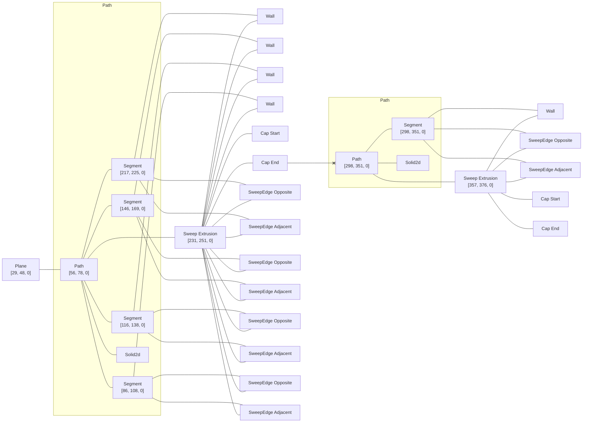

```mermaid
flowchart LR
  subgraph path2 [Path]
    2["Path<br>[56, 78, 0]"]
    3["Segment<br>[86, 108, 0]"]
    4["Segment<br>[116, 138, 0]"]
    5["Segment<br>[146, 169, 0]"]
    6["Segment<br>[217, 225, 0]"]
    7[Solid2d]
  end
  subgraph path23 [Path]
    23["Path<br>[298, 351, 0]"]
    24["Segment<br>[298, 351, 0]"]
    25[Solid2d]
  end
  1["Plane<br>[29, 48, 0]"]
  8["Sweep Extrusion<br>[231, 251, 0]"]
  9[Wall]
  10[Wall]
  11[Wall]
  12[Wall]
  13["Cap Start"]
  14["Cap End"]
  15["SweepEdge Opposite"]
  16["SweepEdge Adjacent"]
  17["SweepEdge Opposite"]
  18["SweepEdge Adjacent"]
  19["SweepEdge Opposite"]
  20["SweepEdge Adjacent"]
  21["SweepEdge Opposite"]
  22["SweepEdge Adjacent"]
  26["Sweep Extrusion<br>[357, 376, 0]"]
  27[Wall]
  28["Cap Start"]
  29["Cap End"]
  30["SweepEdge Opposite"]
  31["SweepEdge Adjacent"]
  1 --- 2
  2 --- 3
  2 --- 4
  2 --- 5
  2 --- 6
  2 ---- 8
  2 --- 7
  3 --- 12
  3 --- 21
  3 --- 22
  4 --- 11
  4 --- 19
  4 --- 20
  5 --- 10
  5 --- 17
  5 --- 18
  6 --- 9
  6 --- 15
  6 --- 16
  8 --- 9
  8 --- 10
  8 --- 11
  8 --- 12
  8 --- 13
  8 --- 14
  8 --- 15
  8 --- 16
  8 --- 17
  8 --- 18
  8 --- 19
  8 --- 20
  8 --- 21
  8 --- 22
  14 <--x 23
  23 --- 24
  23 ---- 26
  23 --- 25
  24 --- 27
  24 --- 30
  24 --- 31
  26 --- 27
  26 --- 28
  26 --- 29
  26 --- 30
  26 --- 31
```
