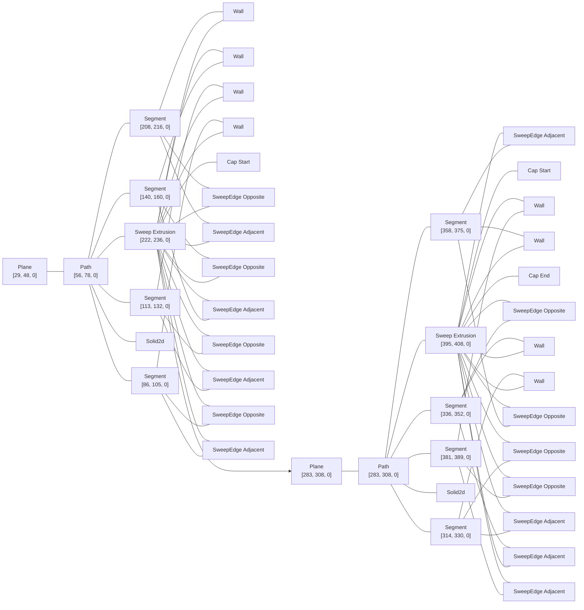

```mermaid
flowchart LR
  1["Plane<br>[29, 48, 0]"]
  2["Path<br>[56, 78, 0]"]
  3["Segment<br>[86, 105, 0]"]
  4["Segment<br>[113, 132, 0]"]
  5["Segment<br>[140, 160, 0]"]
  6["Segment<br>[208, 216, 0]"]
  7[Solid2d]
  8["Sweep Extrusion<br>[222, 236, 0]"]
  9[Wall]
  10[Wall]
  11[Wall]
  12[Wall]
  13["Cap Start"]
  14["Plane<br>[283, 308, 0]"]
  15["SweepEdge Opposite"]
  16["SweepEdge Adjacent"]
  17["SweepEdge Opposite"]
  18["SweepEdge Adjacent"]
  19["SweepEdge Opposite"]
  20["SweepEdge Adjacent"]
  21["SweepEdge Opposite"]
  22["SweepEdge Adjacent"]
  23["Path<br>[283, 308, 0]"]
  24["Segment<br>[314, 330, 0]"]
  25["Segment<br>[336, 352, 0]"]
  26["Segment<br>[358, 375, 0]"]
  27["Segment<br>[381, 389, 0]"]
  28[Solid2d]
  29["Sweep Extrusion<br>[395, 408, 0]"]
  30[Wall]
  31[Wall]
  32[Wall]
  33[Wall]
  34["Cap Start"]
  35["Cap End"]
  36["SweepEdge Opposite"]
  37["SweepEdge Adjacent"]
  38["SweepEdge Opposite"]
  39["SweepEdge Adjacent"]
  40["SweepEdge Opposite"]
  41["SweepEdge Adjacent"]
  42["SweepEdge Opposite"]
  43["SweepEdge Adjacent"]
  27 --- 30
  8 --- 12
  24 --- 43
  29 --- 30
  26 --- 39
  14 --- 23
  2 --- 8
  2 --- 7
  3 --- 22
  8 --- 15
  29 --- 39
  25 --- 40
  29 --- 40
  24 --- 42
  29 --- 31
  26 --- 38
  29 --- 32
  8 --- 22
  6 --- 15
  25 --- 32
  2 --- 6
  29 --- 41
  8 x--> 14
  25 --- 41
  29 --- 33
  3 --- 12
  8 --- 17
  23 --- 28
  26 --- 31
  2 --- 5
  29 --- 42
  8 --- 9
  29 --- 34
  8 --- 16
  23 --- 29
  5 --- 17
  4 --- 19
  2 --- 4
  3 --- 21
  29 --- 43
  1 --- 2
  23 --- 26
  5 --- 10
  29 --- 35
  8 --- 19
  5 --- 18
  2 --- 3
  8 --- 11
  23 --- 27
  4 --- 11
  27 --- 36
  29 --- 36
  8 --- 18
  8 --- 10
  8 --- 21
  23 --- 24
  27 --- 37
  24 --- 33
  29 --- 37
  8 --- 13
  6 --- 16
  4 --- 20
  8 --- 20
  6 --- 9
  23 --- 25
  29 --- 38
```
