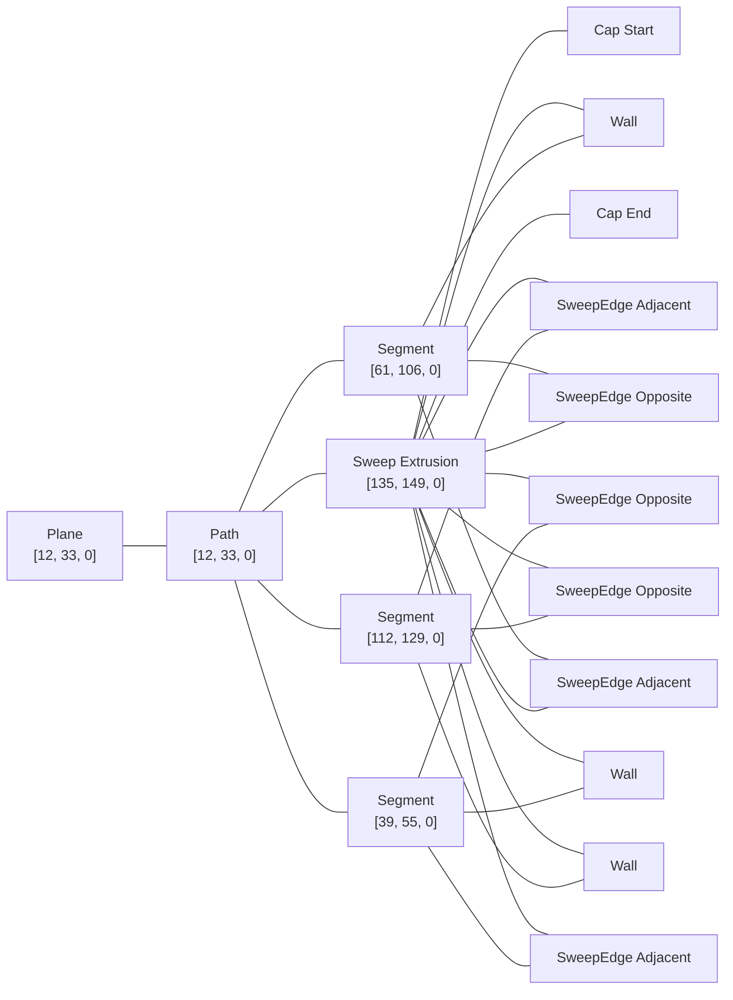

```mermaid
flowchart LR
  1["Plane<br>[12, 33, 0]"]
  2["Path<br>[12, 33, 0]"]
  3["Segment<br>[39, 55, 0]"]
  4["Segment<br>[61, 106, 0]"]
  5["Segment<br>[112, 129, 0]"]
  6["Sweep Extrusion<br>[135, 149, 0]"]
  7[Wall]
  8[Wall]
  9[Wall]
  10["Cap Start"]
  11["Cap End"]
  12["SweepEdge Opposite"]
  13["SweepEdge Adjacent"]
  14["SweepEdge Opposite"]
  15["SweepEdge Adjacent"]
  16["SweepEdge Opposite"]
  17["SweepEdge Adjacent"]
  2 --- 6
  5 --- 17
  2 --- 4
  6 --- 17
  1 --- 2
  4 --- 8
  3 --- 12
  6 --- 8
  6 --- 10
  6 --- 14
  4 --- 14
  5 --- 16
  3 --- 7
  2 --- 5
  6 --- 12
  2 --- 3
  6 --- 7
  6 --- 16
  6 --- 11
  5 --- 9
  6 --- 9
  3 --- 13
  6 --- 15
  4 --- 15
  6 --- 13
```
